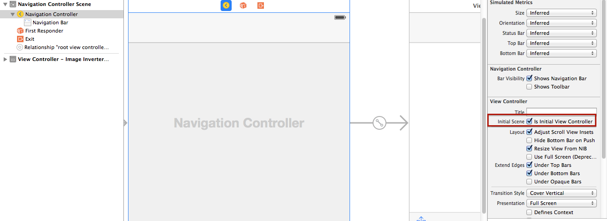

Background: When I changed the default component View Controller to Navigation Controller in Main.storyboard, there was something wrong with this action.

There was a error message in console when I run this project. Like this:

> 2016-05-06 09:48:18.345 gallery[2168:304178] Failed to instantiate the default view controller for UIMainStoryboardFile 'Main' - perhaps the designated entry point is not set?
>

To solve this problem by check this one in red rectangle:

