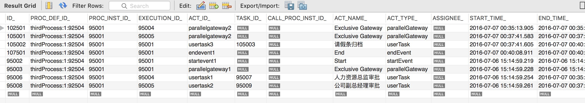

# 数据排序

activiti 的所有表 `ID_ `字段都是字符型的，在排序时就尴尬了，

```sql
select * from act_hi_actinst t where t.proc_inst_id_ = '95001' order by t.id_ asc;
```



看了一下官网的论坛，也有人提出相同的问题：
[https://forums.activiti.org/content/lastest-task-top-task-list-sort-descending](https://forums.activiti.org/content/lastest-task-top-task-list-sort-descending)

作者给了个替代的方法，用时间字段进行排序。这个方法也是可行的。

但是，10年的问题，到现在也没有从根本上解决。

# 反射内部类的问题

在 activiti中，service task 的实现类，如果定义成内部类的话，是无法实例化的。