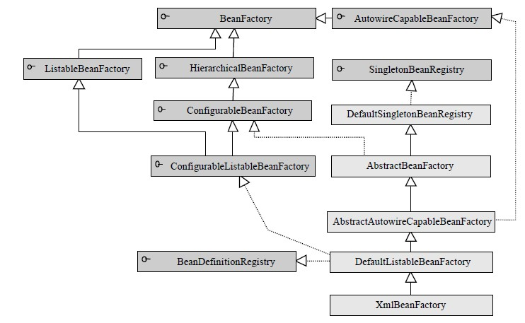
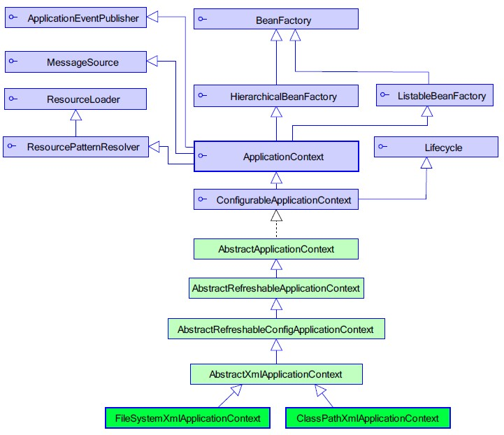
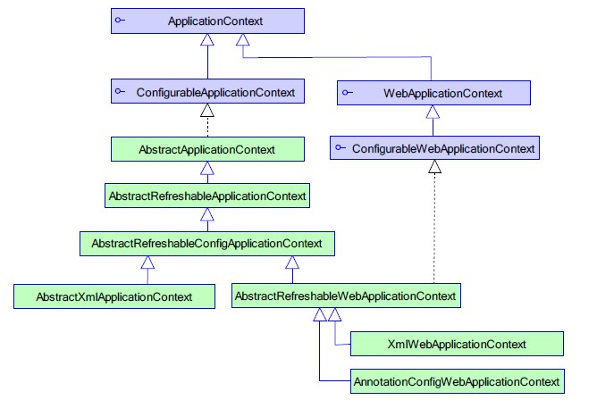

# 对 AOP 的支持方式: JDKProxy 和 CGLIB 的区别

1. spring 对 aop 的支持

* 如果目标对象实现了接口，默认情况下会采用 JDK 的动态代理实现 AOP
* 如果目标对象实现了接口，可以强制使用 CGLIB 实现 AOP
* 如果目标对象没有实现了接口，必须采用 CGLIB 库
* spring 会自动在 JDK 动态代理和 CGLIB 之间转换

2. 强制使用 CGLIB 实现 AOP

* 添加 CGLIB 库
* 在 spring 配置文件中加入: `< aop:aspectj-autoproxy proxy-target-class="true"/>`

3. JDK 动态代理和 CGLIB 字节码生成的区别

* JDK 动态代理只能对实现了接口的类生成代理，而不能针对类
* CGLIB 是针对类实现代理，主要是对指定的类生成一个子类，覆盖其中的方法，因为是继承，所以该类或方法最好不要声明成 final 

# BeanFactory 和 ApplicationContext

com.springframework.beans.factory.BeanFactory：是Spring 框架最核心的接口，也是比较原始的接口。无法支持spring的许多插件。

com.springframework.context.ApplicationContext：建立在BeanFactory 基础之上，是它的子接口。以一种更向面向框架的方式工作以及对上下文进行分层和实现继承，ApplicationContext 包还提供了以下的功能：

- MessageSource, 提供国际化的消息访问
- 资源访问，如URL和文件
- 事件传播
- 载入多个（有继承关系）上下文 ，使得每一个上下文都专注于一个特定的层次，比如应用的web层

## BeanFactory 的类体系结构
BeanFactory 接口位于类结构树的顶端，它最主要的方法就是getBean(StringbeanName)，该方法从容器中返回特定名称的Bean，BeanFactory 的功能通过其他的接口得到不断扩展。

ListableBeanFactory：该接口定义了访问容器中Bean 基本信息的若干方法，如查看Bean 的个数、获取某一类型Bean 的配置名、查看容器中是否包括某一Bean 等方法；

HierarchicalBeanFactory：父子级联IoC 容器的接口，子容器可以通过接口方法访问父容器；

ConfigurableBeanFactory：是一个重要的接口，增强了IoC 容器的可定制性，它定义了设置类装载器、属性编辑器、容器初始化后置处理器等方法；

AutowireCapableBeanFactory：定义了将容器中的Bean 按某种规则（如按名字匹配、按类型匹配等）进行自动装配的方法；

SingletonBeanRegistry：定义了允许在运行期间向容器注册单实例Bean 的方法；

BeanDefinitionRegistry：Spring 配置文件中每一个< bean>节点元素在Spring 容器里都通过一个BeanDefinition 对象表示，它描述了Bean 的配置信息。而BeanDefinitionRegistry 接口提供了向容器手工注册BeanDefinition 对象的方法。


## ApplicationContext 的类体系结构
ApplicationContext 由 BeanFactory 派生而来，提供了更多面向实际应用的功能。在 BeanFactory 中，很多功能需要以编程的方式实现，而在 ApplicationContext 中则可以通过配置的方式实现。

ApplicationContext 的主要实现类是 ClassPathXmlApplicationContext 和 FileSystemXmlApplicationContext，前者默认从类路径加载配置文件，后者默认从文件系统中装载配置文件。

核心接口包括：

ApplicationEventPublisher：让容器拥有发布应用上下文事件的功能，包括容器启动事件、关闭事件等。实现了 ApplicationListener 事件监听接口的 Bean 可以接收到容器事件，并对事件进行响应处理。在 ApplicationContext 抽象实现类 AbstractApplicationContext 中，我们可以发现存在一个 ApplicationEventMulticaster，它负责保存所有监听器，以便在容器产生上下文事件时通知这些事件监听者。

MessageSource：为应用提供i18n 国际化消息访问的功能；

ResourcePatternResolver：所有ApplicationContext 实现类都实现了类似于PathMatchingResourcePatternResolver 的功能，可以通过带前缀的Ant 风格的资源文件路径装载Spring 的配置文件。

LifeCycle：该接口是Spring 2.0 加入的，该接口提供了start()和stop()两个方法，主要用于控制异步处理过程。在具体使用时，该接口同时被ApplicationContext 实现及具体Bean 实现，ApplicationContext 会将start/stop 的信息传递给容器中所有实现了该接口的Bean，以达到管理和控制JMX、任务调度等目的。

ConfigurableApplicationContext：扩展于ApplicationContext，它新增加了两个主要的方法：refresh()和close()，让ApplicationContext 具有启动、刷新和关闭应用上下文的能力。在应用上下文关闭的情况下调用refresh()即可启动应用上下文，在已经启动的状态下，调用 refresh()则清除缓存并重新装载配置信息，而调用close()则可关闭应用上下文。这些接口方法为容器的控制管理带来了便利。


## BeanFactory 和 ApplicationContext 加载时的区别
* BeanFactroy采用的是延迟加载形式来注入Bean的，即只有在使用到某个Bean时(调用getBean())，才对该Bean进行加载实例化，这样，我们就不能发现一些存在的Spring的配置问题。而ApplicationContext则相反，它是在容器启动时，一次性创建了所有的Bean。这样，在容器启动时，我们就可以发现Spring中存在的配置错误。
* BeanFactory和ApplicationContext都支持BeanPostProcessor、BeanFactoryPostProcessor的使用，但两者之间的区别是：BeanFactory需要手动注册，而ApplicationContext则是自动注册。

## WebApplicationContext 类体系结构 
WebApplicationContext 是专门为Web 应用准备的，它允许从相对于Web 根目录的路径中装载配置文件完成初始化工作。从WebApplicationContext 中可以获得ServletContext 的引用，整个Web 应用上下文对象将作为属性放置到ServletContext 中，以便Web 应用环境可以访问Spring 应用上下文（ApplicationContext）。Spring 专门为此提供一个工具类WebApplicationContextUtils，通过该类的getWebApplicationContext(ServletContext sc)方法，即可以从ServletContext 中获取WebApplicationContext 实例。

Spring 2.0 在WebApplicationContext 中还为Bean 添加了三个新的作用域：request 作用域、session 作用域和global session 作用域。而在非Web 应用的环境下，Bean 只有singleton和prototype 两种作用域。

由于Web 应用比一般的应用拥有更多的特性，因此WebApplicationContext 扩展了ApplicationContext。WebApplicationContext 定义了一个常量ROOT_WEB_APPLICATION_CONTEXT_ATTRIBUTE，在上下文启动时，WebApplicationContext 实例即以此为键放置在ServletContext 的属性列表中，因此我们可以直接通过以下语句从Web 容器中获取WebApplicationContext

WebApplicationContext wac = (WebApplicationContext)servletContext.getAttribute(WebApplicationContext.ROOT_WEB_APPLICATION_CONTEXT_ATTRIBUTE);




#### WebApplicationContext 的启动方式和BeanFactory、ApplicationContext 的区别
因为WebApplicationContext 需要ServletContext 实例，也就是说它必须在拥有Web 容器的前提下才能完成启动的工作。有过Web 开发经验的读者都知道可以在web.xml 中配置自启动的Servlet 或定义Web 容器监听器（ServletContextListener），借助这两者中的任何一个，我们就可以完成启动Spring Web 应用上下文的工作。

Spring 分别提供了用于启动WebApplicationContext 的Servlet 和Web 容器监听器：

*    org.springframework.web.context.ContextLoaderServlet
*    org.springframework.web.context.ContextLoaderListener

两者的内部都实现了启动WebApplicationContext 实例的逻辑，我们只要根据Web 容器的具体情况选择两者之一，并在web.xml 中完成配置就可以了。

#### 使用ContextLoaderListener 启动WebApplicationContext 的具体配置：
```xml
<context-param>
  <param-name>contextConfigLocation</param-name>  
  <param-value>/WEB-INF/dao.xml, /WEB-INF/service.xml</param-value>
</context-param>  
<listener>  
  <listener-class>org.springframework.web.context.ContextLoaderListener</listener-class>  
</listener>  

<context-param>  
  <param-name>contextConfigLocation</param-name>  
  <param-value>/WEB-INF/dao.xml, /WEB-INF/service.xml</param-value>  
</context-param>
```

#### 如果在不支持容器监听器的低版本Web 容器中，我们可采用ContextLoaderServlet 完成相同的工作：
```xml
<context-param>  
  <param-name>contextConfigLocation</param-name>
  <param-value>/WEB-INF/dao.xml, /WEB-INF/service.xml</param-value>
</context-param>  

<servlet>  
  <servlet-name>springContextLoaderServlet</servlet-name>  
  <servlet-class>org.springframework.web.context.ContextLoaderServlet </servlet-class>
  <load-on-startup>1</load-on-startup>  
</servlet>
```

## WebApplicationContext 需要使用日志功能
用户可以将 Log4J 的配置文件放置到类路径 WEB-INF/classes 下，这时 Log4J 引擎即可顺利启动。

如果 Log4J 配置文件放置在其他位置，用户还必须在 web.xml 指定 Log4J 配置文件位置。

Spring 为启用 Log4J 引擎提供了两个类似于启动 WebApplicationContext 的实现类：Log4jConfigServlet 和 Log4jConfigListener，不管采用哪种方式都必须保证能够在装载Spring 配置文件前先装载 Log4J 配置信息。

#### Log4jConfigServlet启动日志
```xml
<context-param>  
  <param-name>contextConfigLocation</param-name>
  <param-value>/WEB-INF/dao.xml,/WEB-INF/service.xml</param-value>
</context-param>
<context-param>
  <param-name>log4jConfigLocation</param-name>
  <param-value>/WEB-INF/log4j.properties</param-value>
</context-param>
<servlet>
  <servlet-name>log4jConfigServlet</servlet-name>
  <servlet-class>org.springframework.web.util.Log4jConfigServlet</servlet-class>
  <load-on-startup>1</load-on-startup>
</servlet>
<servlet>
  <servlet-name> springContextLoaderServlet</servlet-name>
  <servlet-class>org.springframework.web.context.ContextLoaderServlet</servlet-class>
  <load-on-startup>2</load-on-startup>
</servlet>
```


注意上面我们将 log4jConfigServlet 的启动顺序号设置为1，而 springContextLoaderServlet 的顺序号设置为2。这样，前者将先启动，完成装载Log4J 配置文件初始化 Log4J 引擎的工作，紧接着后者再启动。如果使用 Web 监听器，则必须将 Log4jConfigListener 放置在 ContextLoaderListener 的前面。

#### Log4jConfigListener启动日志
```xml
<!-- Log4J 配置  -->  
<context-param>  
  <param-name>log4jConfigLocation</param-name>
  <param-value>/WEB-INF/conf/log4j.properties</param-value>
</context-param>  

<!-- Spring上下文配置 -->
<context-param>
  <param-name>contextConfigLocation</param-name>
  <param-value>/WEB-INF/conf/spring/applicationContext.xml</param-value>
</context-param>
<!-- Log4J监听器  -->
<listener>  
  <listener-class>org.springframework.web.util.Log4jConfigListener</listener-class>
</listener>

<!-- Spring监听器  -->
<listener>
  <listener-class>org.springframework.web.context.ContextLoaderListener</listener-class>
</listener>
```

## 层级容器 
通过 HierarchicalBeanFactory 接口，Spring 的 IoC 容器可以建立父子层级关联的容器体系，子容器可以访问父容器中的 Bean，但父容器不能访问子容器的 Bean。

在容器内，Bean 的 id 必须是唯一的，但子容器可以拥有一个和父容器 id 相同的 Bean。父子容器层级体系增强了 Spring 容器架构的扩展性和灵活性，因为第三方可以通过编程的方式，为一个已经存在的容器添加一个或多个特殊用途的子容器，以提供一些额外的功能。

Spring 使用父子容器实现了很多功能，比如在 Spring MVC 中，展现层 Bean 位于一个子容器中，而业务层和持久层的 Bean 位于父容器中。这样，展现层 Bean 就可以引用业务层和持久层的 Bean，而业务层和持久层的 Bean 则看不到展现层的 Bean。