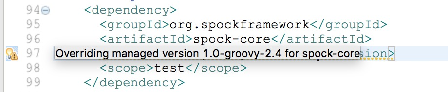

maven 大法虽然好，半路杀出个 gradle。

# Gradle

## 修改 gradle 本地 jar 包的位置
gralde 本地缓存的默认位置是：
>$HOME/.gradle

jar 包的缓存位置在：
>$HOME/.gradle/caches/modules-2/files-2.1/

修改缓存位置，在~/.bash_profile中，加入如下一行：

`export GRADLE_USER_HOME=/Users/WHERE_EVER_YOU_WANT`

## 使用 maven 本地仓库
gradle 可以 ivy 仓库，也可以使用 maven 仓库。使用 maven 仓库时，有三个别名：

* mavenCentral()，表示依赖是从 Central Maven 2 仓库中获取的。
* jcenter()，表示依赖是从 Bintary’s JCenter Maven 仓库中获取的。
* mavenLocal() 别名，表示依赖是从本地的 Maven 仓库中获取的。

对于 maven 和 gradle 都使用的宝宝，自然是想只下载一次 jar 包，两个构建系统都能使用，如下：

```groovy
repositories {
    mavenLocal()
    // 或者直接使用阿里的镜像，给你飞一样的感觉
    maven { url "http://maven.aliyun.com/nexus/content/groups/public/" }
    mavenCentral()
}
```

## 使用 gradle 守护进程
gradle 是运行于 jvm 之上的，为了避免频繁加载 gradle 可以使用以下的命令，守护进程会在空闲3个小时之后，自动过期。

```groovy
gradle build --daemon		// 开启gradle 守护进程
gradle --no-daemon	// 构建时不使用守护进程
gradle --stop			// 停止守护进程
```

## 插件与文件目录的约定
| 插件     | 文件目录            |
| ------ | --------------- |
| java   | src/main/java   |
| groovy | src/main/groovy |
| war    | src/main/webapp |

## build.gradle

```groovy
apply plugin 'java'	//应用java插件

ext {
  ver = '0.0.1'	// 定义扩展属性，与在 gradle.properties 中设置一个效果
}
version = '$ver'		//定义项目版本
srouceCompatibility = 1.8	// 设置Java版本，编译兼容1.8
jar {
  mainfest {
    // 在MAINFEST.MF清单文件中添加Main-Class信息头。
    attributes 'Main-class': "com.foo.Main"	
  }
}
// 修改源代码的目录为src(非约定目录src/main/java)，测试源代码的目录为test，编译输出路径为out
sourceSets {
  main {
    java {
      srcDirs = ['src']
    }
  }
  test {
    java {
      srcDirs = ['test']
    }
  }
}
buildDir = 'out'

repositories {
  mavenCentral()	//使用Maven 中央仓库
}
dependencies {
  //添加编译源码时使用的依赖
  compile 'org.apache.commons:common-lang3:3.1'
  //编译时需要，但是由运行时环境提供，所以标记为provide的依赖不会被打包进war文件
  provideCompile('javax.servlet:servlet-api:2.5')
  //编译时不需要，运行时需要，所以会被打包进war文件
  runtime group:'javax.servlet', name:'jstl', version:'1.1.2'
}
task wrapper(type: Wrapper){
  gradleVersion = '3.5'
  // 在内网环境中，无法从外网获取gradle wrapper，可以指定一个内网gradle仓库地址
  distributionUrl  = 'http://your_gradle_website'
  // 自定义wrapper解压缩后存放的位置
  distributionPath = 'gradle-dists'
}
task printLog {
  doFirst {
    println "first doing"
  }
  doLast {
    logger.quiet "last execution"
  }
}
// 指定依赖多个 task，但是 wrapper 和 printLog 这两个执行顺序并不能保证，只能确定 printVersion 肯定在这两个之后执行
task printVersion(dependsOn: [wrapper, printLog) {
  logger.quiet "Version: $ver"
}
```

# Maven

## 基础概念

### scope依赖范围详解

Maven 的生命周期存在编译、测试、运行这些过程，那么显然有些依赖只用于测试，比如 junit；有些依赖编译用不到，只有运行的时候才能用到，比如 MySQL 的驱动包在编译期就用不到（编译期用的是 JDBC 接口），而是在运行时用到的；还有些依赖，编译期要用到，而运行期不需要提供，因为有些容器已经提供了，比如 servlet-api 在 tomcat 中已经提供了，我们只需要的是编译期提供而已。总结说来，在 POM 4 中，\<dependency\>中还引入了\<scope\>，它主要管理依赖的部署。大致有：compile、provided、runtime、test、system 等几个。

1. compile：默认的 scope，表示被依赖项目需要参与当前项目的编译、测试、运行、打包。
2. provided：只存在编译、运行、测试阶段，不会打入包中。
3. runtime：编译不需要，在测试和运行期有效，需要导入包中。（接口与实现分离）
4. test：一般的编译和运行时都不需要，它们只有在测试编译和测试运行阶段可用，不会打入包中。
5. system：非本地仓库引入、存在系统的某个路径下的jar。（一般不使用）

|          | 编译 | 测试 | 运行 | 打包 |
| -------- | ---- | ---- | ---- | ---- |
| compile  | 是   | 是   | 是   | 是   |
| provided | 是   | 是   | 是   | 否   |
| runtime  | 否   | 是   | 是   | 是   |
| test     | 否   | 是   | 否   | 否   |

#### system (系统范围)

被依赖项不会从 maven 仓库下载，而是从本地系统指定路径下寻找，需要指定 systemPath 属性。

##### 方式1 指定本地jar包

```xml
<dependency>
  <!--自定义-->
  <groupId>com.im</groupId>
  <!--自定义-->
  <artifactId>sdk</artifactId>
  <!--自定义-->
  <version>1.0</version>
  <!--system，类似provided，需要显式提供依赖的jar，Maven不会在Repository中查找它-->
  <scope>system</scope>
  <!--项目根目录下的lib文件夹下-->
  <systemPath>${basedir}/lib/sdk-1.0.jar</systemPath>
</dependency> 
```

##### 方式2 编译阶段指定外部lib

```xml
<plugin>
  <artifactId>maven-compiler-plugin</artifactId>
  <version>2.3.2</version>
  <configuration>
    <source>1.8</source>
    <target>1.8</target>
    <encoding>UTF-8</encoding>
    <compilerArguments>
      <!--指定外部lib-->
      <extdirs>lib</extdirs>
    </compilerArguments>
  </configuration>
</plugin>
```

##### 方式3 将外部 jar 安装到本地 maven 仓库

```shell
mvn install:install-file -Dfile=sdk-1.0.jar -DgroupId=com.im -DartifactId=sdk -Dversion=1.0 -Dpackaging=jar
```

引入jar包

```xml
<dependency>
  <groupId>com.im</groupId>
  <artifactId>sdk</artifactId>
  <version>1.0</version>
</dependency>
```

#### scope 的传递依赖

A -> B -> C，当前项目 A，A 依赖于 B，B 依赖于 C，知道 B 在 A 中的 scope，怎么知道 C 在 A 中的 scope？

即，A 需不需要 C 的问题，本质由 C 在 B 中的 scope 决定

当 C 在 B 中的 scope 是 test 或 provided 时，C 直接被丢弃，A 不依赖 C，否则 A 依赖 C。

## 使用 maven wrapper
maven 没有官方的 wrapper，选择了大家都在用的
[https://github.com/takari/maven-wrapper](https://github.com/takari/maven-wrapper) , 执行下面的命令就ok。

> mvn -N io.takari:maven:wrapper

## 集成 groovy
maven 构建的 java 项目集成 groovy，需要加入 GMavenPlus 这个插件（GMaven已经过时了）。

maven 定义的 groovy 目录是：src/main/groovy

混合编程时，可以把 groovy 文件直接放在 src/main/java 目录的包中。

## 解决版本管理警告
spring-boot 默认引入了spock 1.0-groovy-2.4 版本。

由于 spock 更新较快，指定新的 spock 版本时，会出现如下警告：

可以用如下两种方法解决这个警告：

方法一：

在 STS 的 Effective POM 中，可以看到指定的 spock.version，在 pom 的 properties 中指定需要的版本号，如下：


方法二：


加入后边这个注释。

## 打包源代码安装到本地仓库

```shell
mvn clean source:jar install
```

## 子项目版本号批量修改

一个 maven 工程，有多个子模块项目，批量修改子模块的版本号

```shell
# 只更新父模块的版本
mvn versions:set -DnewVersion=1.0.1-SNAPSHOT

# 更新子模块和父模块为一样的版本号
mvn -N versions:update-child-modules

# 回滚
mvn versions:revert

# 提交更新
mvn versions:commit
```

maven 会自动安装一个 versions 的插件帮你完成一系列的工作。 
