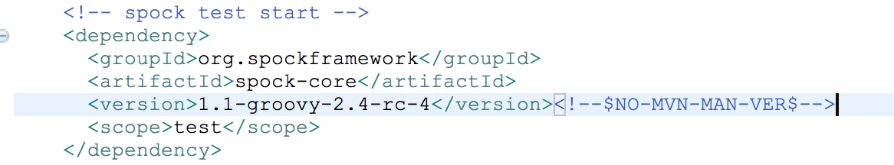

maven大法虽然好，半路杀出个gradle。

# Gradle

## 修改gradle本地jar包的位置
gralde本地缓存的默认位置是：
>$HOME/.gradle

jar包的缓存位置在：
>$HOME/.gradle/caches/modules-2/files-2.1/

修改缓存位置，在~/.bash_profile中，加入如下一行：

`export GRADLE_USER_HOME=/Users/WHERE_EVER_YOU_WANT`

## 使用maven本地仓库
gradle可以ivy仓库，也可以使用maven仓库。使用maven仓库时，有三个别名：

* mavenCentral()，表示依赖是从Central Maven 2 仓库中获取的。
* jcenter()，表示依赖是从Bintary’s JCenter Maven 仓库中获取的。
* mavenLocal()别名，表示依赖是从本地的Maven仓库中获取的。

对于maven和gradle都使用的宝宝，自然是想只下载一次jar包，两个构建系统都能使用，就用如下写法：

```groovy
repositories {
    mavenLocal()
    // 或者直接使用阿里的镜像，给你飞一样的感觉
    maven { url "http://maven.aliyun.com/nexus/content/groups/public/" }
    mavenCentral()
}
```

## 使用gradle 守护进程
gradle是运行于jvm之上的，为了避免频繁加载gradle可以使用以下的命令，守护进程会在空闲3个小时之后，自动过期。

```groovy
gradle build --daemon		// 开启gradle 守护进程
gradle --no-daemon	// 构建时不使用守护进程
gradle --stop			// 停止守护进程
```

## 插件与文件目录的约定
| 插件     | 文件目录            |
| ------ | --------------- |
| java   | src/main/java   |
| groovy | src/main/groovy |
| war    | src/main/webapp |

## build.gradle

```groovy
apply plugin 'java'	//应用java插件

ext {
  ver = '0.0.1'	// 定义扩展属性，与在gradle.properties中设置一个效果
}
version = '$ver'		//定义项目版本
srouceCompatibility = 1.8	// 设置Java版本，编译兼容1.8
jar {
  mainfest {
    // 在MAINFEST.MF清单文件中添加Main-Class信息头。
    attributes 'Main-class': "com.foo.Main"	
  }
}
// 修改源代码的目录为src(非约定目录src/main/java)，测试源代码的目录为test，编译输出路径为out
sourceSets {
  main {
    java {
      srcDirs = ['src']
    }
  }
  test {
    java {
      srcDirs = ['test']
    }
  }
}
buildDir = 'out'

repositories {
  mavenCentral()	//使用Maven 中央仓库
}
dependencies {
  //添加编译源码时使用的依赖
  compile 'org.apache.commons:common-lang3:3.1'
  //编译时需要，但是由运行时环境提供，所以标记为provide的依赖不会被打包进war文件
  provideCompile('javax.servlet:servlet-api:2.5')
  //编译时不需要，运行时需要，所以会被打包进war文件
  runtime group:'javax.servlet', name:'jstl', version:'1.1.2'
}
task wrapper(type: Wrapper){
  gradleVersion = '3.5'
  // 在内网环境中，无法从外网获取gradle wrapper，可以指定一个内网gradle仓库地址
  distributionUrl  = 'http://your_gradle_website'
  // 自定义wrapper解压缩后存放的位置
  distributionPath = 'gradle-dists'
}
task printLog {
  doFirst {
    println "first doing"
  }
  doLast {
    logger.quiet "last execution"
  }
}
// 指定依赖多个task，但是wrapper和printLog这两个执行顺序并不能保证，只能确定printVersion肯定在这两个之后执行
task printVersion(dependsOn: [wrapper, printLog) {
  logger.quiet "Version: $ver"
}
```


# Maven

## 使用maven wrapper
maven没有官方的wrapper，选择了大家都在用的
[https://github.com/takari/maven-wrapper](https://github.com/takari/maven-wrapper) , 执行下面的命令就ok。
> mvn -N io.takari:maven:wrapper

## 集成groovy
maven构建的java项目集成groovy，需要加入GMavenPlus这个插件（GMaven已经过时了）。

maven定义的groovy目录是：src/main/groovy

混合编程时，可以把groovy文件直接放在 src/main/java 目录的包中。

## 解决版本管理警告
spring-boot默认引入了spock 1.0-groovy-2.4 版本。

由于spock更新较快，指定新的spock版本时，会出现如下警告：

可以用如下两种方法解决这个警告：

方法一：

在 STS 的 Effective POM 中，可以看到指定的 spock.version，在pom的properties中指定需要的版本号，如下：


方法二：



加入后边这个注释。