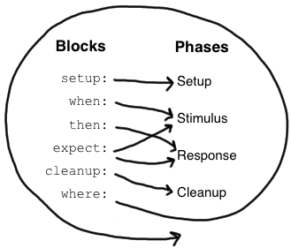

# 核心特性
* 可以应用于 java 或 groovy 应用的单元测试框架。
* 测试代码使用基于 groovy 语言扩展而成的规范说明语言（dsl）。
* 通过junit runner调用测试，兼容绝大部分junit的运行场景（ide，构建工具，持续集成等）。
* 框架的设计思路参考了JUnit, jMock, RSpec, Groovy, Scala, Vulcans, and other fascinating life forms。

# 优点
* spock框架使用标签分隔单元测试中不同的代码，更加规范，也符合实际写单元测试的思路
* 代码写起来更简洁、优雅、易于理解
* 由于使用groovy语言，所以也可以享受到脚本语言带来的便利
* 底层基于jUnit，不需要额外的运行框架
* 支持与spring集成

# Spock中的概念
## Specification
在Spock中，待测系统(system under test; SUT) 的行为是由specification所定义的。在使用Spock框架编写测试时，测试类需要继承自Specification类。

## Fields
Specification类中可以定义字段，这些字段在运行每个测试方法前会被重新初始化，跟放在setup()里是一个效果。

## Fixture Methods
预先定义的几个固定的函数，与junit或testng中类似

```groovy
def setup() {}          // run before every feature method  
def cleanup() {}        // run after every feature method  
def setupSpec() {}     // run before the first feature method  
def cleanupSpec() {}   // run after the last feature method
```

## Feature methods
这是 Spock Sepcification 的核心，其描述了SUT应具备的各项行为。每个Specification都会包含一组相关的Feature methods，如要测试1+1是否等于2，可以编写一个函数：

```groovy
def "sum should return param1+param2"() {
    expect:
    sum.sum(1,1) == 2
}
```

## blocks
每个feature method又被划分为不同的block，不同的block处于测试执行的不同阶段，在测试运行时，各个block按照不同的顺序和规则被执行，如下图：


下面分别解释一下各个block的用途。

### Setup Blocks
setup也可以写成given，在这个block中会放置与这个测试函数相关的初始化程序，如：

```groovy
setup:
def stack = new Stack()
def elem = "push me"
```

一般会在这个block中定义局部变量，定义mock函数等。

### When and Then Blocks
when与then需要搭配使用，在when中执行待测试的函数，在then中判断是否符合预期，如：

```groovy
when:
stack.push(elem)  

then:
!stack.empty
stack.size() == 1
stack.peek() == elem
```

#### 断言
条件类似junit中的assert，就像上面的例子，在then或expect中会默认assert所有返回值是boolean型的顶级语句。如果要在其它地方增加断言，需要显式增加assert关键字，如：

```groovy
def setup() {
  stack = new Stack()
  assert stack.empty
}
```

#### 异常断言

如果要验证有没有抛出异常，可以用thrown()，如下：

```groovy
when:
stack.pop()  

then:
thrown(EmptyStackException)
stack.empty
```

要获取抛出的异常对象，可以用以下语法：

```groovy
when:
stack.pop()  

then:
def e = thrown(EmptyStackException)
e.cause == null
```

如果要验证没有抛出某种异常，可以用notThrown()：

```groovy
def "HashMap accepts null key"() {
  setup:
  def map = new HashMap()  

  when:
  map.put(null, "elem")  

  then:
  notThrown(NullPointerException)
}
```

### Expect Blocks
expect可以看做精简版的when+then，如：

```groovy
when:
def x = Math.max(1, 2)  

then:
x == 2
```

可以简化为：

```groovy
expect:
Math.max(1, 2) == 2
```

### Cleanup Blocks
函数退出前做一些清理工作，如关闭资源等。

### Where Blocks
做测试时最复杂的事情之一就是准备测试数据，尤其是要测试边界条件、测试异常分支等，这些都需要在测试之前规划好数据。但是传统的测试框架很难轻松的制造数据，要么依赖反复调用，要么用xml或者data provider函数之类难以理解和阅读的方式。比如说：

```groovy
class MathSpec extends Specification {
    def "maximum of two numbers"() {
        expect:
        // exercise math method for a few different inputs
        Math.max(1, 3) == 3
        Math.max(7, 4) == 7
        Math.max(0, 0) == 0
    }
}
```

而在spock中，通过where block可以让这类需求实现起来变得非常搞笑：

```groovy
class DataDriven extends Specification {
    def "maximum of two numbers"() {
        expect:
        Math.max(a, b) == c

        where:
        a | b || c
        3 | 5 || 5
        7 | 0 || 7
        0 | 0 || 0
    }
}
```

上述例子实际会跑三次测试，相当于在for循环中执行三次测试，a/b/c的值分别为3/5/5,7/0/7和0/0/0。如果在方法前声明@Unroll，则会当成三个方法运行。

更进一步，可以为标记@Unroll的方法声明动态的spec名：

```groovy
class DataDriven extends Specification {
    @Unroll
    def "maximum of #a and #b should be #c"() {
        expect:
        Math.max(a, b) == c

        where:
        a | b || c
        3 | 5 || 5
        7 | 0 || 7
        0 | 0 || 0
    }
}
```

运行时，名称会被替换为实际的参数值。

除此之外，where block还有两种数据定义的方法，并且可以结合使用，如：

```groovy
where:
a | _
3 | _
7 | _
0 | _

b << [5, 0, 0]

c = a > b ? a : b
```

# Interaction Based Testing

对于测试来说，除了能够对输入-输出进行验证之外，还希望能验证模块与其他模块之间的交互是否正确，比如“是否正确调用了某个某个对象中的函数”；或者期望被调用的模块有某个返回值，等等。

各类mock框架让这类验证变得可行，而spock除了支持这类验证，并且做的更加优雅。

## mock

在spock中创建一个mock对象非常简单：

```groovy
class PublisherSpec extends Specification {
    Publisher publisher = new Publisher()
    Subscriber subscriber = Mock()
    Subscriber subscriber2 = Mock()

    def setup() {
        publisher.subscribers.add(subscriber)
        publisher.subscribers.add(subscriber2)
    }
}
```

而创建了mock对象之后就可以对它的交互做验证了：

```groovy
def "should send messages to all subscribers"() {
    when:
    publisher.send("hello")

    then:
    1 * subscriber.receive("hello")
    1 * subscriber2.receive("hello")
}
```

上面的例子里验证了：在publisher调用send时，两个subscriber都应该被调用一次receive(“hello”)。

示例中，表达式中的次数、对象、函数和参数部分都可以灵活定义：

```
1 * subscriber.receive("hello")      // exactly one call
0 * subscriber.receive("hello")      // zero calls
(1..3) * subscriber.receive("hello") // between one and three calls (inclusive)
(1.._) * subscriber.receive("hello") // at least one call
(_..3) * subscriber.receive("hello") // at most three calls
_ * subscriber.receive("hello")      // any number of calls, including zero
1 * subscriber.receive("hello")     // an argument that is equal to the String "hello"
1 * subscriber.receive(!"hello")    // an argument that is unequal to the String "hello"
1 * subscriber.receive()            // the empty argument list (would never match in our example)
1 * subscriber.receive(_)           // any single argument (including null)
1 * subscriber.receive(*_)          // any argument list (including the empty argument list)
1 * subscriber.receive(!null)       // any non-null argument
1 * subscriber.receive(_ as String) // any non-null argument that is-a String
1 * subscriber.receive({ it.size() > 3 }) // an argument that satisfies the given predicate
                                          // (here: message length is greater than 3)
1 * subscriber._(*_)     // any method on subscriber, with any argument list
1 * subscriber._         // shortcut for and preferred over the above
1 * _._                  // any method call on any mock object
1 * _                    // shortcut for and preferred over the above
```

得益于groovy脚本语言的特性，在定义交互的时候不需要对每个参数指定类型，如果用过java下的其它mock框架应该会被这个特性深深的吸引住。

## Stubbing

对mock对象定义函数的返回值可以用如下方法：

```groovy
subscriber.receive(_) >> "ok"
```

符号代表函数的返回值，执行上面的代码后，再调用subscriber.receice方法将返回ok。如果要每次调用返回不同结果，可以使用：

```groovy
subscriber.receive(_) >>> ["ok", "error", "error", "ok"]
```

如果要做额外的操作，如抛出异常，可以使用：

```groovy
subscriber.receive(_) >> { throw new InternalError("ouch") }
```

而如果要每次调用都有不同的结果，可以把多次的返回连接起来：

```groovy
subscriber.receive(_) >>> ["ok", "fail", "ok"] >> { throw new InternalError() } >> "ok"
```

## mock and stubbing

如果既要判断某个mock对象的交互，又希望它返回值的话，可以结合mock和stub，可以这样：

```groovy
then:
1 * subscriber.receive("message1") >> "ok"
1 * subscriber.receive("message2") >> "fail"
```

注意，spock不支持两次分别设定调用和返回值，如果把上例写成这样是错的：

```groovy
setup:
subscriber.receive("message1") >> "ok"

when:
publisher.send("message1")

then:
1 * subscriber.receive("message1")
```

此时spock会对subscriber执行两次设定：

第一次设定receive(“message1″)只能调用一次，返回值为默认值（null）。

第二次设定receive(“message1″)会返回ok，不限制次数。

## 其它类型的mock对象

spock也支持spy,stub之类的mock对象，但是并不推荐使用。因为使用“正规的”BDD思路写出的代码不需要用这些方法来测试，官方的解释是：

>Think twice before using this feature. It might be better to change the design of the code under specification

具体的使用方法如果有兴趣可以参考官方文档。

# 更多

官方也提供了一个示例项目：

[https://github.com/spockframework/spock-example](https://github.com/spockframework/spock-example)
