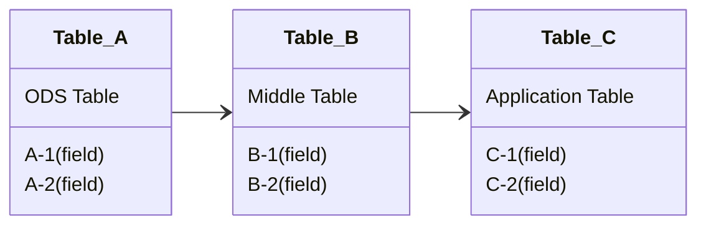

# 术语与定义

1. 对数据表的访问：是指对数据表的查询、插入、删除、修改操作。每一次操作算作一次访问。

1. `数据表固有热度`：对数据表访问的统计数据。

1. `数据表贡献热度`：对数据表访问时，会对其血缘关系表贡献的热度。贡献热度只会按照数据血缘路径向前传递。

# 算法

$$
H_a = HD_a + HI_{ab} + HI_{ac}\\
HI_{ab} = HD_b \times W_{ab}\\
W_{ab} = (F_a \cap F_b) \div F_a \times {\frac 1{2^n}}
$$

**说明** :

1. H~a~ ： `表 A` 的热度。
2. HD~a~ ： `表 A`的固有热度。HD 表示固有热度。
3. HI~ab~ ：`表 B`对`表 A`的贡献热度。HI 表示贡献热度。
4. W~ab~ ：`表 B`对`表 A`的血缘权重。直接血缘关系（如表A与表B的关系），公式中的 n = 0，中间每增加一个层级，n 数值加1。
5. F~a~ ：`表 A`中字段的集合。

# 图例

