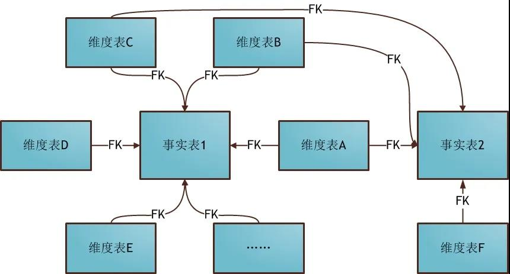

# 概述

数据仓库是一种通过（准）实时 / 批量的方式把各种外部数据源集成起来后，采用多种方式提供给最终用户进行数据消费的信息系统。

面对繁多的上游业务系统而言，数据仓库的一个重要任务就是进行数据清洗和集成，形成一个标准化的规范化的数据结构，为后续的一致性的数据分析提供可信的数据基础。

另一方面数据仓库里面的数据要发挥价值就需要通过多种形式表现，有用于了解企业生产状况的固定报表，有用于向管理层汇报的 KPI 驾驶舱，有用于大屏展示的实时数据推送，有用于部门应用的数据集市，也有用于分析师的数据实验室…… 对于不同的数据消费途径，数据需要从高度一致性的基础模型转向便于数据展现和数据分析的维度模型。不同阶段的数据因此需要使用不同架构特点的数据模型与之相匹配，这也就是数据在数据仓库里面进行数据分层的原因。

数据在各层数据中间的流转，就是从一种数据模型转向另外一种数据模型，这种转换的过程需要借助的就是 ETL 算法。打个比方，数据就是数据仓库中的原材料，而数据模型是不同产品形态的模子，不同的数据层就是仓库的各个“车间”，数据在各个“车间”的形成流水线式的传动就是依靠调度工具这个流程自动化软件，执行 SQL 的客户端工具是流水线上的机械臂，而 ETL 程序就是驱动机械臂进行产品加工的算法核心。

# 数仓分层架构

## 为什么要在数仓中分层

作为一名数据的规划者，我们肯定希望自己的数据能够有秩序地流转，数据的整个生命周期能够清晰明确被设计者和使用者感知到。直观来讲就是如下的左图这般层次清晰、依赖关系直观。

但是，大多数情况下，我们完成的数据体系却是依赖复杂、层级混乱的。如下的右图，在不知不觉的情况下，我们可能会做出一套表依赖结构混乱，甚至出现循环依赖的数据体系。

因此，我们需要一套行之有效的数据组织和管理方法来让我们的数据体系更有序，这就是谈到的数据分层。数据分层并不能解决所有的数据问题，但是，数据分层却可以给我们带来如下的好处：

**清晰数据结构**：每一个数据分层都有它的作用域和职责，在使用表的时候能更方便地定位和理解

**减少重复开发**：规范数据分层，开发一些通用的中间层数据，能够减少极大的重复计算

**统一数据口径**：通过数据分层，提供统一的数据出口，统一对外输出的数据口径

**复杂问题简单化**：将一个复杂的任务分解成多个步骤来完成，每一层解决特定的问题

## 金融行业中的分层模型（传统模式）

金融行业中的数据仓库是对模型建设要求最高也是最为成熟的一个行业，在多年的金融行业数据仓库项目建设过程中，基本上都形成了**缓冲层**，**基础模型层**，**汇总层（共性加工层）**，以及**集市层**。不同的客户会依托这四层模型做不同的演化，可能经过合并形成三层，也可能经过细分，形成五层或者六层。下述最常见的四层模型：

**缓冲层**：有的项目也称为 ODS（Operational Data Store） 层，简单说这一层数据的模型就是贴源的，是在仓库里面形成一个上游系统的落地缓冲带，原汁原味的生产数据在这一层得以保存和体现，所以这一层数据保留时间周期较短，常见的是7～15天，最大的用途是直接提供基于源系统结构的简单原貌访问，如审计等。

**基础层**：也称为核心层，基础模型层，PDM层等。ODS 之上的物理模型，放在这一层。数据按照主题域进行划分整合后，较长周期地保存详细数据。这一层数据高度整合，是整个数据仓库的核心区域，是所有后面数据层的基础。这一层保存的保存的数据最少13个月，常见的是2～5年。

**集市层**：先跳到最后一层。集市层的数据模型具备强烈的业务意义，便于业务人员理解和使用，是为了满足部门用户，业务用户，关键管理用户的访问和查询所使用的，而往往对接前端门户的数据查询，报表工具的访问，以及数据挖掘分析工具的探索。

**汇总层**：汇总层其实并不是一开始就建立起来的。往往是基础层和集市层建立起来后，发现众多的集市层数据进行汇总，统计，加工的时候存在对基础层数据的反复查询和扫描，而不同部门的数据集市的统计算法实际上是有共性的，所以主键的在两层之间，把具有共性的汇总结果形成一个独立的数据层次，承上启下，节省整个系统计算资源。

## 互联网行业中的分层模型（互联网模式）

互联网行业常用的分层方式：数据运营层（ ODS ）、数据仓库层（DW）和数据应用层（APP）。如下图所示。简单来讲，我们可以理解为：**ODS层存放的是接入的原始数据，DW层是存放我们要重点设计的数据仓库中间层数据，APP是面向业务定制的应用数据。**下面详细介绍这三层的设计。

- **数据运营层：ODS（Operational Data Store）**

  ODS 层，是最接近数据源中数据的一层，数据源中的数据，经过抽取、洗净、传输，也就是 ETL 之后，装入本层。本层的数据，总体上大多是按照源头业务系统的分类方式而分类的。

  一般来讲，为了考虑后续可能需要追溯数据问题，因此对于这一层就不建议做过多的数据清洗工作，原封不动地接入原始数据即可，至于数据的去噪、去重、异常值处理等过程可以放在后面的DWD层来做。

- **数据仓库层：DW（Data Warehouse）**

  数据仓库层是我们在做数据仓库时要核心设计的一层，在这里，从 ODS 层中获得的数据按照主题建立各种数据模型。DW层又细分为 DWD（Data Warehouse Detail）层、DWM（Data WareHouse Middle）层和DWS（Data WareHouse Servce）层。

  - **数据明细层：DWD（Data Warehouse Detail）**

    该层一般保持和ODS层一样的数据粒度，并且提供一定的数据质量保证。同时，为了提高数据明细层的易用性，该层会采用一些维度退化手法，将维度退化至事实表中，减少事实表和维表的关联。

    另外，在该层也会做一部分的数据聚合，将相同主题的数据汇集到一张表中，提高数据的可用性，后文会举例说明。

  - **数据中间层：DWM（Data WareHouse Middle）**

    该层会在DWD层的数据基础上，对数据做轻度的聚合操作，生成一系列的中间表，提升公共指标的复用性，减少重复加工。直观来讲，就是对通用的核心维度进行聚合操作，算出相应的统计指标。

  - **数据服务层：DWS（Data WareHouse Servce）**

    又称数据集市或宽表。按照业务划分，如流量、订单、用户等，生成字段比较多的宽表，用于提供后续的业务查询，OLAP分析，数据分发等。

    一般来讲，该层的数据表会相对比较少，一张表会涵盖比较多的业务内容，由于其字段较多，因此一般也会称该层的表为宽表。

    在实际计算中，如果直接从DWD或者ODS计算出宽表的统计指标，会存在计算量太大并且维度太少的问题，因此一般的做法是，在DWM层先计算出多个小的中间表，然后再拼接成一张DWS的宽表。由于宽和窄的界限不易界定，也可以去掉DWM这一层，只留DWS层，将所有的数据在放在DWS亦可。

- 数据应用层：APP（Application）

  在这里，主要是提供给数据产品和数据分析使用的数据，一般会存放在 ES、PostgreSql、Redis等系统中供线上系统使用，也可能会存在 Hive 或者 Druid 中供数据分析和数据挖掘使用。比如我们经常说的报表数据，一般就放在这里。

- 维表层（Dimension）

  最后补充一个维表层，维表层主要包含两部分数据：

  高基数维度数据：一般是用户资料表、商品资料表类似的资料表。数据量可能是千万级或者上亿级别。

  低基数维度数据：一般是配置表，比如枚举值对应的中文含义，或者日期维表。数据量可能是个位数或者几千几万。

# 维度建模

维度建模是专门用于分析型数据库、数据仓库、数据集市建模的方法。这里牵扯到两个基本的名词：维度，事实。

**维度**

维度是维度建模的基础和灵魂，在维度建模中，将度量成为事实，将环境描述为维度，维度是用于分析事实所需的多样环境。例如，在分析交易过程中，可以通过买家、卖家、商品和时间等维度描述交易发生的环境。

**事实**

事实表作为数据仓库维度建模的核心，紧紧围绕着业务过程来设计，通过获取描述业务过程的度量来表达业务过程，包含了引用的维度和与业务过程有关的度量。事实表中一条记录所表达的业务细节被称之为粒度。通常粒度可以通过两种方式来表述：一种是维度属性组合所表示的细节程度，一种是所表示的具体业务含义。

简单的说，维度表就是你观察该事物的角度（维度)，事实表就是你要关注的内容。例如用户使用滴滴打车，那么打车这件事就可以转化为一个事实表，即打车订单事实表，然后用户对应一张用户维度表，司机对应一张司机维度表。

## 维度建模的三种模型

### 星型模型

星型模型架构是一种非正规化的结构，特点是有一张事实表，多张维度表，是不存在渐变维度的，事实表和维度表通过主外键相关联，维度表之间是没有关联，因为维度表的数据冗余，所以统计查询时不需要做过多外部连接

### 雪花模型

雪花模型架构就是将星型模型中的某些维度表抽取成更细粒度的维度表，然后让维度表之间也进行关联，通过最大限度的减少数据存储量以及联合较小的维度表来改善查询性能。

下图为使用雪花模式进行维度建模的关系结构：

星形模型中的维表相对雪花模式来说要大，而且不满足规范化设计。雪花模型相当于将星形模型的大维表拆分成小维表，满足了规范化设计。雪花模型会导致开发难度增大，而数据冗余问题在数据仓库里并不严重。

### 星座模型

数据仓库由多个主题构成，包含多个事实表，而维表是公共的，可以共享，这种模式可以看做星型模型的汇集，因而称作星系模型或者事实星座模型。

事实上，星座模式是数据仓库最长使用的数据模式，尤其是企业级数据仓库（EDW）。这也是数据仓库区别于数据集市的一个典型的特征，从根本上而言，数据仓库数据模型的模式更多是为了避免冗余和数据复用，套用现成的模式，是设计数据仓库最合理的选择。

## 维度表设计

维度的设计过程就是确定维度属性的过程，如何生成维度属性，以及所生成维度属性的优劣，决定了维度是用的方便性，成为数据仓库易用性的关键。

数据仓库的能力直接与维度属性的质量和深度成正比。

### 维度表基本设计方法

以商品维度为例对维度设计方法进行详细说明。

第一步：确定维度，具备唯一性

作为维度建模的核心，在企业级数据仓库中，必须保证维度的唯一性。以商品维度为例，有且只有一个维度定义。

第二步：确定主维表，确定描述维度的主表

此处的主维表一般是 ODS 表，直接与业务系统同步。

第三步：确定相关表，根据业务之间的关联性，确定维度的相关表

数据仓库是业务源系统的数据整合，不同业务系统或者同一业务系统中的表之间存在关联性，根据业务系统的梳理，确定哪些表和主维表存在关联关系，并选择其中的某些表用于生成维度属性。以商品维度为例，根据业务逻辑的梳理，可以得到商品与类目、sku、买家、卖家、店铺等维度存在的关联关系。

第四步：确定维度属性

包含两个阶段，第一个阶段从主维表中选择维度属性，第二阶段从相关维表中选择维度属性。确定维度有以下原则：

- 尽可能丰富的维度属性，为下游分析、统计提供良好的基础
- 维度属性提供编码+文字的描述，编码用于表关联，文字表示真正的标签
- 沉淀出通用的维度属性，一来减少下游使用的复杂度，二来避免下游口径不一致

以商品维度为例，从主维表和类目、sku、卖家、店铺等相关维表中选择维度属性或者生成新的维度属性。

该模式就属于雪花模式。

对于商品维度，如果采用反规范化，将表现为下图所示的形式：

采用雪花模式，除了可以节约一部分存储之外，对于 OLAP 系统来说没有其他的效用。而现阶段存储的成本非常低。出于易用性和性能的考虑，维表一般设计成不规范化的。在实际应用中，几乎总是使用维表的空间来换取简明性和查询性能。

## 事实表设计

事实表作为数据仓库维度建模的核心，紧紧围绕着业务过程来设计，通过获取描述业务过程的度量来表达业务过程，包含了引用的维度和业务过程有关的度量。

相对维表来说，事实表要细长的多，行的增加速度也比维表快很多。事实表分为三种类型：事务事实表，周期快照事实表，累计快照事实表。本文主要讨论事务事实表，不做词义赘述。

### 事实表设计原则及基本设计方法

1. 尽可能包括所有业务过程相关的事实

2. 只选择与业务过程相关的事实

3. 分解不可加事实为可加的组件

4. 选择维度和事实之前必须先声明粒度

5. 在同一个事实表中不可以有多重不同粒度的事实

6. 事实的单位要保持一致

7. 对事实的 null 值要处理

8. 使用退化维提高事实表的易用性

任何类型的事件都可以被理解成一种事务。比如交易过程中的创建订单，买家付款，物流中的发货，签收，付款等。事务事实表针对这些过程创建的一种事实表。

下面店铺交易事务为例，阐述事务事实表的一般设计过程。

1. 选择业务过程及确定事实表类型：

交易的过程分为：创建订单、买家付款、卖家发货、买家确认收货，即下单、支付、发货和成功完结四个业务过程。Kimball 维度建模理论认为，为了便于进行独立的分析研究，应该为每一个业务过程建立一个事实表。

2. 声明粒度：

业务过程选定之后，就要对每个业务过程确定一个粒度，即确定事实表每一行所表达的细节层次。需要为四个业务过程确定粒度，其中下单、支付和成功完结选择交易子订单粒度，即每个子订单为事实表的一行，买家收货的粒度为物流单。

3. 确定维度：

完成粒度声明以后，也就意味着确定了主键，对应的维度组合以及相关的维度字段就可以确定了，应该选择能够描述清楚业务过程所处的环境的维度信息。在店铺交易事实表设计过程中，按照经常用于统计分析的场景，确定维度包含：买家、卖家、商品、商品类目、发货地区、收货地址、父订单维度以及杂项维度。

4. 确定事实：

作为过程度量的核心，事实表应该包含与其描述过程有关的所有事实。以店铺交易事实表为例，选定三个业务过程:下单、支付、成功完结，不同的业务过程有不同的事实。比如在下单业务过程中，需要包含下单金额、下单数量、下单分摊金额；

经过以上四步店铺交易事务事实表已成型，如下图所示：

在确定维度时，包含了买卖家维度，商品维度，类目维度，收发货等。Kimball 维度建模理论建议在事实表中只保留这个维度表的外键，但是在实际的应用中，可以将店铺名称、商品类型、商品属性、类目属性冗余到事实表中，提高对事实表的过滤查询，减少表之间的关联次数，加快查询速度，该操作称之为`退化维`。

经过以上的操作，基本完成了店铺交易事务事实表的设计工作。

# 元数据管理

元数据通常定义为`关于数据的数据`，在数据仓库中是定义和描述系统的结构，操作和内容的所有信息。

元数据贯穿了数据仓库的整个生命周期，使用元数据驱动数据仓库的开发，使数据仓库自动化，可视化。

在操作数据仓库时，操作的都是元数据，而元数据分为技术元数据和业务元数据。

业务元数据是为管理层和业务分析人员服务，从业务的角度描述数据，包括行业术语、数据的可用性、数据的意义等。常用的业务元数据有：维度和属性、业务过程、指标等规范化定义，用于更好的管理和使用数据。数据应用元数据，数据报表、数据产品等配置和运行元数据。

技术元数据是指数据仓库开发、管理、维护相关的数据，描述了数据的原信息，转换描述、数据映射、访问权限等。常用的技术元数据有：存储位置、数据模型、数据库表、字段长度、字段类型、ETL 脚本、SQL 脚本、接口程序、数据关系等。

元数据的存储有常用的两种，一种是以数据集为基础，每一个数据集有对应的元数据文件，每一个元数据文件对应数据集的元数据内容，另一种是以数据库为基础，由若干项组成，每一项标识元数据的一个元素。

# 任务调度与监控

在数据仓库建设中，有各种各样非常多的程序和任务，比如：数据采集任务、数据同步任务、数据清洗任务、数据分析任务等。这些任务除了定时调度，还存在非常复杂的任务依赖关系。

比如：数据分析任务必须等相应的数据采集任务完成后才能开始；数据同步任务需要等数据分析任务完成后才能开始；这就需要一个非常完善的任务调度与监控系统，它作为数据仓库的中枢，负责调度和监控所有任务的分配与运行。

# ETL

虽然数据仓库里面数据模型对于不同行业，不同业务场景有着千差万别，但从本质上从缓冲层到基础层的数据加工就是对于增/全量数据如何能够高效地追加到基础层的数据表中，并形成合理的数据历史变化信息链条；而从基础层到汇总层进而到集市层，则是如何通过关联，汇总，聚合，分组这几种手段进行数据处理。所以长期积累下来，对于数据层次之间的数据转换算法实际上也能形成固定的ETL算法，这也是市面上很多数据仓库代码生成工具能够自动化地智能化地形成无编码方式开发数据仓库ETL脚本的原因所在。

# 常见问题

## ODS / stg 层数据漂移问题

数据漂移是 ODS 数据的一个顽疾，通常是指 ODS 表的同一个业务日期数据中包含前一天或后一天凌晨附近的数据或者丢失当天变更数据。

**数据漂移的处理方式**：

1. 多获取后一天的数据
2. 通过多个时间戳字段限制时间来获取相对准确的数据。