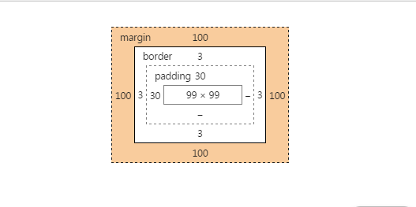
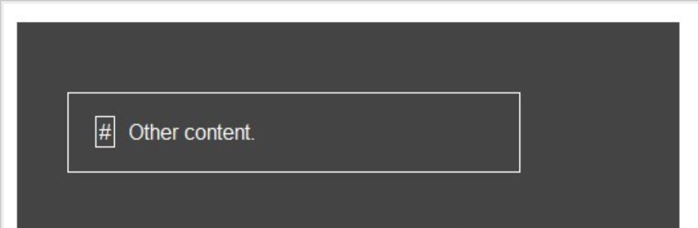

# CSS

[TOC]

## margin和padding的区别

（1）padding-left:10px; 左内边距
（2）padding-right:10px; 右内边距
（3）padding-top:10px; 上内边距
（4）padding-bottom:10px; 下内边距
（5）padding：10px; 四边统一内边距
（6）padding:10px 20px; 上下、左右内边距
（7）padding:10px 20px 30px; 上、左右、下内边距
（8）padding:10px 20px 30px 40px; 上、右、下、左内边距

（1）margin-left:10px; 左外边距
（2）margin-right:10px; 右外边距
（3）margin-top:10px; 上外边距
（4）margin-bottom:10px; 下外边距
（5）margin:10px; 四边统一外边距
（6）margin:10px 20px; 上下、左右外边距
（7）margin:10px 20px 30px; 上、左右、下外边距
（8）margin:10px 20px 30px 40px; 上、右、下、左外边距



## :before和:after的区别

:before和:after都是伪元素(pseudo element)。

什么是伪元素？它创建了一个虚假的元素，并插入到目标元素内容之前或之后。

伪元素插入的内容在页面的源码里是不可见的。只能在css里可见。

伪元素如果没有设置“content”属性，是无用的。

关于之前还是之后？注入的内容将是有关联的目标元素的子元素，但它会被置于这个元素的任何内容的“前”或“后”。举个例子：

```html
<p class="box">Other content.</p>	
```

下面是插入伪元素的css：

```css
p.box {
  width: 300px;
  border: solid 1px white;
  padding: 20px;
}

p.box:before {
  content: "#";
  border: solid 1px white;
  padding: 2px;
  margin: 0 10px 0 0;
}	
```

浏览器中查看的结果是：



### ::before和:before的区别

With the introduction of CSS3, in order to make a differentiation between pseudo-classes and pseudo-elements (yes, they’re different), in CSS3 **all pseudo-elements must use the double-colon syntax**, and **all pseudo-classes must use the single-colon syntax**.

## display 元素

display 属性用于定义建立布局时元素生成的显示框类型。

| 值            | 描述                                    |
| ------------ | ------------------------------------- |
| none         | 此元素不会被显示。                             |
| block        | 此元素将显示为块级元素，此元素前后会带有换行符。              |
| inline       | 默认。此元素会被显示为内联元素，元素前后没有换行符。            |
| inline-block | 行内块元素。（CSS2.1 新增的值）                   |
| list-item    | 此元素会作为列表显示。                           |
| table        | 此元素会作为块级表格来显示（类似\<table\>），表格前后带有换行符。 |
| inline-table | 此元素会作为内联表格来显示（类似\<table\>），表格前后没有换行符。 |

## !important

提升指定样式的优先级

```html
<!DOCTYPE HTML>
<html>
<head>
<title>测试Css中的!Important区别</title> 
</head> 
<style type="text/css">
.testClass{ 
color:blue !important;
}
</style>
<body>
    <div class="testClass" style="color:red;">
        测试Css中的Important
    </div>
</body>
</html>
```

此时会显示成蓝色。