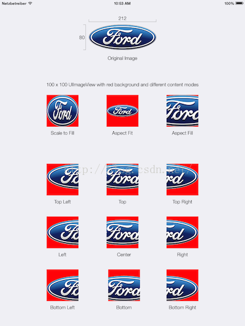

# Xcode解惑

## 关于图片的属性

| 属性            | 解释                                   |
| :------------ | :----------------------------------- |
| Aspect Fill   | 在保持长宽比的前提下，缩放图片，使图片充满容器。             |
| Aspect Fit    | 在保持长宽比的前提下，缩放图片，使得图片在容器内完整显示出来。      |
| Scale to Fill | 缩放图片，使图片充满容器。图片未必保持长宽比例协调，有可能会拉伸至变形。 |

其他属性，参考下图：

## StoryBoard 页面跳转方式

**Show**

根据当前屏幕中的内容，在master area或者detail area中展示内容。

例如：如果app当前同时显示master和detail视图，内容将会压入detail区域。

如果app当前仅显示master或者detail视图，内容则压入当前视图控制器堆栈中的顶层视图。

**Show Detail**

在detail area中展现内容。

例如：即使app同时显示master和detail视图，那么内容将被压入detail区域

如果app当前仅显示Master或者detail视图，那么内容将替换当前视图控制器堆栈中的顶层视图。

**Present Modally**

使用模态展示内容。属性面板中提供presentation style (UIModalPresentationStyle)与 transition style (UIModalTransitionStyle)两种选项

**Present as Popover**

在某个现有视图中的锚点处使用弹出框展示内容。这个选项可指定显示在弹出框视图一边上的箭头可用方向，同时也是指定锚点视图的一个选项。