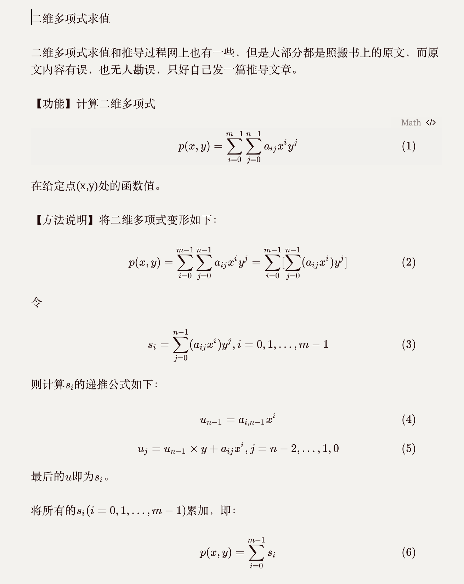

二维多项式求值

二维多项式求值和推导过程网上也有一些，但是大部分都是照搬书上的原文，而原文内容有误，也无人勘误，只好自己发一篇推导文章。

【功能】计算二维多项式

$$
p(x,y) = \sum_{i=0}^{m-1}\sum_{j=0}^{n-1}a_{ij}x^iy^j
$$

在给定点(x,y)处的函数值。

【方法说明】将二维多项式变形如下：
$$
p(x,y) = \sum_{i=0}^{m-1}\sum_{j=0}^{n-1}a_{ij}x^iy^j = \sum_{i=0}^{m-1}[\sum_{j=0}^{n-1}(a_{ij}x^i)y^j]
$$
令
$$
s_i = \sum_{j=0}^{n-1}(a_{ij}x^i)y^j,  i = 0,1,...,m-1
$$
则计算$s_i$的递推公式如下：
$$
u_{n-1} = a_{i, n-1}x^i
$$

$$
u_j = u_{n-1} \times y + a_{ij}x^i,  j = n-2, ... ,1,0
$$

最后的$u$即为$s_i$。

将所有的$s_i (i=0,1,…,m-1)$累加，即：
$$
p(x,y) = \sum_{i=0}^{m-1}s_i
$$

