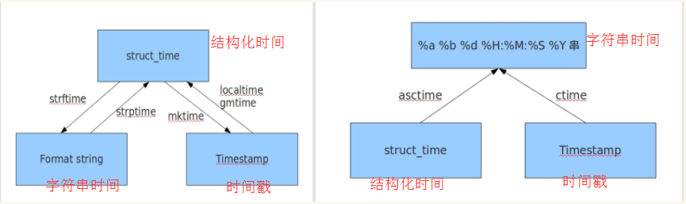

# time 模块

在 Python 中，通常有这几种方式来表示时间：

- 时间戳 (timestamp) ： 通常来说，时间戳表示的是从1970年1月1日00:00:00开始按秒计算的偏移量。
- 格式化的时间字符串（字符串时间） 如“2018-05-06”
- 元组 (struct_time) （结构化时间） ： struct_time 元组共有9个元素共九个元素:(年，月，日，时，分，秒，一年中第几周，一年中第几天，夏令时)

## 常用函数

### 1. time()

返回当前时间戳，“type(time.time())”，返回的是 float 类型。

### 2. localtime([secs])

将一个时间戳转换为当前时区的 struct_time，即时间数组格式的时间。secs 参数未提供，则以当前时间为准。

```python
tm_year    #年 1970-2018
tm_mon     #月 1-12
tm_mday    #日 1-31
tm_hour    #时 0-23
tm_min     #分 0-59
tm_sec     #秒 0-59
tm_wday    #一周中得第几天 0-6  ，星期一是0，周日是6
tm_yday    #一年中得第几天 0-365
tm_isdst   #是否是夏令时  0-1
```

### 3. gmtime([secs])

和 localtime() 方法类似，gmtime() 方法是将一个时间戳转换为 UTC 时区（0时区）的 struct_time。即返回当前的格林尼治时间的元组数值。

### 4. mktime(t)

将一个 struct_time 转化为时间戳。

### 5. asctime([t])

把一个表示时间的元组或者 struct_time 表示为这种形式：'Sun Jun 20 23:21:05 1993'。

### 6. ctime([secs])

把一个时间戳（按秒计算的浮点数）转化为 time.asctime() 的形式。如果参数未给或者为 None 的时候，将会默认 time.time() 为参数。它的作用相当于 time.asctime(time.localtime(secs))。

### 7. strftime(format[, t])

把一个代表时间的元组或者 struct_time（如由 time.localtime() 和 time.gmtime() 返回）转化为格式化的时间字符串。如果 t 未指定，将传入 time.localtime()。如果元组中任何一个元素越界，会被抛出 ValueError 的错误。

python中时间日期格式化符号：

> %y            两位数的年份表示(00 - 99）
> %Y           四位数的年份表示(000 - 9999）
> %m          月份(01 - 12）
> %d           月内中的一天（0 - 31)
> %H          24小时制小时数(0 - 23) #注意是大写
> %I           12小时制小时数(01 - 12)
> %M         分钟(00 - 59) #注意是大写
> %S          秒(00 - 59) #注意是大写
> %a          本地简化星期名称
> %A         本地完整星期名称
> %b         本地简化的月份名称
> %B         本地完整的月份名称
> %c         本地相应的日期表示和时间表示
> %j          年内的一天(001 - 366)
> %p         本地A.M.或P.M.的等价符
> %U         一年中的星期数(00 - 53)星期天为星期的开始
> %w         星期(0- 6)，星期天为星期的开始
> %W        一年中的星期数(00 - 53)星期一为星期的开始
> %x          本地相应的日期表示
> %X         本地相应的时间表示
> %Z         当前时区的名称
> %%        % 号本身

### 8. strptime(string[, format])

把一个格式化时间(字符串时间)字符串转化为 struct_time。实际上它和 strftime() 是逆操作。

### 9. sleep(secs)

线程推迟指定的时间运行，单位为秒。

## 示例

```python
import time
t1 = time.time()
print(t1)

t2 = time.localtime()
print(t2)
# 取结构化数据中的值
print(t2.tm_year)

t3 = time.gmtime()
print(t3)

print(time.mktime(t2))

print(time.asctime(t3))

print(time.ctime())

print(time.strftime("%Y-%m-%d %H:%M:%S",time.localtime()))

print(time.strptime("2018/05/07 20:33:32","%Y/%m/%d %H:%M:%S"))

print(time.sleep(2))
```

运行结果：

```shell
1535440017.912516
time.struct_time(tm_year=2018, tm_mon=8, tm_mday=28, tm_hour=15, tm_min=6, tm_sec=57, tm_wday=1, tm_yday=240, tm_isdst=0)
2018
time.struct_time(tm_year=2018, tm_mon=8, tm_mday=28, tm_hour=7, tm_min=6, tm_sec=57, tm_wday=1, tm_yday=240, tm_isdst=0)
1535440017.0
Tue Aug 28 07:06:57 2018
Tue Aug 28 15:06:57 2018
2018-08-28 15:06:57
time.struct_time(tm_year=2018, tm_mon=5, tm_mday=7, tm_hour=20, tm_min=33, tm_sec=32, tm_wday=0, tm_yday=127, tm_isdst=-1)
None
```

## time 不同形式相互转换



# random 模块

产生随机数的模块

## 常用函数

### 1. random()

随机产生大于0且小于1之间的小数

### 2. uniform(a, b)

返回一个介于 a 和 b 之间的浮点数。一般是 a<b，即返回 a 和 b 之间的浮点数，如果 a 大于 b，则是 b 到 a 之间的浮点数。这里的 a 和 b 都有可能出现在结果中。

### 3. randint(a, b)

返回 range[a,b] 之间的一个整数。

### 4. randrage(start, stop[, step])

randrange(start, stop[, step]) 返回 range[start,stop) 之间的一个整数，start\stop 必须是整数，可加 step，跟 range(0,10,2) 类似。

### 5. choice(seq)

从非空序列 seq（字符串也是序列）中随机选取一个元素。如果 seq 为空则弹出 IndexError 异常。

### 6. sample(population, k)

从population样本或集合中随机选取 k 个不重复的元素组成新的序列。

### 7. shuffle()

将列表的顺序打乱。

## 示例

```python
print(random.random())

print(random.uniform(1.1, 2.5))

print(random.randint(1, 3))

print(random.randrange(1, 5, 2))

print(random.choice([1,5,2,"ni",{"k1":"v1"},["hi",8]]))

print(random.sample([1,5,2,"ni",{"k1":"v1"},["hi",8]],3))

li = [1,5,2,3]
print(random.shuffle(li))
print(li)
```

运行结果：

```shell
0.3250115730426676
1.5995975114027763
2
3
5
[{'k1': 'v1'}, 5, 'ni']
None
[5, 2, 3, 1]
```

# string 模块

string 模块包含一些字符串常量

```python
print(string.ascii_lowercase)
print(string.ascii_uppercase)
print(string.ascii_letters)
print(string.digits)
print(string.hexdigits)
print(string.octdigits)
print(string.punctuation)
print(string.printable)
```

运行结果：

```shell
abcdefghijklmnopqrstuvwxyz
ABCDEFGHIJKLMNOPQRSTUVWXYZ
abcdefghijklmnopqrstuvwxyzABCDEFGHIJKLMNOPQRSTUVWXYZ
0123456789
0123456789abcdefABCDEF
01234567
!"#$%&'()*+,-./:;<=>?@[\]^_`{|}~
0123456789abcdefghijklmnopqrstuvwxyzABCDEFGHIJKLMNOPQRSTUVWXYZ!"#$%&'()*+,-./:;<=>?@[\]^_`{|}~
```

# shutil 模块

## 常用函数

### 1. copyfileobj(fsrc, fdst[, length])

将文件内容拷贝到另一个文件中，需要用open()函数打开文件，注意会替换目标文件的所有内容，不是追加。

### 2. copyfile(src, dst)

复制文件内容到另外一个文件，不需要打开文件，事实上，copyfile 调用了 copyfileobj。

未完待续。。。

# configparser 模块

configparse模块用于生成和修改，解析（读取分析，获得数据）常见配置文档，多数此类配置文件名格式为XXX.ini。

配置文件示例说明：

```ini
##### ini 文件示例 ########
  
[section1]     
name = nicholas
age = 18
   
[section2]
name:python
age = 19
  
#### 文件格式说明 #########
[XXX]  代表节点
XX = XX 或者 XX : XX 代表参数
#支持的两种分隔符“=”, “:”
```


