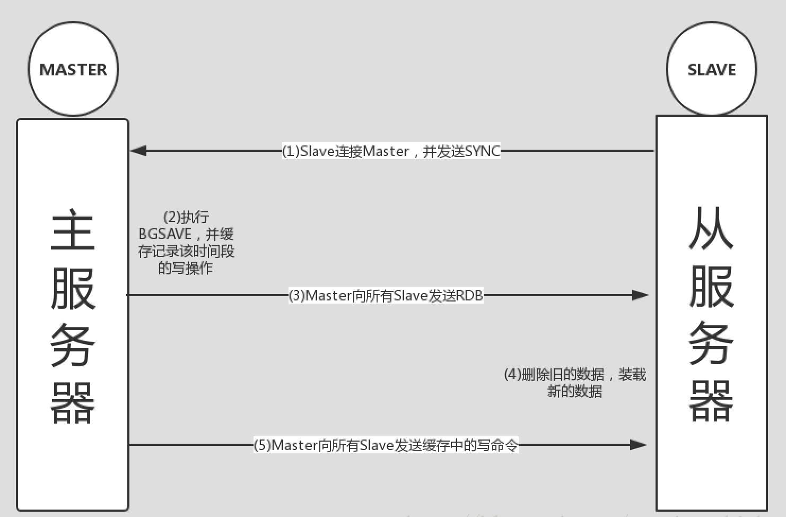
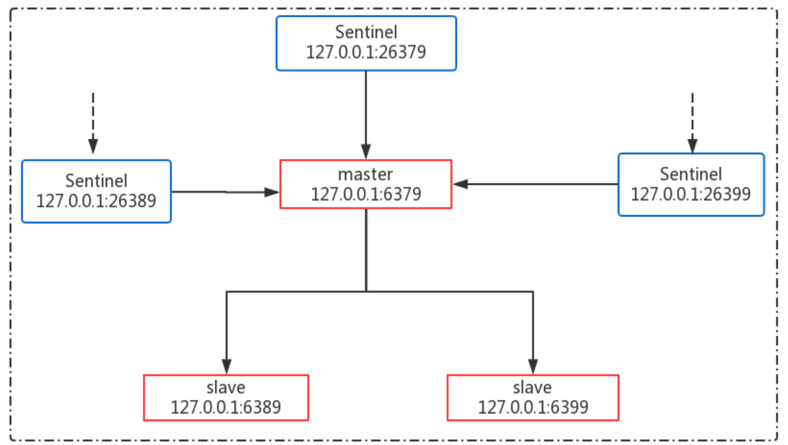

# 切片与非切片

- 在单服务器，或一主多从服务器模式，就是非切片模式。
- 切片模式是多主多从。切片使用非一致性哈希算法，在多主服务器上散列 key。

# 配置、持久化、复制

Redis的配置主要放置在 redis.conf，可以通过修改配置文件实现 Redis 许多特性，比如复制，持久化，集群等。

## redis.conf 部分配置详解

``` properties
# 启动 redis，显示加载配置 redis.conf
# ./redis-server /path/to/redis.conf

# 停止 redis
# redis-cli -h IP -p PORT shutdown

# 可以包含一个或多个其他配置文件，如果多个 redis 服务器存在标准配置模板，但是每隔 redis 服务器可能有个性化的配置
# include /path/to/local.conf
# include /path/to/other.conf

# 对于一个redis服务器来说可以有一个或者多个网卡。比如服务器上有两个网卡：bind 192.168.1.100 192.168.1.101，如果 bind 192.168.1.100，则只有该网卡地址接受外部请求，如果不绑定，则两个网卡都接受请求
# bind 192.168.1.100 192.168.1.101
# bind 127.0.0.1 ::1

# 监听端口号，默认为6379，如果为0监听任连接
port 6379

# TCP 连接中已完成队列的长度
tcp-backlog 511

#客户端和 Redis 服务端的连接超时时间，默认为0表示永不超时
timeout 0

# 服务端周期性时间（单位秒）验证客户端是否处在健康状态，避免服务端一直阻塞
tcp-keepalive 300

# Redis 以后台守护进程形式启动
daemonize yes

# 配置 PID 文件路径，当redis以守护进程启动时，它会把PID默认写到 /var/redis/run/redis_6379.pid文件里面
pidfile "/var/run/redis_6379.pid"

#Redis日志级别：debug，verbose，notice，warning，级别一次递增
loglevel notice

#日志文件路径及名称
logfile ""

```
## 持久化

为了能够重用 Redis 数据，或者防止系统故障，我们需要将 Redis 中的数据写入到磁盘空间中，即持久化。

Redis提供了两种不同的持久化方法可以将数据存储在磁盘中，一种叫快照（RDB），另一种叫只追加文件（AOF）。

### RDB 方式

Redis 通过创建快照的方式获取某一时刻 Redis 中所有数据的副本。用户可以针对该快照进行各种操作，比如：将快照复制到其他服务器从而完成 Redis 的主从复制，或者将快照留在原地，服务器重启的时候重用数据。

根据配置文件，可以手动设置Redis快照名及路径：

```properties
# RDB文件名
dbfilename "dump.rdb"
# RDB文件和AOF文件路径
dir "/usr/local/var/db/redis"
```

Redis创建快照主要有以下几种方式： 

(1) 客户端直接通过命令BGSAVE或者SAVE来创建一个快照

- BGSAVE是通过redis调用fork来创建一个子进程，然后子进程负责将快照写入磁盘，而父进程仍然继续处理命令。

- SAVE是在没有足够的内存空间去执行BGSAVE或者无所谓等待的时候。执行SAVE命令过程中，redis不在响应任何其他命令。


(2) 在 redis.conf 中设置 save 配置选项（应用开发中比较常用）

```properties
# 在规定的时间内，Redis 发生写操作的次数的条件，会触发 BGSAVE 命令。
# save <seconds> <changes>
# 当用户设置了多个 save 的选项配置，只要其中任一条满足，Redis 都会触发一次 BGSAVE 操作，比如：900秒之内至少一次写操作、300秒之内至少发生10次写操作、60秒之内发生至少10000次写操作都会触发发生快照操作
save 900 1
save 300 10
save 60 10000
```

(3) 当 Redis 通过 shutdown 命令关闭服务器请求时，会执行 SAVE 命令创建一个快照，如果使用 kill -9 PID 将不会创建快照。

(4) 主从同步，这个将在下面一小节讲解。

(5) **注意：**

* 在只使用快照持久化来报错数据时，如果系统崩溃或者强杀，用户将会丢失最近一次生成快照之后更改的所有数据。因此如果应用程序对于两次快照间丢失的数据可接受，利用快照就是一个很好的方式，但是往往一些系统对于丢失几分钟的数据都不可接受，比如高频的电子商务系统。
* 此外，如果 Redis 存储的数据量长达数十 G 的时候，每执行一次快照需要花费大量时间，严重影响到服务器的性能。

因此，针对上述的问题，可以使用 AOF 方式来持久化数据。

### AOF 方式

在执行写命令时，AOF 持久化会将执行的写命令也写到 AOF 文件的末尾，以此来记录数据的变化。换句话说，将 AOF 文件中包含的内容重新执行一遍，就可以回复 AOF 文件所记录的数据集。

在 Redis.conf 配置中设置如下：

```properties
# redis 默认关闭 AOF 机制，可以将 no 改成 yes 实现 AOF 持久化
appendonly no
# AOF 文件
appendfilename "appendonly.aof"
# AOF 持久化同步频率，always 表示每个 Redis 写命令都要同步 fsync 写入到磁盘中，但是这种方式会严重降低 redis 的速度；everysec 表示每秒执行一次同步 fsync，显示的将多个写命令同步到磁盘中；no 表示让操作系统来决定应该何时进行同步 fsync，Linux 系统往往可能30秒才会执行一次
# appendfsync always
appendfsync everysec
# appendfsync no

# 在日志进行 BGREWRITEAOF 时，如果设置为 yes 表示新写操作不进行同步 fsync，只是暂存在缓冲区里，避免造成磁盘 IO 操作冲突，等重写完成后在写入。redis 中默认为 no  
no-appendfsync-on-rewrite no   
# 当前 AOF 文件大小是上次日志重写时的 AOF 文件大小两倍时，发生 BGREWRITEAOF操作。
auto-aof-rewrite-percentage 100  
# 当前 AOF 文件执行 BGREWRITEAOF 命令的最小值，避免刚开始启动 Reids时由于文件尺寸较小导致频繁的 BGREWRITEAOF。  
auto-aof-rewrite-min-size 64mb  
# Redis 再恢复时，忽略最后一条可能存在问题的指令(因为最后一条指令可能存在问题，比如写一半时突然断电了)
aof-load-truncated yes
# Redis4.0 新增 RDB-AOF 混合持久化格式，在开启了这个功能之后，AOF 重写产生的文件将同时包含 RDB 格式的内容和 AOF 格式的内容，其中 RDB 格式的内容用于记录已有的数据，而 AOF 格式的内存则用于记录最近发生了变化的数据，这样Redis就可以同时兼有 RDB 持久化和 AOF 持久化的优点（既能够快速地生成重写文件，也能够在出现问题时，快速地载入数据）。
aof-use-rdb-preamble no
```

RDB 与 AOF 同时开启，默认先加载 AOF 的配置文件，因此需要根据具体情况使用，4.0+的可以使用 RDB-AOF 混合持久化格式。

## 复制

本部分只介绍主从同步的简单实现，并利用哨兵机制实现高可用，不介绍集群 Cluster 无中心的方式。

### Redis 主从复制

在 Redis 中实现主从复制比较简单，只需要修改 slave 服务器的 redis.conf 中的 slaveof。下面利用一个具体的实例展示主从同步。

### 主从复制示例

> 环境如下： MacOS，Redis 版本4.0.2 
>
> master 服务器：127.0.0.1 : 6379 
>
> slave    服务器：127.0.0.1 :  6399

配置 slave 服务器：

```properties
# 设置 master 服务器 IP 和端口
slaveof 127.0.0.1 6379 
# slave 是否只读，从服务器负责读操作，主服务器负责写操作，从而实现读写分离
slave-read-only yes
```

分别按照顺序启动 mater (redis-server redis.conf)和 slave(redis-server redis2.conf) 

在 master 中添加元素，在 slave 服务器中可以获得元素。

### 主从复制如何交互

下面来研究下 slave 服务器和 master 服务器间是如何建立起主从同步机制的。 




1. Slave 服务启动，主动连接 Master，并发送 SYNC 命令，请求初始化同步
2. Master 收到 SYNC 后，执行 BGSAVE 命令生成 RDB 文件，并缓存该时间段内的写命令
3. Master 完成 RDB 文件后，将其发送给所有 Slave 服务器
4. Slave 服务器接收到 RDB 文件后，删除内存中旧的缓存数据，并装载 RDB 文件
5. Master 在发送完 RDB 后，即刻向所有 Slave 服务器发送缓存中的写命令
6. 至此初始化完成，后续进行增量同步

上述主从复制模式链是非常脆弱的，一旦 Master 服务器发生宕机，会导致无法向 redis 中读取或者写入数据，高可用性极差。 

# 高可用性集群

上述主从复制机制，简单地实现了 Redis 高可用。然而，Master服务器宕机，会导致整个 Redis 瘫痪，这种方式的高可用性较低。正常会采用多台 Redis 服务器构成一个集群，即使某台，或者某几台 Redis 宕机，Redis 集群仍能正常运行，从而提高其可用性。

在 Redis 中，主要存在两种方式实现 Redis 集群机制：

* Redis Sentinel 集群机制: 在 Redis2.X 版本，往往都是通过这种方式实现 Redis 的高可用。redis-sentinel 是在 master-slave 机制上加入监控机制哨兵 Sentinel 实现的。
* Redis Cluster 集群机制: 在 Redis3.0 版本后推出了 redis-cluster 集群机制。redis-cluster 集群中各个节点之间是对等的，即 master-master 模式。

**注意：**Redis Sentinel 集群是解决 HA 问题的（主从同步），Redis Cluster 集群是解决 sharding 问题的（分区），两种不重复，可以混合使用。

* [Sharding 机制](http://blog.csdn.net/basycia/article/details/52013098)
* [HA 机制](https://baike.baidu.com/item/%E9%AB%98%E5%8F%AF%E7%94%A8%E6%80%A7(HA)/2355576)

下面详细说明这两种集群，并给出具体的演示示例。

## Redis Sentinel 集群机制

Redis-Sentinel 是在 master-slave 机制上加入监控机制哨兵 Sentinel 实现的。Sentinel 主要功能就是为 Redis Master-Slave 集群提供：

* 监控（Monitoring）： Sentinel 会不断地检查你的主服务器和从服务器是否运作正常。
* 提醒（Notification）： 当被监控的某个 Redis 服务器出现问题时， Sentinel 可以通过 API 向管理员或者其他应用程序发送通知。
* 自动故障迁移（Automatic failover）： 当一个主服务器不能正常工作时， Sentinel 会开始一次自动故障迁移操作， 它会将失效主服务器的其中一个从服务器升级为新的主服务器， 并让失效主服务器的其他从服务器改为复制新的主服务器； 当客户端试图连接失效的主服务器时， 集群也会向客户端返回新主服务器的地址， 使得集群可以使用新主服务器代替失效服务器。

在 Sentinel 集群中，一个最小的 Master-Slave 单元包含一个 master 和一个 slave 服务器。当 master 失效后，sentinel 自动将 slave 提升为 master，从而可以减少管理员的人工切换 slave 的操作过程。

### Redis-Sentinel 集群架构图



### 各个机器配置

部署在本地机器上，保证各个端口号不一样，具体配置如下

Redis 服务器：

- master:   127.0.0.1:6379

- slave01:  127.0.0.1:6389
- slave02:  127.0.0.1:6399

Sentinel 服务器

- sentinel01: 127.0.0.1:26379
- sentinel02: 127.0.0.1:26389
- sentinel03: 127.0.0.1:26399

### redis.conf 和 sentinel.conf 配置

#### redis.conf

##### master 特殊配置如下：

```properties
# 后台线程启动
daemonize yes
# 监听端口号
port 6379
# 访问验证密码
requirepass "123456"
```

##### slave 特殊配置如下：

```properties
# 后台线程启动
daemonize yes
# 监听端口号，如果为 slave02,端口号为6399
port 6389
# 主节点访问密码
masterauth "123456"
# 访问验证密码
requirepass "123456"
# 主节点服务器 IP 和端口号
slaveof 127.0.0.1 6379
```

#### sentinel.conf

```properties
# 后台线程启动
daemonize yes
# 监听端口号，如果为 sentinel02，则端口号为26389，如果为 sentinel01，则端口号为26399
port 26379
# 1表示在 sentinel 集群中只要有两个节点检测到 redis 主节点出故障就进行切换
sentinel monitor mymaster 127.0.0.1 6379 1
# master 节点密码验证
sentinel auth-pass mymaster 123456
# 如果3秒内 mymaster 无响应，则认为 mymaster 宕机了
sentinel down-after-milliseconds mymaster 3000
# 选项指定了在执行故障转移时，最多可以有多少个从服务器同时对新的主服务器进行同步，这个数字越小，完成故障转移所需的时间就越长
sentinel parallel-syncs mymaster 1
# 如果10秒后,mysater 仍没活过来，则启动 failover 
sentinel failover-timeout mymaster 10000
```

注意：

1. 如果上述涉及的所有配置均放置在同一目录下，需保证各配置名称不同；
2. 在配置中，不同实例的日志输出、快照文件要求名称不能一样，具体可自行配置；
3. 一定要保证"sentinel myid"不相同，否则无法进行故障转移。

### 启动集群及启动后结果详情展示

各Redis节点启动：

```shell
redis-server redis_****.conf
```

各Sentinel节点启动：

```shell
redis-sentinel sentinel_****.conf
```

Redis Master节点详情展示：


这里写图片描述
Redis Slave节点效果截图展示 
这里写图片描述
各个Sentinel节点详情展示 
这里写图片描述
1.5 高可用性场景测试

Master宕机 
这里写图片描述
sentinel使用failover机制重新选举出master
Master恢复 
这里写图片描述
master节点恢复后，由Master变成slave
Slave宕机 
这里写图片描述
哨兵发现6399已经宕机，等待6399的恢复(主观下线)
Slave重启6399节点 
这里写图片描述
如果想详细了解sentinel机制的话，可以参考博客： 
http://shift-alt-ctrl.iteye.com/blog/1884370
## Redis Cluster 集群机制

### Redis-cluster 介绍

Redis-cluster 是一种服务器 Sharding 技术，Redis3.0以后版本正式提供支持。

Redis-cluster 没有使用一致性 hash，而是引入了哈希槽的概念。Redis-cluster 中有16384个哈希槽，每个 key 通过 CRC16校验后对16384取模来决定放置哪个槽。Cluster 中的每个节点负责一部分 hash 槽（hash slot），比如集群中存在三个节点，则可能存在的一种分配如下：

- 节点A包含0到5500号哈希槽；

- 节点B包含5501到11000号哈希槽；
- 节点C包含11001 到 16384号哈希槽。

这种集群架构很容易扩展，如果扩充一个节点 D，只需要将 A、B、C 节点中的部分槽放置在 D 上；如果想移除节点 A，只需要将 A 的 slot 转移到 B 和 C 节点上。由于将哈希槽从一个节点移动到另一个节点不需要停止服务，只需要通过命令直接再分配，因而上述拓展不会造成集群不可用。目前这种方式还是一种半自动的方式，需要人工介入。

### Redis-Cluster主从复制

在 Redis-Cluster 中，如果某个节点宕机或者处在不可用状态时，那它负责的 Hash槽也将失效，导致整个集群不可用。因而为了提供高可用性，正常会将每个节点配置成主从式结构，即一个 master 节点，挂在多个 slave 节点。如果 Master 节点失效时，集群便会选取一个 slave 节点作为 master，继续提供服务，从而不会导致整个集群不可用。

### Redis-Cluster集群模拟

2.3.1 Redis-Cluster集群准备

集群部署图 
这里写图片描述
集群由三个节点组成，每个节点均为主从式架构。因而共需要创建6个Redis实例，分配如下：

Redis01:127.0.0.1:7000
Redis02:127.0.0.1:7001
Redis03:127.0.0.1:7002
Redis04:127.0.0.1:7003
Redis05:127.0.0.1:7004
Redis06:127.0.0.1:7005
对于每个实例的redis_700*.conf配置如下:

# 监听端口号
port 700*
# 开启集群
cluster-enabled yes
# 修改集群加载配置文件，不需要手动创建，启动后默认生成，并且需要时自动更新
cluster-config-file /Users/guweiyu/develop/redis/redis-cluster/workpid/nodes-7000.conf
# 集群中的节点能够失联的最大时间，超过这个时间，该节点就会被认为故障
cluster-node-timeout 15000
# 默认为“no”，表示部分Key所在的节点不可用时，集群仍然为可达节点提供服务；如果为“yes”,表示部分key所在的节点不可用时，则整个集群停止服务。注意:实际使用中要修改为"yes"
cluster-require-full-coverage no
1
2
3
4
5
6
7
8
9
10
11
安装ruby，如果为Mac OS系统，直接执行即可：

brew install ruby
1
2.3.2 集群启动

启动所有Redis实例，可以编写一个启动和停止所有redis实例的脚本(start.sh，stop.sh)

redis-server redis_7000.conf
redis-server redis_7001.conf
redis-server redis_7002.conf
redis-server redis_7003.conf
redis-server redis_7004.conf
redis-server redis_7005.conf

ps -ef | grep redis-server
echo "redis 7000-7005全部启动完成"
1
2
3
4
5
6
7
8
9
redis-cli -p 7000 shutdown
redis-cli -p 7001 shutdown
redis-cli -p 7002 shutdown
redis-cli -p 7003 shutdown
redis-cli -p 7004 shutdown
redis-cli -p 7005 shutdown

ps -ef | grep redis-server
echo "redis-server 7000-7005节点已全部停止"
1
2
3
4
5
6
7
8
9
创建redis-cluster
Redis中创建集群是通过redis-trib.rb命令实现的，redis-trib.rb位于Redis源码的src目录下，可将其直接拷贝到当前目录下。

运行命令

./redis-trib.rb create --replicas 1 127.0.0.1:7000 127.0.0.1:7001 127.0.0.1:7002 127.0.0.1:7003 127.0.0.1:7004 127.0.0.1:7005
1
如果出现如下错误：

/System/Library/Frameworks/Ruby.framework/Versions/2.3/usr/lib/ruby/2.3.0/rubygems/core_ext/kernel_require.rb:55:in `require': cannot load such file -- redis (LoadError)
    from /System/Library/Frameworks/Ruby.framework/Versions/2.3/usr/lib/ruby/2.3.0/rubygems/core_ext/kernel_require.rb:55:in `require'
    from ./redis-trib.rb:25:in `<main>'
1
2
3
这是由于没有安装redis的第三方接口导致的。因此需要给Ruby安装client包，如下(必须加上sudo执行，否则会执行失败)：

sudo gem install redis
1
再执行创建集群命令，结果如下：

>>> Creating cluster
>>> Performing hash slots allocation on 6 nodes...
Using 3 masters:
127.0.0.1:7000
127.0.0.1:7001
127.0.0.1:7002
Adding replica 127.0.0.1:7004 to 127.0.0.1:7000
Adding replica 127.0.0.1:7005 to 127.0.0.1:7001
Adding replica 127.0.0.1:7003 to 127.0.0.1:7002
>>> Trying to optimize slaves allocation for anti-affinity
[WARNING] Some slaves are in the same host as their master
M: aab0162a039d2f224322afe6caf2e153230f2d82 127.0.0.1:7000
   slots:0-5460 (5461 slots) master
M: 058204226f52757925a606b9697a8e39756bfdff 127.0.0.1:7001
   slots:5461-10922 (5462 slots) master
M: 857075aef280cf35cd369ebc30738cd31c05e479 127.0.0.1:7002
   slots:10923-16383 (5461 slots) master
S: 7dac141fa9510315905f505be52bba0208c391ab 127.0.0.1:7003
   replicates aab0162a039d2f224322afe6caf2e153230f2d82
S: 65a2bc432e5930e97f0fd172eb838af9f07229b6 127.0.0.1:7004
   replicates 058204226f52757925a606b9697a8e39756bfdff
S: 3d2a665d2e2eb28acb0a187c1a0b4bbce9ce87d2 127.0.0.1:7005
   replicates 857075aef280cf35cd369ebc30738cd31c05e479
Can I set the above configuration? (type 'yes' to accept): yes
>>> Nodes configuration updated
>>> Assign a different config epoch to each node
>>> Sending CLUSTER MEET messages to join the cluster
Waiting for the cluster to join...
>>> Performing Cluster Check (using node 127.0.0.1:7000)
M: aab0162a039d2f224322afe6caf2e153230f2d82 127.0.0.1:7000
   slots:0-5460 (5461 slots) master
   1 additional replica(s)
S: 3d2a665d2e2eb28acb0a187c1a0b4bbce9ce87d2 127.0.0.1:7005
   slots: (0 slots) slave
   replicates 857075aef280cf35cd369ebc30738cd31c05e479
S: 65a2bc432e5930e97f0fd172eb838af9f07229b6 127.0.0.1:7004
   slots: (0 slots) slave
   replicates 058204226f52757925a606b9697a8e39756bfdff
S: 7dac141fa9510315905f505be52bba0208c391ab 127.0.0.1:7003
   slots: (0 slots) slave
   replicates aab0162a039d2f224322afe6caf2e153230f2d82
M: 857075aef280cf35cd369ebc30738cd31c05e479 127.0.0.1:7002
   slots:10923-16383 (5461 slots) master
   1 additional replica(s)
M: 058204226f52757925a606b9697a8e39756bfdff 127.0.0.1:7001
   slots:5461-10922 (5462 slots) master
   1 additional replica(s)
[OK] All nodes agree about slots configuration.
>>> Check for open slots...
>>> Check slots coverage...
[OK] All 16384 slots covered.
1
2
3
4
5
6
7
8
9
10
11
12
13
14
15
16
17
18
19
20
21
22
23
24
25
26
27
28
29
30
31
32
33
34
35
36
37
38
39
40
41
42
43
44
45
46
47
48
49
50
51
创建成功，16384个Hash槽分配完成，所有节点（Master和slave节点）均已加入到集群中。三个Master节点分配的Hash槽及从节点如下：

Master01：127.0.0.1:7000

M: aab0162a039d2f224322afe6caf2e153230f2d82 
slots:0-5460 (5461 slots) master
127.0.0.1:7004 to 127.0.0.1:7000
1
2
3
Master02：127.0.0.1:7001

M: 058204226f52757925a606b9697a8e39756bfdff 
slots:5461-10922 (5462 slots) master
127.0.0.1:7005 to 127.0.0.1:7001
1
2
3
Master03：127.0.0.1:7002

M: 857075aef280cf35cd369ebc30738cd31c05e479 
slots:10923-16383 (5461 slots) master
127.0.0.1:7003 to 127.0.0.1:7002
1
2
3
2.3.3 集群测试

测试集群存取值
客户端命令redis-cli连接集群需要带上”-c”, 比如redis-cli -c -p 端口号

127.0.0.1:7000> set test1 guweiyu
OK
127.0.0.1:7000> set name  guweiyu
-> Redirected to slot [5798] located at 127.0.0.1:7001
OK
127.0.0.1:7001> get name
"guweiyu"
127.0.0.1:7001> get test1
-> Redirected to slot [4768] located at 127.0.0.1:7000
"guweiyu"
127.0.0.1:7000>
1
2
3
4
5
6
7
8
9
10
11
测试发现”set test1 guweiyu”，直接返回OK，说明该值就是存储在7000上，执行“set name guweiyu”发生了Redirected到7001上，获取的时候，同样出现上述情况。这个是Redis Cluster去中心特性，访问集群中的任一节点，均可直接操作集群。

主节点宕机测试

从节点宕机

*
版权声明：本文为博主原创文章，未经博主允许不得转载。  https://blog.csdn.net/guweiyu_thinker/article/details/79188281
个人分类： Redis学习

想对作者说点什么？ 我来说一句
Redis之——搭建高可用及负载均衡的Redis
之前，给大家介绍了一些关于Redis的文章，大家可以参见博文中有关Redis的文章。今天，我们就一起来学习如何搭建高可用及负载均衡的Redis，好了，不多说了，我们直接进入正题吧。 一、测试环境 1、...
 l1028386804 l1028386804
2016-09-18 21:57:25
阅读数：15536
Redis哨兵—实现Redis高可用
概述 Redis哨兵为Redis提供了高可用性。实际上这意味着你可以使用哨兵模式创建一个可以不用人为干预而应对各种故障的Redis部署。 哨兵模式还提供了其他的附加功能，如监控，通知，为客...
 lee_nacl lee_nacl
2017-03-20 14:49:41
阅读数：1867
搭建一个redis高可用系统 - CSDN博客
redis sentinel可以将一个从redis升级为主redis,并对其他从redis进行配置,让它们...概述Redis哨兵为Redis提供了高可用性。实际上这意味着你可以使用哨兵模式创建一个...
2018-5-4
redis详解(四)-- 高可用分布式集群 - CSDN博客
在Redis中是支持这杨配置的,一台master,一台slave,同时这台salve又作为其他...至少部署两台Redis服务器构成一个小的集群,主要有2个目的: 高可用性:在主机挂掉...
2018-5-4
广告
搭建一个redis高可用系统
原网址：http://www.jianshu.com/p/c2ab606b00b7 一、单个实例 当系统中只有一台redis运行时，一旦该redis挂了，会导致整个系统无法运行。 ...
 jack__ming jack__ming
2017-05-18 23:08:14
阅读数：2021
部署高可用的Redis集群架构 - CSDN博客
单实例模式是指单台redis完成所有请求任务,因此复用和不具备容错性;同时在单台机器...如同redis主从配置使用sentinel作为代理来处理请求一样。 下面三点是redis官方文档...
2018-3-30
redis 高可用解决方案 - seapeak007的博客 - CSDN博客
本文主要介绍一种通过Jedis&Sentinel实现Redis集群高可用方案,该方案需要使用Jedis2...故障恢复和配置变更,一般在生产环境中部署多个实例来提高系统可用性,只要有一个...
2017-7-18
一个简单的redis高可用方案
redis简单的高可用方式
 qq_22123167 qq_22123167
2017-04-03 00:33:27
阅读数：991
企业级Redis数据库高可用解决方案
企业级Redis数据库高可用解决方案   背景： 最近比较火的Redis非关系数据，可基于内存亦可持久化的日志型、Key-Value数据库。由于服务器的内存管理能力有限，使用过大内存的Redis...
 wanwengjie wanwengjie
2016-06-20 11:27:46
阅读数：1963
Redis 高可用性部署 - CSDN博客
notify_stop /etc/keepalived/scripts/redis_stop.sh  } 在Slave上创建如下配置文件:  vrrp_script chk_redis {  script “/etc/keepalived/scripts/redis...
2018-1-26
理解redis高可用方案
如何容灾?即某个redis节点出了问题如何保证服务的高可用性 如何横向扩容?当数据...bind需要注意的就是需要配置为其它机器可以访问的ip,否则无论是创建集群还是客户...
2017-6-30
Redis之高可用方案
Redis以其高效的访问速度著称。但由于官方还未发布redis-cluster，而redis的replica又有诸多不便：比如一组master-slave的机器，如果之间有链接瞬段，或者对slave重...
 zgl_dm zgl_dm
2012-12-19 10:22:04
阅读数：11506
腰椎疼痛不止？只需一招就解决！
青青 · 顶新
Redis 高可用架构最佳实践 - CSDN博客
在讲解 Redis 高可用方案之前,我们先来看看 Redis Sentinel 原理(https://redis.io/topics/sentinel)是怎么样的。 Sentinel 集群通过给定的配置文件发现 master,启...
2018-5-8
如何部署高可用的Redis集群架构 - CSDN博客
如何部署高可用的Redis集群架构 Redis 是一个开源(BSD许可)的,内存中的数据结构存储系统,它可以用作数据库、缓存和消息中间件。 本文主要介绍redis在不同模式下的...
2018-4-7
Redis 高可用架构最佳实践
http://www.sohu.com/a/150426358_505802 一、前言 2017 年 5 月 13 日，应用性能管理大讲堂广州站圆满落幕，其中来自三七互娱的 DBA 温...
 tengxing007 tengxing007
2017-08-13 21:33:16
阅读数：901
Redis高可用-Cluster
I.准备vm Centos7 64位 master:10.1.125.152 slave1:10.1.125.89  slave2:10.1.125.212 slave3:10.1.125.203 s...
 dingsai88 dingsai88
2016-03-29 14:11:45
阅读数：1294
Redis 高可用方案Keepalived - CSDN博客
在redis3.0没有现世之前,为了提高redis的高可用性,通常的做法是采用HAProxy或Keepalived来实现故障自动转移,事实上如果是做Failover而非负载均衡的话,Keepalived的效率...
2018-2-28
undefined
Redis高可用方案-哨兵与集群
Redis高可用方案 一.名词解释 二.主从复制        Redis主从复制模式可以将主节点的数据同步给从节点，从而保障当主节点不可达的情况下，从节点可以作...
 sunhuiliang85 sunhuiliang85
2017-10-27 09:38:29
阅读数：1003
Redis Cluster高可用(HA)集群环境搭建详细步骤
1.为什么要有集群由于Redis主从复制架构每个数据库都要保存整个集群中的所有数据,容易形成木桶效应，所以Redis3.0之后的版本添加特性就是集群(Cluster)2.Redis集群架构说明 架构...
 RobertoHuang RobertoHuang
2017-04-26 22:17:58
阅读数：5562
【方法】Redis集群生产环境高可用方案实战过程
布署方案说明 1、sentinel负责对redis集群中的主从服务监控、提醒和自动故障转移 2、redis集群负责对外提供相关服务 Sentinel原理介绍 原理：...
 English0523 English0523
2017-05-16 15:23:18
阅读数：973
redis实现负载均衡和高可用
一 redis介绍 功能：主要用作高速缓存，以实现冷热分离/读写分离。 redis存储热数据，mysql存储冷数据 热数据： 经常被查询的数据；比如：商品类别，组织结构 冷数据： 不经常使...
 yangtuogege yangtuogege
2017-09-14 22:12:33
阅读数：3228
redis详解（四）-- 高可用分布式集群
一，高可用 高可用（High Availability），是当一台服务器停止服务后，对于业务及用户毫无影响。 停止服务的原因可能由于网卡、路由器、机房、CPU负载过高、内存溢出、自然灾害等不可预...
 guchuanyun111 guchuanyun111
2016-08-02 11:11:48
阅读数：8322

redis实战（java项目应用）
首先，简单介绍下Redis,redis是一个key-value存储系统，并提供多种语言的API。和Memcached类似，它支持存储的value类型相对更多，包括string(字符串)、list(链表...
 truelove12358 truelove12358
2017-03-10 21:11:23
阅读数：5298
《redis实战》中文 高清完整PDF版

2017年03月12日 49.08MB 下载

Redis实战经验及使用场景
随着应用对高性能需求的增加，NoSQL逐渐在各大名企的系统架构中生根发芽。这里我们将为大家分享社交巨头新浪微博、传媒巨头Viacom及图片分享领域佼佼者Pinterest带来的Redis实践，首先我们...
 yoko_luo yoko_luo
2016-08-24 20:42:04
阅读数：4575
【带书签】redis实战 高清中文版

2017年09月16日 49.08MB 下载

Redis实战
大约一年多前，公司同事开始使用Redis，不清楚是配置，还是版本的问题，当时的Redis经常在使用一段时间后，连接爆满且不释放。印象中，Redis 2.4.8以下的版本由于设计上的主从库同步问题，就会...
 it_man it_man
2013-08-03 10:59:26
阅读数：12876

【Redis基础】Redis在项目中实战
redis搭建，集群搭建，多属于运维知识，基本了解就可以。但是在项目如何让redis发挥它的特长就属于我们需要掌握和探索的。接下来讲解一下在项目中如何使用redis来做缓存的。   适用场景 什...
 u010539352 u010539352
2016-06-30 08:32:59
阅读数：11421
《Redis实战》翻译：黄健宏

2017年08月27日 47.83MB 下载

redis实战 黄健宏 完整版 下载

2017年03月15日 47.83MB 下载

《Redis实战》高清完整版

2017年12月09日 47.83MB 下载

Redis实战清晰版

2017年08月16日 60.74MB 下载


Redis实战pdf
下载地址：网盘下载 图书简介编辑本书深入浅出地介绍了Redis的5种数据类型，并通过多个实用示例展示了Redis的用法。除此之外，书中还讲述了Redis的优化方法以及扩展方法，是一本对于学习和使用 R...
 cf406061841 cf406061841
2017-08-31 01:13:11
阅读数：813
redis实战（中文完整版）

2017年08月16日 49.08MB 下载

redis实战之使用redis实现排行榜
设想在一个游戏中，有上百万的玩家数据，如果现在需要你根据玩家的经验值整理一个前20名的排行榜，你会怎么做呢？ 一般的做法是写一条类似下面这条sql语句的方式来获取： select * from gam...
 u011250882 u011250882
2015-09-21 21:51:19
阅读数：10088
高并发之Redis高级
-
学院
2015年03月07日 00:49
Redis实战完整中文版

2018年01月18日 889B 下载


《Redis实战》读书笔记
第一章：初识Redis Redis的五种数据结构 STRING 可以存放字符串、整数、浮点数等等。 常用指令： GET 获取给定键的值 SET 设定给定键的值 DEL 删除给定键的值 LIST ...
 yums467 yums467
2016-06-13 21:03:16
阅读数：613
《Redis实战》(黄健宏 )高清完整.pdf版下载

2017年03月13日 47.83MB 下载

《Redis实战》中文完整版

2016年01月26日 1.29MB 下载

一个不错的Redis实战学习视频教程
一套比较不错的Redis实战学习视频教程。地址如下：         http://www.lthack.com/thread-4997-1-1.html     视频内容共计6个课时，从...
 kevin_pso kevin_pso
2017-01-12 15:42:47
阅读数：15451
Redis实战 中文高清PDF完整版

2018年03月02日 49.28MB 下载


redis实战(带书签) 完整版下载

2017年05月15日 60.74MB 下载

Redis实战总结-简单介绍和常用数据结构及命令
* 序言 最近花了一些时间将《Redis实战》，和网上关于Redis的一些博客研究了下。针对这段时间的学习做一个总结，内容如下： Redis介绍 Redis的数据结构及命令 Redis的管道及P...
 guweiyu_thinker guweiyu_thinker
2017-12-10 15:47:02
阅读数：176
Redis实战 中文高清完整PDF版

2016年09月26日 2.77MB 下载

Redis实战Redis实战

2017年12月24日 46.97MB 下载

Redis实战（高清中文版PDF）

2017年11月14日 49.28MB 下载


Redis实战之Redis + Jedis
用Memcached，对于缓存对象大小有要求，单个对象不得大于1MB，且不支持复杂的数据类型，譬如SET 等。基于这些限制，有必要考虑Redis！ 言归正传，目前Redis大概有3中基于Java语言的...
 it_man it_man
2013-08-03 11:01:50
阅读数：24750
redis实战pdf完整版高清 下载

2017年06月26日 60.74MB 下载

redis实战 黄健宏 完整得

2017年09月17日 47.83MB 下载

《Redis实战》

2011年11月08日 1.35MB 下载

redis可用性提升（哨兵sentinel）配置示例
redis提供了sentinel（哨兵）机制，通过sentinel模式启动redis后，自动监控master/slave的运行状态，基本原理是：心跳机制+投票裁决 每个sentinel会向其它sen...
 lambert310 lambert310
2016-07-05 15:22:53
阅读数：7269

redis持久化与可用性
redis持久化与可用性
 zhaozhenzuo zhaozhenzuo
2014-06-17 19:47:32
阅读数：5113
linux 安装redis集群 一台机器上安装六个redis 集群
安装单机版redis下载网址：https://redis.io/download写文章时最新版本为：redis-4.0.1.tar.gz可以先下载到windows操作系统，然后拷贝到centos。下载...
 u013308504 u013308504
2018-02-12 16:11:27
阅读数：97
Redis Cluster 实现细节
Redis Cluster 实现 本文将从设计思路，功能实现，源码几个方面介绍Redis Cluster。假设读者已经了解Redis Cluster的使用方式。 简介 Redis C...
 lambert310 lambert310
2016-05-13 18:06:40
阅读数：3066
部署高可用的Redis集群架构
原文：http://rdc.hundsun.com/portal/article/669.html Redis 是一个开源（BSD许可）的，内存中的数据结构存储系统，它可以用作数据库、缓存和...
 u013063153 u013063153
2017-05-05 09:31:33
阅读数：6455
Mysql高可用架构设计
什么是高可用 导致不可用的可能因素 如何实现高可用 如何避免单点故障 MMM架构介绍 MHA架构介绍 读写分离和负载均衡介绍 MaxScale的使用和安装什么是高可用高可用指的是通过尽量缩短因日常维护...
 liuzp111 liuzp111
2017-01-12 22:38:37
阅读数：1041


