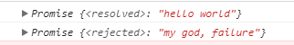

# javascript all in one

## 使用 Promises

一个 `Promise` 就是一个对象，它代表了一个异步操作的最终完成或者失败。大多数人仅仅是使用已创建的 Promise 实例对象，因此本教程将首先说明怎样使用 Promise，之后说明如何创建 Promise。

本质上，**Promise 是一个绑定了回调的对象，而不是将回调传进函数内部**。

假设，现有一个名为 createAudioFileAsync() 的函数，在给定的配置文件和两个回调函数（一个是声音文件成功创建时的回调，另一个是出现异常时的回调）的情况下，这个函数能异步地生成声音文件。

以下为使用 createAudioFileAsync() 的示例：

```javascript
function successCallback(result) {
  console.log("声音文件创建成功: " + result);
}
function failureCallback(error) {
  console.log("声音文件创建失败: " + error);
}
createAudioFileAsync(audioSettings, successCallback, failureCallback)
```

最新的方式就是返回一个 promise 对象，使得你可以将你的 callback 绑定在该 promise 上（如下所示）：

如果函数 createAudioFileAsync() 被重写为返回 Promise 对象，就可以像这样简单的使用：

```javascript
const promise = createAudioFileAsync(audioSettings); 
promise.then(successCallback, failureCallback);
```

 简写为：

```javascript
createAudioFileAsync(audioSettings).then(successCallback, failureCallback);
```

我们把这个称为异步函数调用，这种形式有若干优点。我们将会逐一讨论。

### 约定

不同于老式的传入回调，在应用 Promise 时，我们将会有以下约定：

- 在 [本轮 Javascript event loop（事件循环）运行完成](https://developer.mozilla.org/zh-CN/docs/Web/JavaScript/EventLoop#执行至完成) 之前，callbacks（回调）是不会被调用的。
- 综上，通过 then() 形式添加的回调函数总会被调用，即便是在异步操作完成之后才被添加的函数。
- 通过多次调用 .then()，可以添加多个回调函数，它们会按照插入顺序并且独立运行。

因此，Promise 最直接的好处就是链式调用。

### 链式调用

**一个常见的需求就是连续执行两个或者多个异步操作，在上一个操作执行成功之后开始下一个的操作，并带着上一步操作所返回的结果。我们可以通过创造一个 Promise chain 来完成这种需求**。

见证奇迹的时刻：then() 函数会返回一个全新的 Promise，和原来的不同：

```javascript
const promise = doSomething();
const promise2 = promise.then(successCallback, failureCallback);
```

或者

```javascript
const promise2 = doSomething().then(successCallback, failureCallback);
```

第二个对象（promise2）不仅代表 `doSomething()` 函数的完成，也代表了你传入的 `successCallback` 或者 `failureCallback` 的完成，`successCallback` 或 `failureCallback` 有可能返回一个 Promise 对象从而形成另一个异步操作。这样的话，任何一个 `promise2` 新增的回调函数都会被依次排在由上一个 `successCallback(成功回调函数)` 或 `failureCallback(失败回调函数)` 执行后所返回的 Promise 对象的后面。

基本上，每一个 Promise 代表了链式中另一个异步过程的完成。

在过去，做多重的异步操作，会导致经典的回调地狱：

```javascript
doSomething(function(result) {
  doSomethingElse(result, function(newResult) {
    doThirdThing(newResult, function(finalResult) {
      console.log('Got the final result: ' + finalResult);
    }, failureCallback);
  }, failureCallback);
}, failureCallback);
```

通过新的方法，我们把回调绑定到被返回的 Promise 上代替以往的做法，形成一个 Promise 链：

```javascript
doSomething().then(function(result) {
  return doSomethingElse(result);
})
.then(function(newResult) {
  return doThirdThing(newResult);
})
.then(function(finalResult) {
  console.log('Got the final result: ' + finalResult);
})
.catch(failureCallback);
```

then 里的参数是可选的，`catch(failureCallback)` 是 `then(null, failureCallback)` 的缩略形式。如下所示，也可以用 arrow functions （箭头函数）来表示：

```javascript
doSomething()
.then(result => doSomethingElse(result))
.then(newResult => doThirdThing(newResult))
.then(finalResult => {
  console.log(`Got the final result: ${finalResult}`);
})
.catch(failureCallback);
```

**注意：**一定要有返回（即需要 `return` ），否则 callback 无法获取上个 Promise 的结果。(使用 `() => x` 比`() => { return x; }` 更简洁一点).

#### Catch 的后续链式操作

很可能会在一个回调失败之后继续使用链式操作，即使用一个 `catch`，这对于在链式操作中抛出一个失败之后，再次开启新的操作很有用。请阅读下面的例子：

```javascript
new Promise((resolve, reject) => {
    console.log('Initial');

    resolve();
})
.then(() => {
    throw new Error('Something failed');
        
    console.log('Do this');
})
.catch(() => {
    console.log('Do that');
})
.then(() => {
    console.log('Do this whatever happened before');
});
```

输出结果如下：

```shell
Initial
Do that
Do this whatever happened before
```

**注意：**由于 "Something failed" 错误的抛出导致了失败回调函数的调用，所以 "Do this" 文本没有被输出。

### 错误传递

在之前的回调地狱示例中，你可能记得有3次 `failureCallback` 的调用，而在 Promise 链中只有尾部的一次调用。

```javascript
doSomething()
.then(result => doSomethingElse(value))
.then(newResult => doThirdThing(newResult))
.then(finalResult => console.log(`Got the final result: ${finalResult}`))
.catch(failureCallback);
```

通常，一遇到异常抛出，promise 链就会停下来，直接调用链式中的 catch 处理程序来继续当前执行。这看起来和以下的同步代码的执行很相似。

```javascript
try {
  let result = syncDoSomething();
  let newResult = syncDoSomethingElse(result);
  let finalResult = syncDoThirdThing(newResult);
  console.log(`Got the final result: ${finalResult}`);
} catch(error) {
  failureCallback(error);
}
```

在 ECMAScript 2017 标准的 `async/await` 语法糖中，这种同步形式代码的对称性得到了极致的体现：

```javascript
async function foo() {
  try {
    let result = await doSomething();
    let newResult = await doSomethingElse(result);
    let finalResult = await doThirdThing(newResult);
    console.log(`Got the final result: ${finalResult}`);
  } catch(error) {
    failureCallback(error);
  }
}
```

这个例子是在 Promise 的基础上构建的，`doSomething()` 与之前的函数是相同的。

通过捕获所有的错误，甚至抛出异常和程序错误，Promise 解决了回调地狱的基本缺陷。这对于构建异步操作的基础功能是很有必要的。

### Promise rejection events

当 Promise 被拒绝时，会有下文所述的两个 event 之一被派发到全局作用域（通常而言，就是 window；如果是在 web worker 中使用的话，就是 `Worker` 或者其他 worker-based 接口）。这两个 event 如下所示：

- **rejectionhandled**

  当 Promise 被拒绝、并且在 `reject` 函数处理该 rejection 之后会派发此 event。

- **unhandledrejection**

  当 Promise 被拒绝，但没有提供 `reject` 函数来处理该 rejection 时，会派发此 event。

以上两种 event（类型是 `PromiseRejectionEvent` ）都有两个属性，一个是 `promise` 属性，该属性指向被驳回的 Promise 对象，另一个是 `reason` 属性，该属性用来说明 promise 被驳回的原因。

这使得为 Promise 提供回退错误处理，以及帮助调试 Promise 管理问题成为可能。每个上下文中都有一个全局的 handler，因此不管错误源在哪里，所有的错误都会在同一个 event handler 中被捕捉处理。

一个特别有用的例子：当你写 Node.js 代码时，有些依赖模块可能会有未被处理的 rejected promises。这些都会在运行时打印到控制台。你可以在自己的代码中捕捉这些信息然后添加 `unhandledrejection` 相应的 handler 来做分析和处理，或者只是为了让你的输出更整洁。举例如下：

```javascript
window.addEventListener("unhandledrejection", event => {
  /* 你可以在这里添加代码来查看event.promise和event.reason */

  event.preventDefault();
}, false);
```

通过调用 event 的 `preventDefault()` 方法，可以告诉 Javascript 运行时，当 rejected promise 未处理时，不要执行默认操作，默认操作一般会包含把错误打印到控制台，尤其是在 Node 中。

理想情况下，在忽略这些 event 之前，我们应该检查所有 rejected promise 来确认这不是代码的bug。

### 在旧式回调 API 中创建 Promise

通过构造器从头开始创建 `Promise`。只应该用在包裹旧的 API 时。

理想状态下，所有的异步函数都已经返回 Promise 对象了。不幸的是，一些 API 仍然希望成功和/或失败回调能够以旧的方式传递。典型的例子就是 `setTimeout()` 函数：

```javascript
setTimeout(() => saySomething("10 seconds passed"), 10000);
```

混用旧式回调和 Promise 是会有问题的。如果 `saySomething()`  失败了或者包含了编程错误，那就没有办法捕获它了。`setTimeout` 就不能混用两种方式。

幸运的是我们可以用 `Promise` 来包裹 `setTimeout`。最佳实践是在尽可能低的级别包装有问题的函数，然后再也不要直接调用它们：

```javascript
const wait = ms => new Promise(resolve => setTimeout(resolve, ms));

wait(10000).then(() => saySomething("10 seconds")).catch(failureCallback);
```

通常，Promise 的构造器会有一个可以让我们手动操作 resolve 和 reject 的执行函数。既然 `setTimeout` 没有真的执行失败，那么我们可以在这种情况下忽略reject。

### 组合

`Promise.resolve()` 和 `Promise.reject()` 是手动创建一个已经 resolve 或者 reject 的 promise 快捷方法。它们有时很有用。

`Promise.all()` 和 `Promise.race()` 是并行运行异步操作的两个组合式工具。

我们可以发起并行操作，然后等多个操作全部结束后进行下一步操作，如下：

```javascript
Promise.all([func1(), func2(), func3()])
.then(([result1, result2, result3]) => { /* use result1, result2 and result3 */ });
```

时序组合可以使用一些优雅的javascript形式：

```
[func1, func2, func3].reduce((p, f) => p.then(f), Promise.resolve())
.then(result3 => { /* use result3 */ });
```

通常，我们递归调用一个由异步函数组成的数组时相当于一个 Promise 链式：

```
Promise.resolve().then(func1).then(func2).then(func3);
```

我们也可以写成可复用的函数形式，这在函数式 编程中极为普遍：

```
const applyAsync = (acc,val) => acc.then(val);
const composeAsync = (...funcs) => x => funcs.reduce(applyAsync, Promise.resolve(x));
```

composeAsync函数将会接受任意数量的函数作为其参数，并返回一个新的函数，该函数接受一个通过composition pipeline传入的初始值。这对我们来说非常有益，因为任一函数可以是异步 或同步的，它们能被保证按顺序执行：

```
const transformData = composeAsync(func1, func2, func3);
const result3 = transformData(data);
```

在 ECMAScript 2017标准中, 时序组合可以通过使用async/await而变得更简单：

```
let result;
for (const f of [func1, func2, func3]) {
  result = await f(result);
}
/* use last result (i.e. result3) */
```

## 时序

为了避免意外，即使是一个已经变成 resolve 状态的 Promise，传递给 `then` 的函数也总是会被异步调用：

```
Promise.resolve().then(() => console.log(2));
console.log(1); 
```

传递到then中的函数被置入了一个微任务队列，而不是立即执行，这意味着它是在JavaScript事件队列的所有运行时结束了，事件队列被清空之后才开始执行：

```
const wait = ms => new Promise(resolve => setTimeout(resolve, ms));

wait().then(() => console.log(4));
Promise.resolve().then(() => console.log(2)).then(() => console.log(3));
console.log(1); 
```

## 嵌套

简便的 Promise 链式编程最好保持扁平化，不要嵌套 Promise，嵌套经常会是粗心导致的。可查阅下一节的常见错误中的例子。

嵌套 Promise 是一种可以限制 catch 语句的作用域的控制结构写法。明确来说，嵌套的 catch 仅捕捉在其之前同时还必须是其作用域的 failureres，而捕捉不到在其链式以外或者其嵌套域以外的 error。如果使用正确，那么可以实现高精度的错误修复。

```
doSomethingCritical()
.then(result => doSomethingOptional()
  .then(optionalResult => doSomethingExtraNice(optionalResult))
  .catch(e => {console.log(e.message)})) // 即使有异常也会忽略，继续运行;(最后会输出)
.then(() => moreCriticalStuff())
.catch(e => console.log("Critical failure: " + e.message));// 没有输出
```

注意,有些代码步骤是嵌套的，而不是一个简单的纯链式，这些语句前与后都被（）包裹着。

这个内部的 catch 语句仅能捕获到 `doSomethingOptional() 和 doSomethingExtraNice() 的失败，而且还是在`moreCriticalStuff() 并发运行以后。重要提醒，如果 doSomethingCritical() 失败，这个错误才仅会被最后的（外部）catch 语句捕获到。

## 常见错误

在编写 Promise 链时，需要注意以下示例中展示的几个错误：

```
// 错误示例，包含 3 个问题

doSomething().then(function(result) {
  doSomethingElse(result) // 没有返回 Promise 以及没有必要的嵌套 Promise
  .then(newResult => doThirdThing(newResult));
}).then(() => doFourthThing());
// 最后是没有使用 catch 终止 Promise 调用链，可能导致没有捕获的异常
```

第一个错误是没有正确地将事物相连接。当我们创建新 Promise 但忘记返回它时，会发生这种情况。因此，链条被打破，或者更确切地说，我们有两个独立的链条竞争（同时在执行两个异步而非一个一个的执行）。这意味着 `doFourthThing()` 不会等待 `doSomethingElse()` 或`doThirdThing()` 完成，并且将与它们并行运行，可能是无意的。单独的链也有单独的错误处理，导致未捕获的错误。

第二个错误是不必要地嵌套，实现第一个错误。嵌套还限制了内部错误处理程序的范围，如果是非预期的，可能会导致未捕获的错误。其中一个变体是 [promise 构造函数反模式](https://stackoverflow.com/questions/23803743/what-is-the-explicit-promise-construction-antipattern-and-how-do-i-avoid-it)，它结合了 Promise 构造函数的多余使用和嵌套。

第三个错误是忘记用 `catch` 终止链。这导致在大多数浏览器中不能终止的 Promise 链里的 rejection。

一个好的经验法则是总是返回或终止 Promise 链，并且一旦你得到一个新的 Promise，返回它。下面是修改后的平面化的代码：

```
doSomething()
.then(function(result) {
  return doSomethingElse(result);
})
.then(newResult => doThirdThing(newResult))
.then(() => doFourthThing());
.catch(error => console.log(error));
```

注意：`() => x` 是 `() => { return x; }`的快捷方便的写法。

上述代码的写法就是具有适当错误处理的简单明确的链式写法。

使用 `async/await` 可以解决以上大多数错误，使用 `async/await` 时最常见的错误就是忘记了`await` 关键字。

## 参见：

- [`Promise.then()`](https://developer.mozilla.org/zh-CN/docs/Web/JavaScript/Reference/Global_Objects/Promise/then)
- [Promises/A+ specification](http://promisesaplus.com/)
- [Venkatraman.R - JS Promise (Part 1, Basics)](https://medium.com/@ramsunvtech/promises-of-promise-part-1-53f769245a53)
- [Venkatraman.R - JS Promise (Part 2 - Using Q.js, When.js and RSVP.js)](https://medium.com/@ramsunvtech/js-promise-part-2-q-js-when-js-and-rsvp-js-af596232525c#.dzlqh6ski)
- [Venkatraman.R - Tools for Promises Unit Testing](https://tech.io/playgrounds/11107/tools-for-promises-unittesting/introduction)
- [Nolan Lawson: We have a problem with promises — Common mistakes with promises](http://pouchdb.com/2015/05/18/we-have-a-problem-with-promises.html)


## async/await

先说一下 async 的用法，它作为一个关键字放到函数前面，用于表示函数是一个异步函数，异步函数也就意味着该函数的执行不会阻塞后面代码的执行。 

```javascript
async function timeout() {
　　return 'hello world';
}
```

在函数前面加上 async 关键字，来表示它是异步的，为了表示它没有阻塞它后面代码的执行，我们在 async 函数调用之后加一句 console.log

```javascript
async function timeout() {
    return 'hello world'
}
timeout();
console.log('虽然在后面，但是我先执行');
```

打开浏览器控制台，我们看到了


async 函数 timeout 调用了，但是没有任何输出。没有返回 "hello world"，看一看 timeout() 执行返回了什么？

```javascript
async function timeout() {
    return 'hello world'
}
console.log(timeout());
console.log('虽然在后面，但是我先执行')
```

继续看控制台


原来 async 函数返回的是一个 promise 对象，如果要获取到 promise 返回值，我们应该用 then 方法，继续修改代码

```javascript
async function timeout() {
    return 'hello world'
}
timeout().then(result => {
    console.log(result);
})
console.log('虽然在后面，但是我先执行');
```

看控制台


我们获取到了 "hello world"，同时 timeout 的执行也没有阻塞后面代码的执行，和我们刚才说的一致。

这时，你可能注意到控制台中的 Promise 有一个 resolved，这是 async 函数内部的实现原理。**如果 async 函数中有返回一个值，当调用该函数时，内部会调用 Promise.solve() 方法把它转化成一个 promise 对象作为返回，但如果timeout 函数内部抛出错误呢？ 那么就会调用 Promise.reject() 返回一个 promise 对象**。继续修改 timeout 函数

```javascript
async function timeout(flag) {
    if (flag) {
        return 'hello world'
    } else {
        throw 'my god, failure'
    }
}
console.log(timeout(true))  // 调用Promise.resolve() 返回promise 对象。
console.log(timeout(false)); // 调用Promise.reject() 返回promise 对象。
```

控制台如下：



如果函数内部抛出错误，promise 对象有一个 catch 方法进行捕获。

```javascript
timeout(false).catch(err => {
    console.log(err)
})
```

　　async 关键字差不多了，我们再来考虑await 关键字，await是等待的意思，那么它等待什么呢，它后面跟着什么呢？其实它后面可以放任何表达式，不过我们更多的是放一个返回promise 对象的表达式。注意await 关键字只能放到async 函数里面

　　现在写一个函数，让它返回promise 对象，该函数的作用是2s 之后让数值乘以2


```
// 2s 之后返回双倍的值
function doubleAfter2seconds(num) {
    return new Promise((resolve, reject) => {
        setTimeout(() => {
            resolve(2 * num)
        }, 2000);
    } )
}
```


　　现在再写一个async 函数，从而可以使用await 关键字， await 后面放置的就是返回promise对象的一个表达式，所以它后面可以写上 doubleAfter2seconds 函数的调用

```
async function testResult() {
    let result = await doubleAfter2seconds(30);
    console.log(result);
}
```

　　现在调用testResult 函数

```
testResult();
```

　　打开控制台，2s 之后，输出了60. 

　　现在我们看看代码的执行过程，调用testResult 函数，它里面遇到了await, await 表示等一下，代码就暂停到这里，不再向下执行了，它等什么呢？等后面的promise对象执行完毕，然后拿到promise resolve 的值并进行返回，返回值拿到之后，它继续向下执行。具体到 我们的代码, 遇到await 之后，代码就暂停执行了， 等待doubleAfter2seconds(30) 执行完毕，doubleAfter2seconds(30) 返回的promise 开始执行，2秒 之后，promise resolve 了， 并返回了值为60， 这时await 才拿到返回值60， 然后赋值给result， 暂停结束，代码才开始继续执行，执行 console.log语句。

　　就这一个函数，我们可能看不出async/await 的作用，如果我们要计算3个数的值，然后把得到的值进行输出呢？


```
async function testResult() {
    let first = await doubleAfter2seconds(30);
    let second = await doubleAfter2seconds(50);
    let third = await doubleAfter2seconds(30);
    console.log(first + second + third);
}
```


　　6秒后，控制台输出220, 我们可以看到，写异步代码就像写同步代码一样了，再也没有回调地域了。

　　再写一个真实的例子，我原来做过一个小功能，话费充值，当用户输入电话号码后，先查找这个电话号码所在的省和市，然后再根据省和市，找到可能充值的面值，进行展示。

为了模拟一下后端接口，我们新建一个node 项目。 新建一个文件夹 async, 然后npm init -y 新建package.json文件，npm install express --save 安装后端依赖，再新建server.js 文件作为服务端代码， public文件夹作为静态文件的放置位置， 在public 文件夹里面放index.html 文件， 整个目录如下

 

　　server.js 文件如下，建立最简单的web 服务器


```
const express = require('express');
const app = express();// express.static 提供静态文件，就是html, css, js 文件
app.use(express.static('public'));

app.listen(3000, () => {
    console.log('server start');
})
```


　　再写index.html 文件，我在这里用了vue构建页面，用axios 发送ajax请求， 为了简单，用cdn 引入它们。 html部分很简单，一个输入框，让用户输入手机号，一个充值金额的展示区域， js部分，按照vue 的要求搭建了模版


```
<!DOCTYPE html>
<html lang="en">
<head>
    <meta charset="UTF-8">
    <title>Async/await</title>
    <!-- CDN 引入vue 和 axios -->
    <script src="https://cdn.jsdelivr.net/npm/vue"></script>
    <script src="https://unpkg.com/axios/dist/axios.min.js"></script>
</head>
<body>
    <div id="app">

        <!-- 输入框区域 -->
        <div style="height:50px">
            <input type="text" placeholder="请输入电话号码" v-model="phoneNum">
            <button @click="getFaceResult">确定</button>
        </div>

        <!-- 充值面值 显示区域 -->
        <div>
            充值面值：
            <span v-for="item in faceList" :key='item'>
                {{item}}
            </span>
        </div>
    </div>

    <!-- js 代码区域 -->
    <script>
        new Vue({
            el: '#app',
            data: {
                phoneNum: '12345',
                faceList: ["20元", "30元", "50元"]
            },
            methods: {
                getFaceResult() {

                }
            }
        })
    </script>
</body>
</html>
```


　　为了得到用户输入的手机号，给input 输入框添加v-model指令，绑定phoneNum变量。展示区域则是 绑定到faceList 数组，v-for 指令进行展示， 这时命令行nodemon server 启动服务器，如果你没有安装nodemon， 可以npm install -g nodemon 安装它。启动成功后，在浏览器中输入 http://localhost:3000, 可以看到页面如下， 展示正确


　　现在我们来动态获取充值面值。当点击确定按钮时， 我们首先要根据手机号得到省和市，所以写一个方法来发送请求获取省和市，方法命名为getLocation, 接受一个参数phoneNum , 后台接口名为phoneLocation，当获取到城市位置以后，我们再发送请求获取充值面值，所以还要再写一个方法getFaceList, 它接受两个参数, province 和city, 后台接口为faceList，在methods 下面添加这两个方法getLocation, getFaceList


```
        methods: {
            //获取到城市信息
            getLocation(phoneNum) {
               return axios.post('phoneLocation', {
                    phoneNum
                })
            },
            // 获取面值
            getFaceList(province, city) {
                return axios.post('/faceList', {
                    province,
                    city
                })
            },
            // 点击确定按钮时，获取面值列表
            getFaceResult () {
               
            }
        }
```


　　现在再把两个后台接口写好，为了演示，写的非常简单，没有进行任何的验证，只是返回前端所需要的数据。Express 写这种简单的接口还是非常方便的，在app.use 和app.listen 之间添加如下代码


```
// 电话号码返回省和市，为了模拟延迟，使用了setTimeout
app.post('/phoneLocation', (req, res) => {
    setTimeout(() => {
        res.json({
            success: true,
            obj: {
                province: '广东',
                city: '深圳'
            }
        })
    }, 1000);
})

// 返回面值列表
app.post('/faceList', (req, res) => {
    setTimeout(() => {
        res.json(
            {
                success: true,
                obj:['20元', '30元', '50元']
            }
            
        )
    }, 1000);
})
```


　　最后是前端页面中的click 事件的getFaceResult, 由于axios 返回的是promise 对象，我们使用then 的链式写法，先调用getLocation方法，在其then方法中获取省和市，然后再在里面调用getFaceList，再在getFaceList 的then方法获取面值列表，


```
            // 点击确定按钮时，获取面值列表
            getFaceResult () {
                this.getLocation(this.phoneNum)
                    .then(res => {
                        if (res.status === 200 && res.data.success) {
                            let province = res.data.obj.province;
                            let city = res.data.obj.city;

                            this.getFaceList(province, city)
                                .then(res => {
                                    if(res.status === 200 && res.data.success) {
                                        this.faceList = res.data.obj
                                    }
                                })
                        }
                    })
                    .catch(err => {
                        console.log(err)
                    })
            }
```


　　现在点击确定按钮，可以看到页面中输出了 从后台返回的面值列表。这时你看到了then 的链式写法，有一点回调地域的感觉。现在我们在有async/ await 来改造一下。

首先把 getFaceResult 转化成一个async 函数，就是在其前面加async， 因为它的调用方法和普通函数的调用方法是一致，所以没有什么问题。然后就把 getLocation 和

getFaceList 放到await 后面，等待执行， getFaceResult  函数修改如下


```
            // 点击确定按钮时，获取面值列表
            async getFaceResult () {
                let location = await this.getLocation(this.phoneNum);
                if (location.data.success) {
                    let province = location.data.obj.province;
                    let city = location.data.obj.city;
                    let result = await this.getFaceList(province, city);
                    if (result.data.success) {
                        this.faceList = result.data.obj;
                    }
                }
            }
```


　　现在代码的书写方式，就像写同步代码一样，没有回调的感觉，非常舒服。

　　现在就还差一点需要说明，那就是怎么处理异常，如果请求发生异常，怎么处理？ 它用的是try/catch 来捕获异常，把await 放到 try 中进行执行，如有异常，就使用catch 进行处理。


```
            async getFaceResult () {
                try {
                    let location = await this.getLocation(this.phoneNum);
                    if (location.data.success) {
                        let province = location.data.obj.province;
                        let city = location.data.obj.city;
                        let result = await this.getFaceList(province, city);
                        if (result.data.success) {
                            this.faceList = result.data.obj;
                        }
                    }
                } catch(err) {
                    console.log(err);
                }
            }
```


　　现在把服务器停掉，可以看到控制台中输出net Erorr，整个程序正常运行。