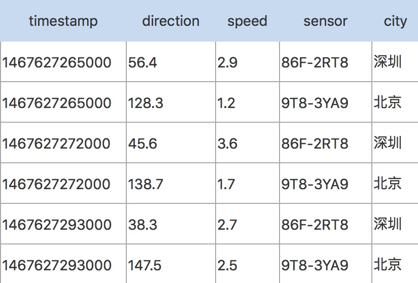

# 时序数据库

时间序列数据库简称**时序数据库**(Time Series Database)，用于处理带时间标签(按照时间的顺序变化，即时间序列化)的数据，带时间标签的数据也称为时间序列数据。

## 时序数据的几个特点

1. 基本上都是插入，没有更新的需求。
2. 数据基本上都有时间属性，随着时间的推移不断产生新的数据。
3. 数据量大，每秒钟需要写入千万、上亿条数据

## 业务方常见需求

1. 获取最新状态，查询最近的数据(例如传感器最新的状态)
2. 展示区间统计，指定时间范围，查询统计信息，例如平均值，最大值，最小值，计数等。。。
3. 获取异常数据，根据指定条件，筛选异常数据

## 常见业务场景

1. 监控软件系统： 虚拟机、容器、服务、应用
2. 监控物理系统： 水文监控、制造业工厂中的设备监控、国家安全相关的数据监控、通讯监控、传感器数据、血糖仪、血压变化、心率等
3. 资产跟踪应用： 汽车、卡车、物理容器、运货托盘
4. 金融交易系统： 传统证券、新兴的加密数字货币
5. 事件应用程序： 跟踪用户、客户的交互数据
6. 商业智能工具： 跟踪关键指标和业务的总体健康情况
7. 在互联网行业中，也有着非常多的时序数据，例如用户访问网站的行为轨迹，应用程序产生的日志数据等等。

## 一些基本概念(不同的时序数据库称呼略有不同)

| 概念       | 名称   | 解释                                                         |
| ---------- | ------ | ------------------------------------------------------------ |
| Metric     | 度量   | 相当于关系型数据库中的 table                                 |
| Data point | 数据点 | 相当于关系型数据库中的 row                                   |
| Timestamp  | 时间戳 | 代表数据点产生的时间                                         |
| Field      | 字段   | 比如位置这个度量具有经度和纬度两个 field。一般情况下存放的是随时间戳而变化的数据 |
| Tag        | 标签   | 一般存放的是不随时间戳变化的信息。timestamp 加上所有的 tags 可以视为 table 的 primary key |

例如采集有关风的数据，度量为 Wind，每条数据都有时间戳timestamp，两个字段 field：direction(风向)、speed(风速)，两个tag：sensor(传感器编号)、city(城市)。第一行和第三行，存放的都是 sensor 编号为86F-2RT8的设备，城市是深圳。随着时间的变化，风向和风速发生了改变，风向从56.4变为45.6，风速从2.9变为3.6。

## 需要解决的几个问题

时序数据的写入：如何支持每秒钟成千上亿条数据的写入。

时序数据的读取：如何支持在秒级对上亿条数据的分组聚合运算。

成本敏感：海量数据存储带来的成本问题。如何以更低成本存储数据，将成为时序数据库需要解决的重中之重。

## 常见时序数据库

时序数据库出现的时间较晚。

InfluxDB(单机版免费，集群版收费)最成熟，Kairosdb(底层使用Cassandra)，OpenTsdb(底层使用HBase)，beringei(Facebook开源)，TimeScaleDB(底层基于PostgreSQL)，TSDB(百度开源)，HiTSDB(阿里开源，底层是PostgreSQL)。