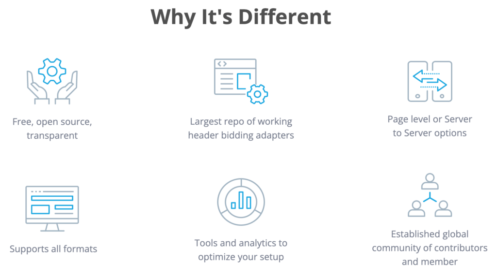
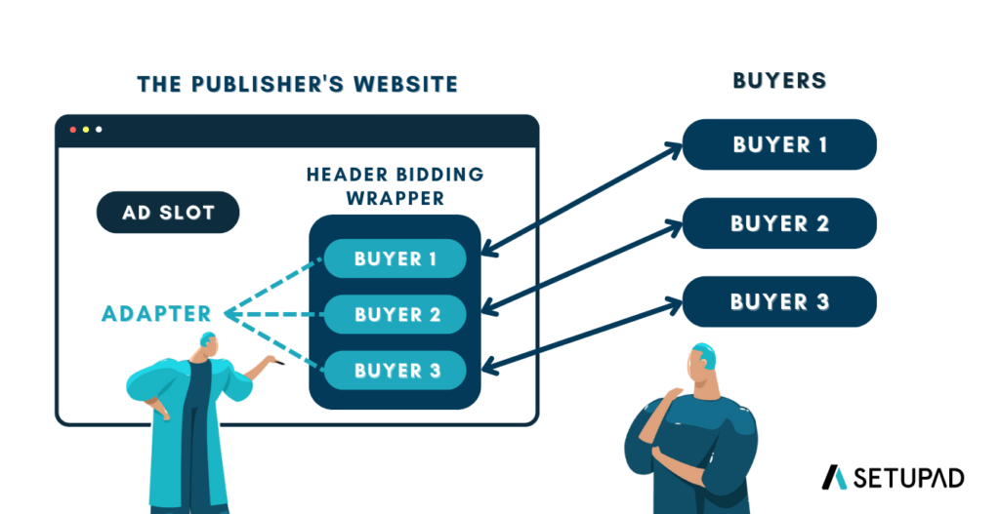
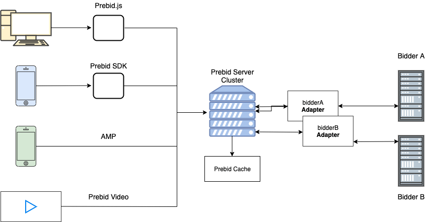
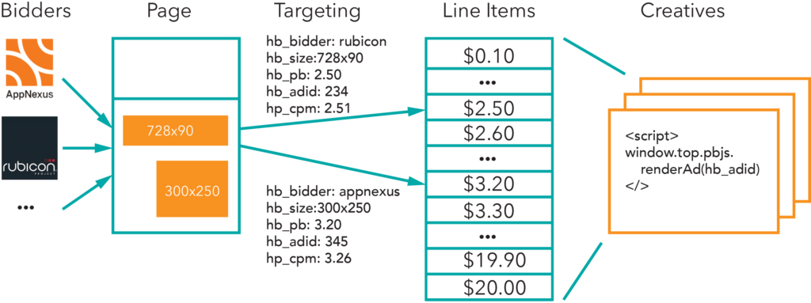
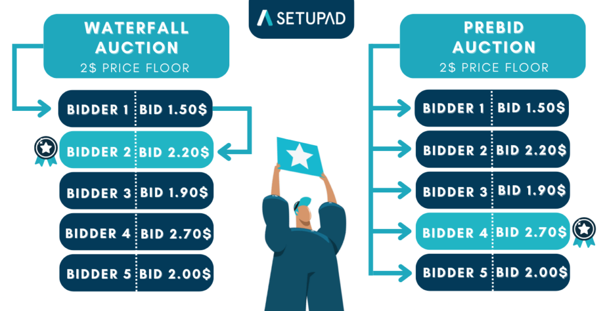
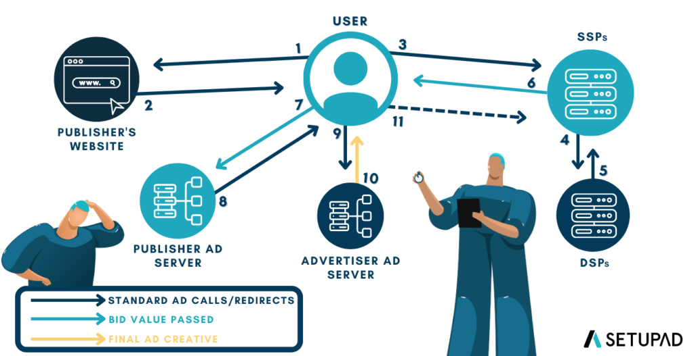

[What is Prebid? | Everything Publishers Should Know (setupad.com)](https://setupad.com/blog/what-is-prebid/)

Prebid is an open-source header bidding wrapper that’s accessible to anyone and is used by many publishers today. 

With the introduction of prebid.js in 2015, everything was transformed. It sped up the widescale adoption of the header bidding technology, introduced a clear industry standard, and simplified the setup.

In this article, you’ll learn what prebid is, how it works, how to implement it, and what benefits it provides.

## What is Prebid?

Prebid enables publishers to connect to thousands of demand partners through its extensive library of efficient adapters, which allows placing bids on the publisher’s available ad inventory.

This feature, along with the open-source software’s flexibility for customization, results in the ideal header bidding solution that publishers may modify to meet their requirements. 

Prebid.js is now the most popular header bidding wrapper on the internet.

Prebid.org is an organization created to guarantee and promote fair, transparent, and effective header bidding throughout the industry. It’s available to all companies in the programmatic ecosystem, including publishers, [adtech](https://setupad.com/blog/adtech-trends/) vendors, and others.

## What is Prebid.js? 

Prebid.js, also known as a prebid wrapper, is an open-source solution that simplifies header bidding implementation on publishers’ websites and mobile apps. 

Before prebid, publishers were required to have a tech team to build header bidding. However, prebid.js made a solution available to everyone with a relatively quick basic setup and low cost.

Prebid.js provides the most extensive collection of active adapters by developing a basic, open tech layer upon which businesses can build their code.

### What is a prebid adapter?

According to [Prebid](https://docs.prebid.org/dev-docs/bidder-adaptor.html), “At a high level, a bidder adapter is responsible for:

1. Creating the bid requests for the bidder’s server.
2. Parsing and registering the bid responses.”

If you’re a publisher and want to implement header bidding and include top [SSPs](https://setupad.com/blog/dsp-vs-ssp/) like OpenX, you’d need an adapter for each partner. 

Simply put, the adapter is required to access an SSP’s demand. Header bidding wrappers serve as containers for these adapters, but a wrapper alone can’t integrate demand partners.

Additionally, [prebid adapters](https://setupad.com/blog/prebid-adapter/) create the [bid requests](https://setupad.com/blog/bid-request/) for the bidder’s server and analyze the bid responses (bid value and ad creative) obtained from DSPs.

Prebid.js adapters are plugins that attach to the prebid.js core, and they are designed to be interchangeable depending on the partners a publisher chooses to work with.

Bidder and analytics adapters are two different categories:

- **Bidder adapters**. Represent the SSPs and ad exchanges you want to work with. According to Prebid.org, there are more than 300 bidder adapters. Prebid.js is unique because of this collection of functional header bidding integrations. Instead of a proprietary wrapper solution that tries to reverse-engineer another company’s adapter, each company maintains its prebid.js adapter to provide publishers with the most recent code. 

- **Analytics adapters**. Provide the ability to learn more about [page latency](https://setupad.com/blog/reduce-page-latency/), revenues, bid rates, etc. Prebid.js analytics data can be obtained and sent to any analytics service provider, such as Google Analytics. 

### What is a prebid server? 

[Prebid server is](https://setupad.com/blog/prebid-server/) a [server-side header bidding](https://setupad.com/blog/client-side-vs-server-side/) solution that runs on a server instead of the user’s browser. Thus, it helps to reduce latency and enhances the user experience.

A publisher must make one call to the server when implementing a prebid server for their server-side auction integrations, and the server will contact the configured bidder adapters.

The highest bidder wins the auction, and their ad is displayed on the site. One request is made by a client (such as prebid.js) to the prebid server when a user first visits your site. 

Once it has decided which bidders to use, it calls the appropriate demand partners ([SSPs](https://setupad.com/blog/dsp-vs-ssp/)) and returns the winning bids to the client.

The winning bids are then forwarded to the [ad server,](https://setupad.com/blog/ad-server/) which selects the highest bid. Prebid wrapper will display the winning ad creative on your website.

### Understanding the Connection Between Prebid.js, Prebid Server, and Prebid Adapters

Prebid.js is an integral part of the header bidding ecosystem and is a key connection between the Prebid Server and Prebid adapters.

Essentially, Prebid.js is a client-side library that enables publishers to manage demand partners (bidders) and conduct header bidding directly within the browser.

Prebid adapters, on the other hand, are the individual modules or connectors that translate bid requests and responses between Prebid.js and the demand partners’ APIs, allowing various demand sources to interact in a standardized way.

Prebid Server is an optional server-side component that can work in tandem with Prebid.js to offload some of the browser’s work, handling the bid requests and responses on the server side instead. By doing so, it can reduce latency and enhance user experience.

Together, Prebid.js, Prebid Server, and Prebid adapters form a cohesive and flexible architecture that supports an efficient, transparent, and customizable header bidding process, allowing publishers to maximize their advertising revenue.

## How Does Prebid Work?

The core principle of prebid or pre-bidding technology is that it enables multiple demand partners to bid on a publisher’s ad inventory simultaneously.

Prebid wrappers enable publishers to easily increase the number of bidders in their auctions and automate the management of their demand partners.

Prebid.js library comprises the following components–the adapters and optional modules a publisher wants to use and the core wrapper code.

Prebid.js’s header bidding process can be completed in 4 steps:

1. The prebid.js library (collection of targeting attributes) gets bids and creatives from the various SSPs & ad exchanges, while the ad server’s tag on the page is stopped and bound by a timeout.

1. Prebid.js sends details about those bids (including price) to the ad server’s tag on the page, which sends them as query string parameters to the ad server.

1. Within the time limit set by the publisher, the ad server evaluates these bids using factors such as ad type, [floor price](https://setupad.com/blog/price-floor-optimization/), and ad structure.

1. Prebid.js receives a signal from the ad server instructing it to serve the winning creative (if there is one) to the page. 

## Prebid vs Waterfall

Both prebid and [waterfall](https://setupad.com/blog/header-bidding-vs-waterfall/) auctions were designed to boost publisher incomes. Waterfall has one notable downside–its auction system is linear. 

Meaning that the first bid above the floor price gets to win despite the fact that other partners might have paid more.

On the other hand, with prebidding all bids take place simultaneously therefore the highest bidder wins.

Publishers relying on programmatic waterfall can lose their potential revenue compared to the header bidding technology. 

Therefore, switching from a programmatic waterfall to an advanced header bidding solution is the best solution for a publisher.

## Benefits of Prebid

Publishers can take advantage of 6 main benefits by using prebid products to improve their header bidding experience, such as:

- Enables anyone to contribute or review code as the available collection of solutions is free and open source.

- Provides the most extensive collection of functional header bidding adapters.

- With a prebid wrapper, header bidding is more seamless, resulting in quicker response times, lower latency, and an improved user experience.

- Prebid Server allows conducting auctions more quickly and with more partners.

- Supports several channels (mobile, web, app) and format choices (display, video, native).

- Publishers can use prebid’s comprehensive analytics to get valuable data on the performance of their ads and how to improve their campaigns.

## How to Implement Prebid.js? 

Here are 6 steps to implement prebid.js:

1. To display advertisements on the page, you add prebid.js code to your page. This code conducts an auction among a few demand sources.

1. Prebid.js calls each demand source simultaneously.

1. Demand sources send bids back to the page.

1. These bids are forwarded to your ad server via prebid.js.

1. Ad server selects the winning bid to serve based on line items targeting keywords that meet price ranges.

1. The page displays the winning bid’s creative.

You can refer to the example below for a more detailed explanation of how header bidding works.

### Frequent problems with Prebid.js implementation

Many publishers prefer to partner with a header bidding platform like Setupad mainly because of the difficulties related to implementing and maintaing prebid.js on their own.

The fact that prebidding needs a dedicated AdOps team to deploy and manage it efficiently is one of the main challenged for the majority of publishers. 

Here are 5 most common problems with prebid implementation:

- **Mismatch in price granularity**. For instance, if your price buckets are set up with $0.10 granularity but the line items are expecting $0.50 increase, bid prices like $0.71 or $0.99 wouldn’t match any line items.

- **Handling Google’s API**. Setting up line items involves familiarity with Google’s API as well as some fundamental coding skills. Another reason many give up on prebidding is that this requirement is particularly challenging for smaller publishers without a dedicated programming staff.

- **The priority of non-prebid line items is higher**. Even with reduced bid prices, the Prebid line items won’t win if you have running sponsorship line items. Use the debugging tools provided by your ad servers, such as the [Google Publisher Console](https://setupad.com/blog/google-gpt/), to determine whether higher-priority line items are active.

- **Setting Up real-time analytics.** In order to maximize their earnings, publishers need to have access to comprehensive data on their creatives. Unfortunately, it might be challenging and difficult to develop a system that is compatible with all demand partners in order to gather and evaluate this data. Utilizing a third-party service is the ideal option for publishers who lack the requisite personnel to handle this internally. 

- **Although bids are returning, no ads are displayed**. Verify the bid prices. If they are low and are getting reduced to $0 due to price granularity settings, your ad server may choose not to display them. 

## Setupad Prebid

[Setupad Prebid](https://setupad.com/setupad-prebid/) is a customized and Google-optimized prebid.js software.

The technology is preconfigured, adapters are provided to connect with existing publishers’ [GAM](https://setupad.com/blog/audience-segments-in-google-ad-manager/) and SSP accounts, and the ad revenue is directly paid to the publisher from demand partners. 

Essentially, this is a technology for publishers who want to get access to a powerful hybrid header bidding solution but with a high level of control and personalization to perform all optimizations inhouse. This product is offered on a rental basis so that you don’t pay any fixed revenue share. 

With this software service, publishers receive a direct monetization solution to optimize their direct campaigns with programmatic demand partners, such as [Google AdX](https://setupad.com/blog/adsense-vs-ad-exchange/), [SSPs, DSPs](https://setupad.com/blog/dsp-vs-ssp/), and Deals. 

All campaigns and programmatic bids compete in the same header bidding auction, which increases publishers’ ad revenue.

### Why Use Setupad Prebid.js Header Bidding Wrapper?

[Setupad’s header bidding wrapper](https://setupad.com/header-bidding-wrapper-setupad/) is built using prebid.js and is optimized for smooth integratation into a website’s source code or the publisher’s ad server (like GAM).  

The tag-based solution gathers bids from the [client and server-side connections](https://setupad.com/blog/client-side-vs-server-side/) to show the winning programmatic ads. 

## Final Words

Header bidding is challenging to set up on your own without the technical resources. Besides, you’ll need to find demand for your inventory (SSPs) which can be a major roadblock for small publishers since many large SSPs just won’t approve a site under 100m monthly impressions. 

Therefore, most publishers choose to partner with a reliable header bidding partner.

Setupad has numerous server-side connections, including a [prebid server](https://setupad.com/blog/prebid-server/), Google’s [Open Bidding](https://setupad.com/blog/guide-to-google-open-bidding/), and Amazon Transparent Ad Marketplace (TAM). Not to mention a wide choice of [ad formats](https://setupad.com/blog/digital-ad-formats/), a comprehensive dashboard to overview all data and reports, and fast and responsive customer support.
