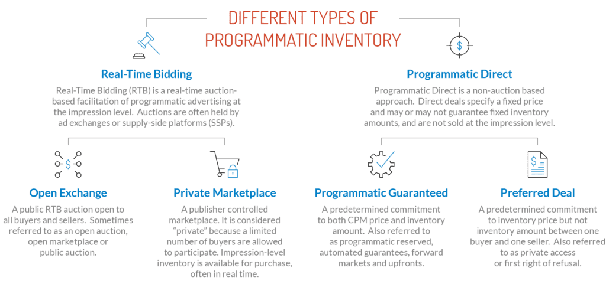

[toc]

Programmatic advertising is more popular than ever. In the U.S, [programmatic ad spending increased by 6%](https://www.statista.com/statistics/1296084/change-programmatic-ad-spending-us/) from December 2021 compared to the previous month. In March 2022,  programmatic ad spending in the U.S grew by 12% from the previous  month. 

Global statistics suggest programmatic advertising will continue with the same steady growth. In 2020, worldwide [programmatic ad spending reached $129 billion](https://www.statista.com/topics/2498/programmatic-advertising/#dossierKeyfigures).

Brands are investing heavily in programmatic advertising. The reason is clear–the chances of getting a better return on investment than traditional advertising are quite high. To harness the full power of  programmatic advertising, we’ve prepared a detailed guide with everything you need to know. 

# 1. What Is Programmatic Advertising?

**Programmatic advertising** is the automated buying of all types of ads to appear on all types of platforms and screens. You may also hear it  called **programmatic ad buying**. With this method, ad space is bought and sold in a digital auction, like eBay. However, the buying is automated and it happens in milliseconds.

Programmatic advertising is a holistic[^1] marketing approach that leverages[^2] both traditional and digital channels. The ad formats could include–display, mobile, social media, TV, audio, and more. Initially,  programmatic advertising was created to improve efficiency–by automating the media buying process you save time. Since then, it has evolved to also improve overall ad performance. With it, you reach customers where they are, and when they are most likely to make a purchase.

# 2. How Does Programmatic Advertising Work? 

To place programmatic ads on different media outlets and websites, you’ll want to be familiar with these common terms: 

- Demand-Side Platforms (DSP)
- Supply-Side Platforms (SSP)
- Ad Exchanges
- Ad Networks

## 2.1 Demand-Side Platform (DSP)

A demand-side platform is third-party software that allows advertisers to buy digital ad inventory from mobile, video, and search platforms. With it, you can manage multiple ad campaigns in one place.

A DSP can send your ads to a reliable network of publishers in various mediums. These mediums include radio stations, TV channels, and  content platforms. It relies on your audience’s data to identify the best publisher for your programmatic ad campaign.

It goes beyond simply buying ads on Instagram or Google. For instance, [Google’s Display Network](https://support.google.com/google-ads/answer/2404190?hl=en) only manages the advertisements that you place through Google’s  platform. You can only analyze and purchase ads through Google publishers. If you want to advertise on Google and Instagram, you have  to use two separate platforms to manage ads–Google and Instagram. 

With demand-side platforms, you can manage both (and more) in one place. [The Trade Desk](https://www.thetradedesk.com/us), [Google Display & Video 360](https://marketingplatform.google.com/about/display-video-360/), Amazon Advertising, and Yahoo DSP are popular demand-side platforms. 

Note, that Google’s Display Network for ads and its Display &  Video 360 are two different platforms. Display & Video 360 is a DSP, while Display Network is an ad network. 

## 2.2 Supply-Side Platform (SSP)

On the flip side, you have supply-side platforms. DSPs and SSPs work together to fulfill–as the name suggests–ad supply and demand. 

A supply-side platform is a digital system that ad publishers use to  make their properties available for bidding and ad placements. The  difference between the two platforms is that publishers or ad platforms  use SSPs to sell ad inventory. Those that want to buy ads use DSPs. 

Examples of SSPs include Google Ads Manager, Xandr, and Magnite for Sellers.

## 2.3 Ad Exchanges

Programmatic advertising uses ad exchanges to connect demand-side and supply-side platforms. They are marketplaces where businesses can buy  ads and publishers can offer ad inventory. Ads are usually purchased  through real-time bidding auctions, but it’s not a manual process.

Most advertisers use DSPs to determine if an ad space placed on the  ad exchange is worth bidding on, and it will look at impressions and  pricing. Examples of ad exchanges include [Google’s AdX](https://support.google.com/admanager/answer/6321605?hl=en) through Ads Manager and [OpenX](https://www.openx.com/).

## 2.4 Ad Networks

An ad network is a platform that brokers deals between publishers to  sell ad inventory and advertisers to purchase ad space. You may think that it sounds a lot like an ad exchange. Ad networks have some  similarities to exchanges, but there are key differences to know. 

- An ad network usually does not include all types of media–it focuses solely[^3] on online advertising. 
- In addition, ad networks act as resellers. You are buying from the ad network instead of the publisher directly.  
- Pricing is also not as transparent as an open ad exchange, because the pricing on exchanges is listed with impressions. 

# 3. Programmatic Advertising Buy Types

Not all programmatic advertising is the same, especially when it comes to the buying process. How do you purchase programmatic ads? Here are four main types of programmatic ad buying that you should know: 

- Real-time Bidding
- Private Marketplace
- Preferred Deals
- Programmatic Guaranteed

## 3.1 Real-Time Bidding

Real-time bidding is the most popular type of programmatic advertising. The ad spot is open to the public for any company to bid on the spot. As the name suggests, real-time bidding is an auction process that occurs instantly in real-time. The advertiser that bids the  highest for the ad spot gets it. The bidding process is automatic and is handled by the programmatic platform in milliseconds. 

Suppose a mobile game player watches ads between game levels. At that moment, the programmatic platform runs a real-time auction for  advertisers interested in displaying their ads to the player. 

The advertiser with the highest bid wins the auction in milliseconds. Since real-time bidding is public, your ads can appear anywhere. 

## 3.2 Private Marketplace

Private marketplace programmatic advertising works on an invite-only  basis. The ad publishers invite their preferred advertisers to place ads on the publishers’ inventory, like a website. For example, many  businesses compete for ad spots on high authority websites like Forbes.  For this reason, they set private spots for top-notch advertisers. 

With this type of programmatic marketing, businesses like franchises can set up their [franchise advertising](https://www.goodwaygroup.com/blog/franchise-advertising-guide) campaigns on a specific publisher’s inventory. 

## 3.3 Preferred Deals

With preferred deals, you choose ad spots before they become public.  In addition, you pay a fixed amount for an ad spot. Both parties  (advertiser and publisher) agree on targeting and pricing before the ad space is claimed. 

## 3.4 Programmatic Guaranteed

In this type of programmatic advertising, no bidding is involved. Negotiations for ad spaces are on a one-on-one basis. Programmatic guaranteed takes the conventional approach of media buying. 

As an advertiser, you choose your price, the target audience, and how frequently you want your ad to appear. It can be expensive since you control the ad's placement on a publisher's inventory.

 

# 4. Why Is Programmatic Advertising Important? 

People consume media across multiple devices–tablets, computers,  mobile phones, and TVs. With programmatic advertising, you can reach  more customers in more places. Here are the top benefits of programmatic advertising.

## 4.1 It Automates Media Buying

Programmatic advertising uses automation to purchase ads on thousands of platforms simultaneously. As a result, you streamline marketing campaigns and get accurate ad placements in the fastest time. 

## 4.2 You Can Manage All Your Ads in One Platform

You can monitor all your ad channels—social media, websites, TV, and  mobile—through a unified platform. This makes it easy to measure and  compare results for campaigns in different channels. 

## 4.3 Save Time and Money

Programmatic advertising leverages demand-side platforms to buy ad  inventory automatically. The buying happens in milliseconds to save you  time—no more hand-choosing ad publishers, which consumes a lot of time. 

It is budget-friendly. With real-time results, you can spend money only on what you know will be effective. You can also avoid wasting  resources on what doesn’t work. 

## 4.4 Audience-Based, Effective Marketing Campaigns

Programmatic relies on audience data to ensure your ads appear to people most likely to convert to customers. Using demographic and performance data, programmatic platforms match your ads with the right ad publisher. Also, you can specify who you want to see your ads based on demographics, location, and other audience information. 

# Footnote

[^1]: holistic: dealing with or treating the whole of something or someone and not just a part
[^2]: leverage: 

[^3]: solely: only and not involving anyone or anything else

