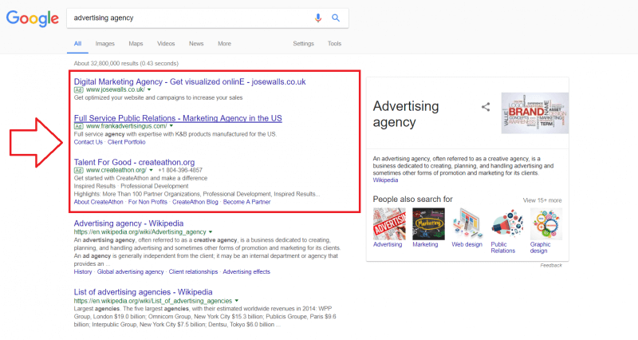

[toc]

# 1. Display advertising — definition, types, and benefits

There are many different variables involved in the decision of whether your business should use display advertising as a marketing strategy. You might wonder if display advertising is worth the investment or not know what it entails.

We’ll cover the following topics:

- What display advertising is
- Types of display advertising
- Benefits of display advertising
- Challenges of display advertising
- Display advertising billing

## 1.1 What is display advertising?

Display advertising, sometimes known as display marketing, involves the promotion of products, services, or brands through visually appealing advertisements that are displayed on digital platforms. These ads are usually a combination of text and images, capturing the attention of users and encouraging them to take action.

Through eye-catching visuals, compelling messages, and strategic ad placements, display advertising aims to engage users and generate interest in advertisements.

Display advertising can sometimes be confused with search advertising. Display advertising involves outbound marketing by proactively showing ads to users, while search advertising is an inbound marketing approach that involves displaying ads in response to user-initiated searches. 

It’s important to understand the differences between **native ads vs. display ads** and **display ads vs. search ads,** which we’ve outlined in the table below.  

|  Ad type   |                         Display ads                          |                          Search ads                          |                          Native ads                          |
| :--------: | :----------------------------------------------------------: | :----------------------------------------------------------: | :----------------------------------------------------------: |
| Definition | A form of advertising that displays ads on relevant, third-party websites. | A form of pay-per-click (PPC) advertising that displays ads in search engine results, based on users’ search queries. | A form of advertising that displays ads on social media and search engines. |
|   Design   | Designed to stand out visually from the platform on which they appear and build brand awareness. | Designed to resemble the look and feel of organic search engine results and to match users’ interests. | Designed to blend in visually with the platform on which they appear. |

Common examples of display ads include banner ads and pop-up ads. These formats allow advertisers to visually engage with users and deliver their messages effectively.

## 1.2 Types of display advertising

When considering display advertising, it’s important to look  at the various types of targeting and ad formats to effectively reach  and engage the desired audience.

- Targeting types include:

  - **Traditional display ads.** Most associated with display advertising; formatted as squares, banners, or skyscrapers; usually have an image, text, and call-to-action (CTA).

  - **Static ads.** Traditional ads in which text and image don't move.

  - **Responsive ads.** Responsive ads dynamically adjust their size, format, and appearance to fit different ad placements and screen sizes.

  - **Retargeting ads.** Display ads that are shown to users who have previously interacted with a brand.

  - **Native display ads.** Ads that blend in with the surrounding content, providing a non-disruptive user experience.

  - **Social display ads.** Ads that are specifically designed for social media platforms, tailored to match the platform’s visual style and user behavior.

- Some types of ad formats include:

  - **Banner ads.** Rectangular or square ads that are typically displayed at the top, bottom, or sides of a webpage.
  - **Rich media.** Interactive ads that incorporate elements like animation, audio, video, or expandable features.
  - **Video ads.** Ads in video format — often inserted before, during, or after online video content.
  - **Interstitial ads:** also called **Pop-up ads**, interactive, full-screen ads that appear in separate windows or overlays on top of the main content.
  - **Rewarded ads.** Ads that offer users incentives, such as in-game rewards or access to premium content.
  - **Interactive content.** Ads that allow quizzes, games, or product configurators.

  With a variety of targeting types and ad formats comes flexibility and  opportunities to tailor display advertising campaigns according to the  needs of different businesses.

## 1.3 Benefits of display advertising

There are several advantages to using display advertising. Among other benefits, using display advertising helps businesses:

- **Increase brand awareness.** Display  advertising allows you to reach a broad audience. Widespread exposure  helps raise brand awareness and visibility among potential customers.
- **Target customers.** Display advertising  allows advertisers to reach their desired audience with precision using  demographics, geography, behavior, and other factors to curate content,  ensuring their ads are seen by the most relevant users.
- **Design a full-funnel campaign.** With [programmatic advertising](https://business.adobe.com/blog/basics/programmatic-advertising-made-simple) and smart bidding, advertisers can design and optimize their campaigns  to effectively target customers at different stages of the sales funnel.
- **Choose from multiple ad formats.** Display  advertising offers banner ads, pop-ups, pop-unders, wallpaper ads,  interstitial ads, map ads, video ads, and more. Advertisers can select  the most suitable format to capture attention and engage users  effectively.
- **Retarget customers.** Businesses can [retarget customers](https://business.adobe.com/blog/basics/retargeting) by displaying ads to users who have previously interacted with their  brand as they browse other websites or platforms, reinforcing their message and encouraging conversions.
- **Measure results.** Display advertising  provides robust measurement and analytics capabilities, allowing  advertisers to track key metrics like reach, click-through rate, bounce  rate, conversion rate, and return on investment. These insights help  advertisers evaluate the effectiveness of their campaigns and perform  data-driven optimizations for better results.

## 1.4 Challenges of display advertising

Despite its benefits, display advertising can produce some  obstacles that hinder its effectiveness. These challenges include ad  blockers limiting ad visibility, banner blindness leading to low  click-through rates (around 0.1%), and random clicks — especially on  mobile devices.

Advertisers must be cautious about potential pitfalls within  their control, such as ineffective creative approaches that fail to  captivate audiences and poor targeting that results in inefficient ad  placements. Addressing these challenges through strategic measures can  enhance the impact and performance of display advertising campaigns.

## 1.5 Display advertising billing

When a business starts using display advertising, they need  to understand the various billing agreements that determine how  advertisers are charged for their ad campaigns. Here’s an overview of  the most common billing agreements:

- **Flat rate.** Advertisers pay a  predetermined fixed amount for a specific duration or number of  impressions, regardless of the performance or engagement of the ad.
- **Cost per mille (CPM).** Advertisers are charged based on the number of impressions their ads receive, typically per 1,000 impressions. CPM focuses on exposure and brand visibility.
- **Cost per click (CPC).** Advertisers pay for each click their ads receive. This billing model is  performance-oriented, as advertisers only pay when users actively engage with the ad.
- **Cost per lead (CPL).** Advertisers pay based on the number of leads generated through the ad campaign. It’s  commonly used when the primary goal is lead generation.
- **Cost per sale (CPS).** Advertisers are charged based on the number of sales generated that were directly attributed to the ad campaign. This model is often used in affiliate marketing or e-commerce scenarios.

## 1.6 Getting started with display advertising

Display advertising can be a valuable tool for businesses to enhance their marketing efforts and achieve their goals. By using  visually appealing ads across various digital platforms, businesses can increase brand awareness, target specific customer segments, and measure campaign performance.

## 1.7 Programmatic Advertising Vs. Display Advertising

Programmatic advertising is an algorithm-based buying and selling of ad spaces across multiple channels. 

Display advertising is the process of advertising through visuals like images and videos. Display ads usually appear as banner ads. They are placed on various publisher websites and are most commonly purchased through [Google’s Display Network](https://support.google.com/google-ads/answer/2404190?hl=en).

Programmatic refers to how you purchase and place ads, while display refers to your ad’s format.

# 2. What Is Search Advertising and How Does It Work?

Paid search advertising (also known as sponsored ads, search marketing, search-engine marketing, pay-per-click marketing, and cost-per-click marketing) is a technique that displays ads in search-engine results whenever someone searches for the services or  products offered by the advertiser. In this way, the ad displayed perfectly matches each query.

Search advertising is very effective; it is based on the explicit need of the users, rather than just on implicit information about what  they might be after. This, naturally, increases the likelihood of clicks and conversion.

Google is the world’s leading provider of search ads. Its AdWords service allows companies offering products or services to pay for their ads based on the queries of Internet users entered into the search box.  It is quite simple—when your results page loads, there are ad boxes with relevant ads displayed next to organic results.

Businesses which advertise in the search results are not charged  until somebody clicks on one of their ads, which explains why it’s known as “pay-per-click” (PPC) advertising. Typically, this advertising  technique is offered by search-engine companies.

We’ll cover the following topics:

- What Are Search Ads?

- Who Offers Search Ads?

- How Search Ads Work

- What is Ad Rank?

- Final Thoughts

## 2.1 What Are Search Ads?

Whenever you look for a product or service online, Google (or any other search-engine provider) displays a results page consisting of both [organic](https://support.google.com/adwords/answer/6054492?hl=en) and sponsored results. The ads can be displayed in many ways, but  search engines typically indicate which results are sponsored and which  are not.

In Google Search results, sponsored entries are typically displayed  as the top few results, and some are also displayed at the bottom of the page. Currently, Google is marking paid search results with a small  green “Ad” symbol next to them, letting you know they are not organic.  Some of Google’s previous implementations of sponsored results included  different backgrounds (yellow, blue) and yellow-colored “Ad” icons.  Ginny Marvin goes more in-depth about these changes in her [post](https://searchengineland.com/search-ad-labeling-history-google-bing-254332) on [Search Engine Land](https://searchengineland.com/).

 

## Who Offers Search Ads?

Most search-engine companies provide advertisers with platforms that  allow them to display ads in their search results (Google does it via [AdWords](https://adwords.google.com/home/), Bing does it via [Bing Ads](https://secure.bingads.microsoft.com/), etc.). This is a natural way for search providers to capitalize on their huge user base and their users’ intent.

While the dominance of Google on the market of search ads is  undeniable, a comprehensive search-marketing strategy should also  consider displaying search ads on engines like Bing and Yahoo. Also,  some markets demonstrate a penchant for specific search providers. For  instance, [Baidu](http://www.baidu.com), while obscure to most people in Europe and the US, is one of the leading internet companies in China. Similarly, [Yandex](https://en.wikipedia.org/wiki/Yandex) is currently the largest search engine in Russia, where it boasts a  whopping 65% market share, a proportion that cannot be ignored when  developing a global search-advertising strategy.

While the [global search-engine market](https://www.netmarketshare.com/search-engine-market-share.aspx) is currently dominated by Google with an eye-watering 77% market share  (and growing), it is impossible to ignore the audiences gathered by some of the other search runners-up:

- [Google](http://google.com) (77.43%)
- [Baidu](https://en.wikipedia.org/wiki/Baidu) (8.13%)
- [Microsoft Bing](http://www.bing.com) (7.31%)
- [Yahoo](http://yahoo.com) (5.6%)
- [Ask](https://www.ask.com/) (0.13%)

## How Search Ads Work

The actual mechanics behind search ads are similar across [most of the popular search engines](https://ignitevisibility.com/what-is-cpc/) with some slight differences. As Google is the most popular search  engine, we’ll use it as the example and explain how its search ads work.

Google uses a modified [second-price auction system](https://clearcode.cc/blog/first-price-second-price-auction/) to rank the ads that appear on Google search-engine results pages  (SERPs), and determine the cost advertisers have to pay to appear on top of the results page.

 Google's Ad Rank score

Google’s second-price auction mechanics basically mean that instead  of having to pay the full price, advertisers pay the amount needed to  beat the nearest competitor, depending on their Ad Rank (more on that  below).

However, the system isn’t based *just* on bidding. If Google  only sold its ads to the highest bidders, the SERP would be littered  with poor-quality paid ads linking to completely irrelevant landing  pages. This would compromise the reliability of the search engine. To  improve the experience for both the users and the advertisers, Google  also takes into account an advertiser’s Ad Rank.

## What is Ad Rank?

[Ad Rank](https://support.google.com/adwords/answer/1752122?hl=en) is the [PageRank](https://en.wikipedia.org/wiki/PageRank) equivalent for search ads in Google. It is an algorithm used to  determine how highly ads rank in the sponsored results and how much the  advertiser has to pay when an internet user clicks the ad.

Google has always been upfront about what advertisers should do to  increase their Ad Rank and position higher in paid search. Conversely,  high positioning in organic search (the good, old PageRank) has always  been the holy grail of online advertising, and algorithms governing it,  unlike Ad Rank, still seem obscure and dynamically changing.

The Ad Rank formula that governs the appearance of ads consists of:

- **Expected click-through rate** – Google’s estimation  of how likely it is the ad will be clicked. This is much like a  self-learning system. Google knows the click-through rates of all the  ads it displays; users “upvote” ads with their clicks. Consequently,  Google shows more of what they like, and estimates the rates for all  future ads.
- **Landing-page experience** – Unsurprisingly, highly  relevant landing pages get a higher Ad Rank score. This involves  relevant and original content, easy navigation, and transparency.
- **Ad relevance** – Google analyzes the content of each  ad to determine how well it relates to the query. This ensures that only the useful ads are shown.
- **Ad formats** – Google also takes into account the  expected impact of specific ad formats—enhancements to search-ad format  with additional information. Apart from the link to the website, ads may contain valuable extensions with structured data: extra information  like ratings (see image below), prices, directions, and phone numbers.

 Google ad format in the wild: an example of search result with star rating

The above considerations make it virtually impossible for advertisers to simply pay their way to SERPs and get irrelevant ads displayed to  users; bidding high does not secure a slot in the paid search results.

In this respect, Google search ads seem like a perfect,  self-regulating system; people want to see only the ads that are  relevant to them. Conversely, advertisers want to show relevant ads so  that users can actually click them.

## Final Thoughts

Paid search advertising is an effective way of advertising directly  to your audience the moment they need your service or product. It offers excellent results for specific industries, where may be more effective  than the use of traditional “spray-and-pray” ads.
