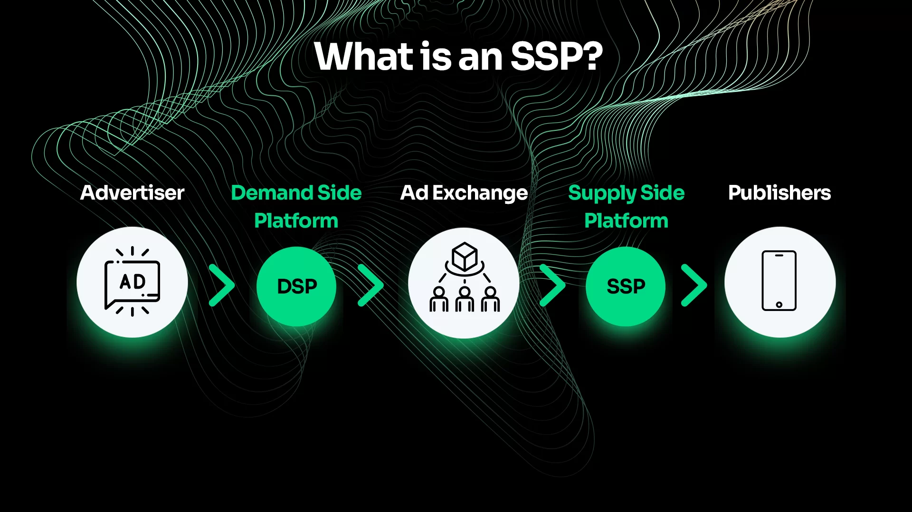
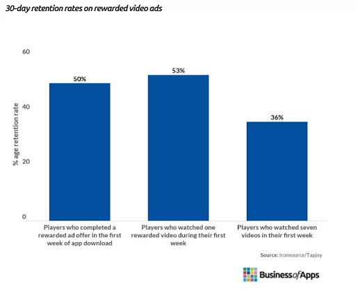

# 1. Real-time bidding, what is it and how does it work?

It’s estimated that the average person sees somewhere between 4,000 and 10,000 ads per day. Most of those ads are bought and sold using an adtech practice called real-time bidding.

In this article, we’ll define real-time bidding, explore how it works, the pros and cons of real-time bidding, and the technology on the horizon that will affect real-time bidding in the future.

## **What is real-time bidding?**

Real-time bidding is a micro-auction that’s completed in less than a second, when advertisers compete for digital ad space in real time.

Digital advertising is built on supply and demand: Websites and mobile apps cost a lot of money to run, so they offset those costs by creating ad units and placing them where people will see them as they consume content.

On the other side of the equation, advertisers want to put their ads in front of the people who are most likely to buy their products or use their services.

The multibillion-dollar advertising technology industry exists to connect supply (in this case, the publishers of websites and apps) with demand (advertisers and advertising agencies).

There are lots of ways to connect supply and demand. In the earliest days of the internet, this process was largely manual: Advertisers looked for websites that catered to their customer demographics, negotiated pricing, and ran their ad campaigns on specific websites for a specific amount of time. It was slow, expensive, and hard to measure which ads were reaching the right people.

Real-time bidding dramatically streamlines this process.

The winning ad loads virtually instantly on the website or mobile app you’re looking at, with all the details, such as ad targeting, price negotiation and payment agreements happening in the background, in a matter of milliseconds.

Every hour, billions of digital ads are bought and sold across the [programmatic advertising](https://www.start.io/blog/programmatic-advertising-advanced-guide-ecosystem-benefits-trends-best-practices) ecosystem using real-time bidding.

## **How does the process of real-time bidding work?**

Real-time bidding is a sophisticated, multistep process, where multiple adtech platforms need to work together in a very short amount of time to successfully deliver an ad.

Let’s first define a couple key terms:

- **Publishers:** The owners of the thing that’s displaying the ads—commonly a website, mobile app, podcast, streaming video platform, TV station, magazine publisher, billboard owner, etc.
- **Supply-side platform:** A software platform that represents the interests of the publisher. Publishers give SSPs information about the ad units they create, and the people who have landed on their media property. [Supply Side Platforms](https://www.start.io/blog/mastering-supply-side-platform-overview-benefits-and-best-practices-for-maximizing-revenue/) exist to get publishers the highest possible ad rates.
- **Advertisers:** Companies that want to get messages in front of customers. Many advertisers are represented by advertising agencies.
- **Demand-side platform:** A software platform that represents the interests of advertisers and their ad agencies. Advertisers load their creative assets into [Demand Side Platforms](https://www.start.io/blog/mobile-dsp-101-demand-side-platform-overview-types-benefits-and-best-practices/) and define which types of customers they’re looking for and how much they’re willing to pay to reach those customers. DSPs exist to help advertisers reach their ideal audience at the most efficient price possible.
- **Ad exchanges:** SSPs and DSPs meet at the advertising exchange, which facilitates the real-time bidding process. [Ad exchanges](https://www.start.io/glossary/ad-exchange/) plug into multiple SSPs and DSPs, giving publishers access to many advertisers, and advertisers access to many outlets for their ads.

### **The role of SSPs in real-time bidding**

The real-time bidding process starts with the publisher. As soon as someone lands on a page, or loads a mobile app, the publisher asks for an ad. This request gets routed through the publisher’s supply-side platform and lands at the ad exchange, where advertisers compete to win that ad unit.

Publishers send along additional information with their ad requests, such as more information about the specific webpage or app the customer is looking at, the customer’s location and language preferences, and any other data that might yield a better, higher-paying ad.

The publisher’s supply-side platform, or SSP, represents the publisher’s interests in the auction, in hopes of getting back an ad that’s relevant, and has a high CPM (the amount of money it costs to deliver 1,000 ad impressions). Here, publishers can set a price floor on their ad inventory—if they don’t get bids above that price, they don’t display an ad.

### **The role of DSPs in real-time bidding**

Meanwhile, advertisers load their campaign requirements into their demand-side platform, or DSP, with varying levels of granularity. Ad campaigns might target people based on where they live, what language they speak, or their age, gender, estimated income, or specific interests. Here too, advertisers can set their maximum bid range and specify the names and types of publishers they don’t want to distribute ads to.

In real-time bidding, the supply side talks to the demand side using a standardized industry protocol called [OpenRTB](https://iabtechlab.com/standards/openrtb/). Developed and maintained by the Interactive Advertising Bureau’s [Tech Lab](https://iabtechlab.com/), this protocol standardizes the metadata fields that the supply side and demand side use to communicate.

These metadata fields include, among other things, information about the publisher, the dimensions of their ad units, the customer’s location, IP address, and/or inferred interests. Here’s an example of an [OpenRTB request](https://protocol.bidswitch.com/standards/bid-request-examples.html).

Armed with this information, SSPs and DSPs meet at an advertising exchange to conduct a real-time bid. Real-time bidding often follows what’s known as a Vickrey auction format—the advertiser that wins places the highest bid, but ultimately pays the price that the second-highest paying bidder offered.

This process happens within several hundred milliseconds, and is repeated over and over, hundreds of billions of times per day.

## **The benefits and challenges of real-time bidding**

Real-time bidding solves a complicated marketplace problem at scale. And while it works very well, it’s not yet perfect. Here are the benefits and challenges of real-time bidding:

### **The benefits of real-time bidding**

For publishers, real-time bidding helps fill ad units with relevant, high-paying ads instantly. Publishers can feel confident that they’re monetizing their platforms efficiently, by getting access to hundreds of thousands of advertisers and multiple competitive bids for their ad units.

For publishers, the biggest benefit of real-time bidding is how easy it is to participate in the global advertising marketplace.

For advertisers, real-time bidding gives them access to large digital properties, and the ability to build targeted campaigns that find prospective customers quickly and efficiently. Once in motion, advertisers can make changes to their campaigns to optimize ad performance. 

Real-time bidding allows advertisers to reach their customers in a cost-effective way.

### **The challenges of real-time bidding**

For publishers, the downside of real-time bidding is the relative lack of transparency and control over the types of ads that get displayed on their properties. A large website or mobile app might display ads from thousands of brands per day, selling a variety of products and services. Publishers need to trust that the adtech ecosystem will serve up relevant, useful, brand-safe advertising.

For advertisers, the downside of real-time bidding is also transparency and control. Given the velocity and scale of real-time bidding, advertisers need to trust that the adtech ecosystem is placing their ads in front of real, relevant customers. The advertising industry relies on performance tracking and management tools to figure out where their ads are being displayed, and whether those impressions are resulting in positive business outcomes.

## **What’s next for real-time bidding?**

Artificial intelligence will continue to take over large parts of the real-time bidding ecosystem. Adtech companies like Start.io use artificial intelligence to improve ad requests as they’re being sent to an SSP, with the goal of commanding a higher CPM for publishers.

On the other side of the equation, adtech companies are using AI to personalize ads as an additional step inside the real-time bidding process, in hopes of improving their click-through rate.

The industry continues to experiment with transparency, performance measurement and attribution markers, which could be built on blockchain technology.

Meanwhile, the advertising industry is losing access to foundational tools such as third-party cookies and unique IDs, as Google, Apple, and other major players improve consumer privacy.

Despite its existing, high level of sophistication, real-time bidding will continue to improve over time.

Start.io is a leading player in the real-time bidding ecosystem. If you’re an advertiser, learn more about our [omnichannel ad-serving capabilities](https://www.start.io/growth/). If you’re the publisher of a mobile app, download the [Start.io advertising SDK](https://www.start.io/mobile-monetization/).

# 2. Mastering Supply Side Platform in 2023: Overview, Benefits, and Best Practices for Maximizing Revenue

Programmatic advertising is a complex ecosystem that serves a broad and vital goal: **connecting publishers and advertisers in the efficient buying and selling of online inventory and digital ad impressions.**

There are multiple players working to bring both sides together and achieve that goal. On the advertiser side, there are the **DSPs and ad networks**. In the middle, there are **ad exchanges, DMPs, trade desks, agencies** and more. On the publisher side, you will find the **SSPs, or Supply Side Platforms**.

SSPs are one part of a bigger engine that drives the process of online advertising.

Let’s take a deeper dive into what is supply side platform, its features, advantages and best practices. We’ll also examine aspects of demand side vs supply side advertising and see how they are different. 

## What is a Supply Side Platform (SSP) in Advertising?

In the programmatic marketplace, publishers ‘supply’ ad space and impressions to advertisers. They do so via a Supply Side Platform, or SSP for short.

SSPs facilitate publishers in the sale of ad impressions on their digital assets (ie. website, mobile site, app) to advertisers via automated real-time bidding. The Supply Side Platform connects to numerous ad exchanges, DSPs and ad networks, so publishers can offer their inventory to a wide range of advertisers at once. This helps drive the maximum bid price, boosting potential publisher revenue on websites and apps.

## How SSPs Work: Understanding the Basics of the Ad Selling Process

**SSPs connect publishers with multiple advertisers on several ad exchanges, ad networks and DSPs simultaneously, in an auction-based process known as Real Time Bidding (RTB)**.

In an RTB transaction, an advertiser places a bid on publisher inventory via the DSP. The SSP supplies the ad space, based on the publisher’s pre-defined parameters and rules, such as brand safety guidelines, ad formats, ad categories and more.

Behind the scenes, the SSP analyzes the demand sources and selects the highest bidding ad that is best suited to the publisher site, placement, time and viewer. The complete transaction is fully automated and happens in real time. In just a second or two, the winning ad is shown on the web page or app.

SSPs help publishers optimize yield from their ad inventory by hugely broadening the advertiser pool. This enables them to fill their inventory with the best possible ads at the maximum bid, targeted to the highest quality audiences. There are several ways that SSPs can optimize ad inventory and maximize revenue, for example:

- **Choosing the best ad network:** SSPs use past data to determine which ad network offers the best requirements for a particular transaction. 
- **Geo optimization:** SSPs can ensure that publishers only offer inventory on ad networks that offer relevant and high-potential geographies.
- **Frequency capping:** SSPs sync with DSPs to limit the number of times that viewers see the ad. This prevents over-exposure and wasted impressions.

## SSP vs. Ad network: What’s the Difference?

The [programmatic advertising](https://www.start.io/blog/programmatic-advertising-advanced-guide-ecosystem-benefits-trends-best-practices/) ecosystem is highly complex, and it includes multiple players on the publisher side and advertiser side. A Supply Side Platform is exclusively a publisher-side platform, interfacing with publishers and providing them with access to advertiser demand. An ad network, on the other hand, works as a marketplace for advertisers, connecting them with publishers via the SSP. 

## What is the Difference between SSP and DSP?

Programmatic buying and selling of online ad impressions requires two parties: publishers (supply) and advertisers (demand), or in other words, supply side vs demand side. The Supply Side Platform is where publishers can offer their ad inventory to ad buyers. On the other hand, the DSP, or the Demand Side Platform, is the advertiser interface, where advertisers place bids for the purchase of ad inventory.

With DSPs, advertisers can manage and optimize their media buying operations across multiple [ad exchanges](https://www.start.io/glossary/ad-exchange/) and SSPs on one interface. By centralizing their programmatic ad buying on a DSP, advertisers can boost operational efficiency and enhance the ROI of their ad campaigns.

In short, DSP vs SSP is simply about the two different interfaces used by advertisers and publishers in programmatic media buying.

## What are the Benefits of Using SSPs for Publishers?

Publishers competing for ad revenue in the programmatic space rely on supply side platform advertising for the advantages they offer. These include:

- **Maximized revenue:** SSPs provide publishers with access to a vast network of demand sources, including ad exchanges, trade desks, and [DSPs](https://www.start.io/glossary/demand-side-platforms-dsps/). This increases the pool of potential buyers, resulting in higher competition and bidding for ad inventory. This in turn drives up ad prices and maximizes revenue opportunities for publishers.
- **Automated supply:** SSPs automate the process of selling ad inventory, giving publishers an efficient and streamlined approach to site or [app monetization](https://www.start.io/blog/maximizing-revenue-proven-strategies-for-app-monetization-statistics-models-and-best-practices/). Publishers connect their inventory to the Supply Side Platform, which then aggregates demand from multiple sources, manages bidding, and selects the highest bidder for each impression, completely automatically and within seconds. This reduces the manual work for publishers while ensuring optimized transactions. 
- **Better control of inventory:** With SSP advertising, publishers gain increased control over the types of ads that are shown on their websites or apps. Publishers can set down preferences and rules about a range of parameters, such as ad formats, ad quality, ad categories and pricing. By enabling publishers to control and block appropriate ads, publishers can assure brand safety and maintain the quality of their online assets.
- **Analytics and reporting:** SSPs offer built-in, granular data analytics and reporting on real-time data, such as fill rates, impressions, eCPM, clicks and other key metrics. These insights help publishers monitor and track their activity, better understand who is buying their inventory and optimize their monetization strategy to increase their revenue yield.

## Common SSP Features and Capabilities 

Supply side platforms typically offer a range of features and capabilities to help publishers improve their efficiency and generate more revenue from their online assets. These include:

 **Inventory management**

SSPs are a powerful tool for publishers to effectively manage and control their ad inventory. They can set preferences and rules about which advertisers and industries they work with, as well as ad formats, ad placements, targeting options, and pricing. This helps to ensure that the right ads are shown to the right audiences at the optimal time. Publishers can also manage the frequency of ad impressions in order to provide the best possible user experience on their app or site.

**Integration with demand-side partners**

SSPs integrate with a range of demand partners, such as ad networks, ad exchanges, trade desks, DSPs as well as direct advertisers. This opens up a wide pool of advertising partners available to publishers on the Supply Side Platform, increasing exposure and demand for their ads supply and creating more opportunities for monetization.

**Yield optimization**

A key feature is the use of AI algorithms to optimize supply and increase the potential yield of the publisher’s ad inventory. The SSP aggregates and analyzes past data about ad performance, such as fill rates, bid rates, performance and revenue, to optimize the publisher’s supply strategy. It also integrates dynamic optimization tactics, such as price floors, to effectively increase and optimize publisher yield in real time.

**Real-time bidding (RTB)**

RTB is a commonly used transaction for digital media buying. SSPs connect with ad exchanges and other demand-side partners to offer real-time bidding for ad impressions, enabling multiple advertisers to compete for the impression simultaneously. With [RTB](https://www.start.io/glossary/real-time-bidding-rtb/), publishers can drive up bidding and get more revenue for each ad impression, thereby increasing the value of their inventory.

**Header bidding**

Some Supply Side Platforms offer a header bidding feature, enabling publishers to collect and analyze bids from several different demand partners and DSPs before calling their ad server. With this capability, publishers can manage and optimize their header bidding strategy across all their demand partners via the SSP.

 

## Choosing the Right SSP for Your Business: Factors to Consider

There are many different SSP companies on the market, and each platform has its own unique configuration of features, tools and advantages for publishers. Let’s take a look at the key factors to consider when choosing a supply side ad platform:

**Ease of use**

Part of the job of SSP programmatic is to make inventory trading simpler and more efficient. Consider the user interface and dashboard, as well as the setup and onboarding process. Make sure to choose a platform that offers advanced features, yet is user friendly at the same time.

**Demand integrations**

Which demand partners does the SSP ad server offer? Be sure to choose one that integrates with good quality ad exchanges and [DMPs](https://www.start.io/glossary/data-management-platforms-dmps/), and serves the geographies, audiences and industries that are relevant to your website or [in-app advertising](https://www.start.io/blog/in-app-advertising-guide-best-practices-ad-types-tips-for-developing-a-successful-in-app-strategy/) revenue goals.

**Analytics capabilities**

The ability to track, analyze and gain insights from granular performance data is critical to yield optimization of ad inventory. A good SSP will provide robust analytics and reporting features, as well as the ability to customize reports and dashboards according to your KPIs and revenue goals.

**Optimization tools and features**

Every SSP is slightly different so make sure to check which features and tools are available for optimizing campaigns and maximizing bids in real time. Also, see what type of auctions and exchanges are built into the platform. For example, does it offer private auctions, in which preferred advertisers can bid on inventory at higher pricing before the general advertiser pool? This can be an important feature to drive up bidding and boost revenue. 

**Brand safety** 

Finally, brand safety is critical, so make sure to closely examine which security tools the SSP integrates with. Take note of how they manage ad fraud, as well as their stated policies for blocking unwanted ads and advertisers from being displayed on your app or website.

 

## Best Practices for Using SSPs – Tips for Maximizing Revenue

In SSP marketing, publishers who want to maximize the revenue of their ad inventory must stay on the ball at all times. This means continually optimizing audience offerings, targeting options and user experience, and leveraging SSP tools to enhance the attractiveness of their inventory. 

Here are our top tips for how to use a Supply Side Platform to boost publisher revenue:

 **Ramp up the bidding pressure**

The key element of maximizing revenue of SSP ads is by maximizing pressure in auctions for ad impressions. There are several ways to do this, such as identifying and filling gaps in mapping, fixing broken ad slots, tracking and responding to performance data in real time, and focusing on high granular data to optimize campaigns in the most focused and effective way.

**Dynamic floor pricing**

This is a key best practice for publishers to avoid underselling ad impressions, and ensuring they realize the maximum value of their inventory. With fixed floor pricing, publishers risk losing out on advertisers who are willing to bid higher on specific inventory. By using dynamic floor pricing, publishers can capture those higher bids and optimize both their fill rate and revenue.

**Build new audiences**

Tap into advanced audience building strategies to provide high quality audiences to advertisers, and to draw more interest and action in your inventory. Providing curated supply is one of the ways to optimize the supply path for advertisers and drive up the bidding for ad impressions.

**Use contextual targeting**

As market competition increases and cookie depreciation makes targeting even harder, advertisers are looking for high-quality, targeted inventory and are even willing to pay more for those impressions. Contextual targeting, based on parameters such as real-time mobile user location, interests, hobbies and more, enables advertisers to effectively target highly relevant audiences, which means higher bids and more revenue for publishers.

## The Future of SSPs: Trends and Predictions

As adtech continues to evolve, SSPs can also be expected to advance to higher levels of efficiency. In particular, AI technology will streamline the functioning of publisher-side platforms, and play a crucial role in enhancing the programmatic advertising ecosystem in the future.

As we can already see in many industries and technologies, AI will revolutionize the way SSPs operate, making them more intelligent and efficient. Publisher platforms that integrate artificial intelligence will have the capability for more advanced audience segmentation, targeting, and optimization. 

Machine learning algorithms will analyze massively increased amounts of data, which will lead to better ad placements and maximized revenue for publishers. AI will also play a role in monitoring and identifying fraudulent ads, helping to improve transparency and trust in programmatic transactions. This will boost brand safety and enhance ad viewability – a win-win for advertisers and publishers.

When looking at the question, “what is SSP?”, the answer comes from understanding how it fits into the broader landscape of the programmatic ecosystem. For publishers, choosing the right platform and leveraging its features and capabilities to drive up bidding on ad inventory is a key skill for success. And with AI on the horizon, the future will bring even more potential and promise for online publishers to succeed in monetization.

# 3. Demand-Side Platform Overview, Types, Benefits, and Best Practices for Effective Campaigns

The programmatic advertising system is a two-way street: advertisers who ‘demand’ ad inventory and publishers who ‘supply’ it.

For publishers in the mobile space, boosting traffic and in-app conversions is the name of the game. 

For advertisers, it’s all about reaching the best target audience at the right time, with the right ad experience to encourage engagement and conversions.

While this might sound simple in a nutshell, there’s a lot of ad-tech that facilitates the process of supply and demand. On the advertising side – also known as the demand side – the Demand-Side Platform is the star of the show.

## What is a Demand-Side Platform (DSP) – Understanding Programmatic Advertising

A [Demand-Side Platform (DSP)](https://www.start.io/glossary/demand-side-platforms-dsps/) is a software platform that enables advertisers to buy and manage digital ad placements across publisher sites on the web and in mobile apps. With a DSP, advertisers can operate multiple accounts on multiple ad exchanges, trade desks and SSP, via one centralized interface.

In the [programmatic advertising](https://www.start.io/blog/programmatic-advertising-advanced-guide-ecosystem-benefits-trends-best-practices/) process, advertisers and publishers interact in bidding auctions for the sale and purchase of ad inventory. Publishers ‘supply’ the ad inventory to the marketplace, and they use an [SSP (Supply-Side Platform)](https://www.start.io/blog/mastering-supply-side-platform-overview-benefits-and-best-practices-for-maximizing-revenue/) to do so. Advertisers are the demand side of the equation, and they rely on the DSP providers to participate in these transactions. 

DSP marketing, however, is much more than just auctions. By using a DSP, advertisers can connect with multiple publishers and auctions at the same time. This provides them with access to a broad pool of ad inventory and significantly expands their reach among potential audiences.

With programmatic DSP, the process of bidding for and buying ad space is automated with advanced tools to optimize audience targeting and bid pricing, so advertisers get the best ad placements at the best cost. In addition, DSPs provide campaign management and analytics capabilities, so advertisers can manage and optimize multiple campaigns far more easily and quickly than if they were simply to rely on old-fashioned manual media buying methods.

## How Mobile DSP Works – The Role of Ad Tech and Real-Time Bidding 

In traditional media buying, advertisers had to manually submit bids for separate auctions on all the different publications, websites or apps where they wanted their ads to appear. Ad-tech and [real-time bidding](https://www.start.io/glossary/real-time-bidding-rtb/) changed all that. 

Around a decade ago, programmatic advertising hit the scene. It enabled advertisers to automate the process of bidding in auctions for ad space across multiple publisher sites and apps, and buy the best ad placements in a split second. That’s where DSPs come into the picture.

Here’s how DSP advertising works: An advertiser creates a digital ad campaign and submits it to the DSP, defining the target audience and bid price in advance. Publisher inventory becomes available on the market via the SSP. Both sides in the programmatic auction – the DSP and SSP – ‘talk’ to each other via ad exchanges and [DMPs (data management platforms)](https://www.start.io/glossary/data-management-platforms-dmps/). Using AI-based algorithms, the DSP identifies and places the most appropriate bids for multiple auctions at once. 

All of this happens automatically in real time, when a user lands on a web page or an app. In a split second, the DSP operates on behalf of the advertiser to buy the best placements and show ads to the most relevant users at the best price. 

Publisher > SSP > Ad exchange /DMP /Trade desk < DSP < Advertiser

Mobile DSP providers operate in precisely this way, but exclusively for mobile ad inventory and [in-app advertising](https://www.start.io/blog/in-app-advertising-guide-best-practices-ad-types-tips-for-developing-a-successful-in-app-strategy/). Advertisers who want to promote their business on apps use mobile DSPs to specifically reach mobile audiences with targeted campaigns. A mobile DSP will take into account a range of mobile-specific signals to determine the best bids and target audiences. These include real time location, device and OS. 

Mobile DSPs also have to take into account changing data privacy regulations specific to mobile advertising, including mobile web cookies and mobile advertising IDs, such as [Apple’s IDFA](https://www.start.io/glossary/identifier-for-advertisers-idfa/) and [Google’s GAID](https://www.start.io/glossary/google-ad-id-gaid/). 

## What are the Types of Mobile DSPs?

There are several DSP platforms available to advertisers, including those that specialize in particular networks, ad types or campaign strategies. For example, using Facebook Ads Manager, advertisers can bid in real-time programmatic auctions for ad space across Meta properties. Amazon’s AAP is the DSP for advertising on all of Amazon’s sites and apps. 

Mobile DSPs specialize in ad inventory across the mobile advertising ecosystem. Here are three types of mobile programmatic DSPs that advertisers can choose from:

### Full-service mobile DSP 

A full-service mobile DSP provides a complete media buying solution for advertisers. Led by an assigned account manager, the DSP team manages and controls ad campaigns and bidding strategies on behalf of the advertiser. With a full-service DSP network, the advertiser is in expert hands, leaving ad bidding, buying and optimization up to an outsourced team. On the other hand, this is a far more expensive option, and places most of the control with the DSP, rather than with the advertiser.

### Self-serve DSP

With a self-serve DSP, advertisers manage their ad buying and optimization activities directly, via the dashboard. The self-serve setup cuts out any third-parties, thereby reducing the cost of media buying. By choosing a self-serve DSP that meets their needs, advertisers gain access to huge amounts of ad inventory, easily and efficiently. 

While self-serve platforms are built for user-friendliness, they do require some skill and knowledge. Advertisers who are adept at programmatic buying can take full advantage of the built-in targeting, optimization and budget tools of the DSP to drive the best campaign performance. 

### White label DSP

A white label DSP is available for purchase and ready to use. The DSP platform is provided as a blank slate, so the advertiser can tweak and configure the mechanisms to create a proprietary solution that meets the needs of the business. With a white label DSP, the advertiser can integrate with the SSPs and [ad exchanges](https://www.start.io/glossary/ad-exchange/) of their choice, and even build specific algorithms to support their buying strategy and enable specific campaign customization capabilities. 

White label DSPs are a costly investment, however, making them a viable alternative only for large agencies or companies that engage in enormous amounts of media trading. 

##  Key Features and Benefits of Mobile DSPs

Whether self-serve, full service or white label, advertisers must engage with a DSP to bid and buy mobile ad placements in programmatic RTB auctions. Fortunately, DSPs do much more than just provide access to real-time bidding – they have several important advantages for mobile advertisers. Let’s take a look at the key features and benefits:

### **Ad buying in one place**

A DSP is a centralized hub where advertisers can manage multiple programmatic advertising accounts and campaigns. Via the dashboard, advertisers access numerous SSPs, ad exchanges, DMPs and trade desks, making the process of campaign set up, auction bidding and optimization far more efficient. A DSP also gives advertisers much more control over their mobile ad placements and campaign spend.

### **Better targeting**

DSP advertising supports advanced targeting capabilities, enabling advertisers to define and reach specific audience segments for different campaigns, across websites, apps and platforms.

Various parameters, such as demographics, interests and browsing behavior, can all be used to target the most relevant users. Advertisers can also leverage DSPs for retargeting and other advanced segmentation tactics, such as [Likely-to-be audiences](https://www.start.io/blog/likely-to-be-segments-new-pre-pack-audience-tool-to-boost-your-reach/), further expanding their potential audience. Mobile DSPs typically offer mobile-centric targeting parameters, like real-time location, OS, device, and other signals, to drive meaningful ad experiences, engagement and conversions among mobile audiences. For publishers, this is key to boosting [app monetization](https://www.start.io/blog/maximizing-revenue-proven-strategies-for-app-monetization-statistics-models-and-best-practices/).

### **Engaging mobile ad formats**

By using a mobile DSP network, advertisers can tap into a range of ad formats that are designed to engage and entice mobile users. **For example**, rewarded video ads are a powerful tool for app retention. According to one study, the retention rate for mobile gamers who watched a rewarded video ad in the first week of app use was over 50%, which is around 6X more than average app retention rates.

There are many more [engaging ad formats for mobile](https://www.start.io/blog/3-ad-formats-to-help-you-achieve-your-marketing-goals-in-2023/), including interstitial, native and banner ads. With DSP ads, advertisers can buy these effective formats at scale, targeted to the right audiences on apps and the mobile web, boosting engagement and campaign performance.

### **Performance tracking and optimization**

A big benefit of DSP marketing is the built-in data integrations and analytics capabilities. Advertisers can track and monitor data on impressions, clicks, conversions, and other key metrics across multiple campaigns in real time, providing valuable insights about campaign performance. Armed with these insights, advertisers can make smarter decisions about campaign optimization and drive better results over time. 

### **Improved ROI**

DSPs allow advertisers to define budget limits, bidding strategies and frequency capping rules across campaigns to ensure cost efficiency. In addition, DSPs use algorithms and machine learning methodologies to automate campaign management and optimization processes, improving ad performance in real time. All these factors come together to help advertisers achieve their KPIs more efficiently and maximize the ROI of their campaign spend.

## Mobile DSP Best Practices for Effective Targeting and Optimization

While mobile DSPs offer a range of features and benefits, there are steps advertisers can take to make sure they get the most from the targeting and optimization capabilities. Here are best practices that advertisers should keep in mind:

- **Make sure your campaign objectives are clear:** Before launching into RTB auctions, clearly define your campaign goals and KPIs, whether it be conversions (such as app installs, completing a form) or engagement (ie. video views, clickthrough rates, etc). This is essential to determine the best targeting parameters and optimize your bidding strategy accordingly.
- **Segment and test your targeting strategies:** Divide your target audience into segments based on relevant criteria, such as demographics and location. Together with [mobile audience data](https://www.start.io/audience/), including consumer niche, device and OS, this will help enrich your targeting strategy. Then, make sure to test and refine your targeting to become more accurate and effective over time.
- **Leverage high-performance mobile ad formats:** Experiment with different ad formats that can engage audiences more effectively at various touchpoints. At the same time, continually adjust your bidding strategy to focus on high-performing placements and target audience segments that show better engagement and conversions.
- **Always be A/B testing:** Conduct A/B tests on your DSP ads and visual messaging, including copy, headlines, CTAs and landing pages. This is necessary to identify the top-performing variations and optimize your campaigns.
- **Stay in control:** Make sure to work with DSP providers that offer deep analytics and reporting so you can maintain control over your mobile campaign settings. Monitor factors such as budget caps and KPI metrics to ensure that your campaign results are aligning with your objectives and budget.

## What are the Main DSP Limitations?

Understanding the limitations of DSPs can help advertisers make informed decisions about their programmatic buying activities. Let’s take a look at the main issues that can arise:

1. **Data quality:** Mobile DSPs depend on data analytics to optimize campaigns and target audiences effectively. However, data accuracy and quality can vary, directly impacting the success of mobile campaigns. In addition, [MAID](https://www.start.io/glossary/mobile-ad-id-maid/) tracking restrictions and data privacy regulations can limit the availability and use of certain data sources.
2. **User experience:** Mobile DSPs must balance ad delivery and the experience of the user. Advertisers should avoid overloading the target audience with intrusive or irrelevant ad experiences that negatively impact user engagement and brand perception.
3. **Brand safety:** While DSPs provide efficient and automated media buying at scale, it is vital that advertisers keep brand safety top of mind. This means adhering to app store guidelines and policies, and working only with high-quality mobile DSPs that can guarantee brand-safe placements.
4. **Attribution tracking:** Attribution tracking is always a challenge, and even more so in mobile environments. Other factors such as cross-device usage make attribution particularly tricky on mobile. A DSP that integrates with reliable attribution measurement partners is the best way to go.

## How to Choose the Right Mobile DSP for Your Advertising Campaign 

Before making a decision about which DSP platform is right for you, here are several questions you should ask:

*How user friendly is it?*

Firstly, ensure that the interface and dashboard are easy to use, and integrations with DMPs and other data partners are available to boost the efficacy of mobile campaigns. 

Accurate audience targeting is vital, so make sure to evaluate if the mobile DSP utilizes integrated first- and third-party data to segment audiences and improve targeting algorithms. 

*Is it safe?*

A good mobile DSP vendor will make brand safety a priority by offering high-quality traffic sources, only allowing high quality advertisers and brands, and using advanced fraud prevention tools. Explore how the platform handles fake traffic and clicks, and request details about viewability metrics that track impressions seen by real users.

*How diverse is the mobile ad inventory?*

To get the most from a mobile DSP, choose one that supports a wide variety of ad formats, including rich media, video, native ads, interstitials, rewarded ads and more. Also, be sure that the DSP can provide access to the publisher supply you need to reach your relevant target audiences. 

*What reporting options are available?*

Take a look at the reporting capabilities and make sure the DSP offers granular reporting that can deliver value-added insights. Comprehensive and relevant reporting is essential for optimizing campaign performance and getting the most from your media buying process. 

In answering the question ‘what is a DSP in advertising’?, you’ve taken the first step towards a more effective and high-performing mobile ad buying process. To dive deeper into the possibilities of targeted mobile ad campaigns, explore Start.io’s global network of mobile user data and [advanced audience segmentation and activation options](https://www.start.io/ai-driven-audiences/).

# 4. SDK Monetization: How to Use a Mobile SDK to Boost App Revenue

For app developers and owners, earning income from apps is one of the biggest challenges.

Successful app monetization means more than sheer profit for the sake of it. The more revenue the app generates, the more resources are available for further development of new features and capabilities. This enables you to scale the user base and boost the app’s success even further. 

There are several ways to monetize an app, but the key question in this article is:

What is the best way to monetize with an SDK?

## What is SDK monetization?

SDK monetization is the process of monetizing an app with the help of a mobile advertising SDK. 

Mobile SDKs, or “[software development kits](https://www.start.io/blog/mobile-sdks-exploring-the-key-to-in-app-advertising-and-monetization/)”, are collections of tools and resources that integrate with an app to make app development faster and more efficient. Mobile advertising SDKs specifically connect the app to a third-party advertising platform, so the app can integrate ads from the platform’s advertiser pool, and generate revenue from interactions of app users with those ads.

SDK monetization provides app publishers with access to an efficient and profitable channel for revenue generation. With SDKs, apps “plug in” to advertising platforms with minimal development or programming required. Then, mobile marketers can leverage ad-based monetization strategies, targeting a wide range of ad formats and campaigns to the app audience via the SDK.

The SDK connects the app to all the capabilities of the mobile advertising platform, including analytics and reporting. With a mobile advertising SDK, app publishers also gain access to valuable [audience data](https://www.start.io/blog/understanding-audience-data-a-starter-guide/) and ad performance insights, which can be used to optimize the app monetization strategy.

## How does SDK monetization work?

Apps that use a monetization SDK approach can tap into existing ad networks and quickly begin generating revenue from in-app ads. The Start.io mobile SDK provides access to 1 billion mobile users every month from all over the world, across a wide range of categories and consumer interests. Apps that integrate with Start.io can leverage a hungry advertiser network who are looking to spend their ad budget in high-quality apps.

To get started with Start.io app monetization, follow these guidelines and resources:

- Integrate the app with [Start.io’s mobile SDK](https://www.start.io/mobile-monetization/).Please note that there are different SDKs depending on the app’s build. [Check out the relevant SDK documentation for Android, iOS, Unity and Flutter.](https://support.start.io/hc/en-us/categories/115000508293-SDK)
- It is important to [test the SDK integration](https://support.start.io/hc/en-us/articles/360012629319-Testing-the-SDK-integration-on-test-mode) in Test Mode before launching into monetization. 
- Start.io SDK is compatible with any other SDKs you may be using.
- Looking for an API solution to integrate your app to the Start.io SDK, or integrate apps in bulk? Learn more [here](https://support.start.io/hc/en-us/articles/360007578854-Apps-Management-API-Manual#h_4035737407921540473782785).

## Ad pricing models for SDK monetization

There are several [app monetization ads and placements](https://support.start.io/hc/en-us/articles/360010475814-A-Guide-to-Our-Ad-Types-Placements#cover-banner-1200x628-7--0-11) available, providing a range of opportunities to engage users and generate revenue inside your apps. These include:

- Banner ads in several sizes
- Interstitial ads, shown at a natural point of transition during app use, such as changing levels in a game
- Splash ads that launch when the app is opened
- Rewarded video ads that provide a reward to the user in exchange for watching the video ad
- Native ads that can be custom designed to fit seamlessly with the in-app experience
- Return ads that are served to users who return to an app after a specified time period

 Revenue generated from in-app ads is usually calculated by impressions and app installs that are derived from in-app ads. These are measured via CPM (cost per mille) and CPI (cost per install).

**CPM (cost per mille)**

CPM is a measure of how much revenue is generated per 1000 impressions (mille) of an in-app ad. It does not require that the app user take any action; rather, advertisers pay simply for 1000 instances of an ad being served inside the app. 

eCPM, or effective cost per mille, provides a more insightful measurement rather than just the raw number of impressions served. eCPM is used by app developers to compare how different ads are performing and to determine the success of the ad monetization strategy. Calculate eCPM by dividing the total campaign earnings by the number of impressions of a particular ad from the campaign, and multiply by 1000. By calculating eCPM for several ads, you can determine the ad with the highest eCPM and optimize towards that.

**CPI (cost per install)**

CPI is a measure of the number of installs of an app that resulted from clicking on an ad inside your app. CPI is calculated by dividing the total ad spend by the number of app installs that resulted from the ad campaign.

The advertiser pays per app install, meaning that the user who installed the app does not need to interact with the app in order for the app publisher to receive the revenue.

### How do app owners get paid for ad monetization?

App developers and owners receive ad monetization payments directly from the ad networks that are integrated on their apps via SDKs. By leveraging the advanced ad creation and placement capabilities of the mobile advertising platform, app publishers can optimize their monetization strategy and gain the maximum revenue from in-app ads.

For example, the Start.io app monetization platform uses a revenue-share model. This means that app developers and Start.io share the revenue generated from Start.io ads. Revenue amount will vary depending on a range of factors, such as location, operating system, mobile device and more. App publishers receive payment generated from Start.io in-app ads on an automated, monthly basis. 

## App monetization without SDK

Advertising is not the only monetization strategy used by developers and publishers to generate revenue from apps. Other paths to app monetization include:

- **Freemium apps:** Offer a basic, free version of the app, and charge a fee to unlock premium features. Provide a free trial, enticing users to upgrade to paid after the trial is over.
- **One-time purchase:** Charge users upfront for the app, granting them access without any further payments.
- **Subscriptions:** Provide access to content or features via monthly or yearly subscription fees. Subscription tiers can offer varying access to features and levels to suit user preferences and budgets.
- **In-app purchases:** Offer virtual products or gaming ‘currency’ for purchase within the app.
- **Sponsorships/partnerships:** Collaborate with brands for sponsorships, promotions, or cross-promotions to tap into their audience and revenue.
- **Data monetization:** Aggregate anonymous user data to sell insights to third parties while maintaining privacy.
- **Referral programs:** Encourage users to refer friends in exchange for rewards or discounts for successful referrals. This increases the user base and potential revenue.

While app monetization without SDK is possible, it is not recommended. That’s because [in-app advertising](https://www.start.io/blog/in-app-advertising-guide-best-practices-ad-types-tips-for-developing-a-successful-in-app-strategy/) is an enormous and rapidly growing global market with incredible opportunities for revenue generation. In 2023, the [in-app advertising market is forecast to reach nearly $315 billion](https://www.businessofapps.com/guide/in-app-advertising/). By comparison, the potential for app revenue from subscriptions or gaming purchases is significantly smaller. In 2022, [app and game revenue was around $130 billion](https://www.businessofapps.com/data/app-revenues/), reflecting a decrease from the previous year. 

While it is important to diversify and employ a range of monetization tactics, in-app advertising is definitely worth it, and SDKs make it so much easier. In fact, SDK advertising should be an integral part of every publisher’s toolbox for app monetization and revenue growth.

# 5. Mobile SDKs: Exploring the Key to In-App Advertising and Monetization

Imagine you want to build a toy spaceship. Where to start?

You need parts in all the right shapes, connectors, glue, tools, and a blueprint of how to put it together. Or you can just buy a Lego set—everything you need is pre-designed and ready to use out of the box, so you don’t need to build it from scratch.

This is a great analogy for SDKs in the world of application programming. Software development kits, or SDKs, are an essential building block for app developers, very similar to a Lego set.

In this article, we’ll explore SDKs and what they’re used for, and why app developers rely so heavily on SDKs for mobile advertising.

## What is an SDK? 

An SDK (software development kit) is a group of tools, documentation and libraries used by programmers and developers to create software applications for a specific platform or operating system. With an SDK, the developer gains access to a set of blueprints for an application, which they can customize and integrate into an app, platform or product. 

SDKs enable faster development of complex apps, as the programmer has a huge head start; instead of developing from scratch, they can tap into the SDK and get features and functions up and running far more quickly. 

For example, a programmer can use one set of SDKs to build a news feed or include weather information in their app. They might use a different set of SDKs to allow users to create an account or log in with their Google, Facebook or Twitter credentials.

Mobile developers use SDKs to connect their apps to a wide range of third-party technologies and services. For this group, one of the most important categories of SDKs are those that connect apps to advertising platforms, allowing developers to monetize their apps.

The average Android app uses 18 SDKs, according to a [2018 study](https://www.safedk.com/Full_SDKs_Report/SafeDK_Yearly_Report_PR) from SafeDK.

## What is included in an SDK?

The companies that build various hardware platforms, software platforms, programming languages and operating systems create SDKs to make it easier for other people to build apps that run on, or otherwise connect seamlessly to their hardware, software, programming language, or operating system.

Two of the best-known SDKs on the planet are the iOS SDK and Android SDK—developers who want to build a mobile app for iOS or Android need to use the correct SDK to do so. 

There are hundreds of other popular SDKs in use today, which help mobile apps track user analytics, improve app performance, display ads, integrate with social media platforms, and more.

SDKs typically include:

- Code samples
- Libraries
- Documentation
- Technical notes/tutorials
- APIs
- Drivers
- A compiler
- Editors
- Testing tools
- Network protocols
- Debuggers
- And more

## Common types of SDKs

There are several types of SDKs available for a range of software and hardware applications, including desktop, mobile and internet-connected devices. These include:

### **Proprietary SDKs**

Proprietary SDKs are licensed by the SDK owner. For example, Microsoft owns the Windows SDK, and Start.io owns the [Start.io mobile SDK](https://support.start.io/hc/en-us/categories/115000508293-SDK). In order to access a proprietary SDK, app developers must sign a licensing agreement, and in some cases, may need to pay the SDK developer a licensing fee. 

### **Open-source SDKs**

Open-source SDKs are available for general public use and modification, and typically do not require that developers buy a license. They can be used for the development of free software applications. 

### **Mobile SDKs**

Mobile SDKs connect to mobile apps, making app development faster and easier. The most commonly used mobile SDKs are for in-app ad monetization and analytics.

#### **Hardware SDKs**

These SDKs are for the development of hardware-based applications, such as smart devices. Hardware SDKs include additional components, such as hardware monitoring, diagnostics and other hardware-specific tools and documentation.

## What’s the difference between SDKs and APIs?

An API, or application programming interface, is a software interface that enables communication between different platforms or applications. The API provides developers with access to third-party proprietary technology that they can integrate on their platform or app. 

In contrast, an SDK is the complete collection of tools, documentation, libraries and other building blocks to support the development of an entire app. 

Due to their function, APIs are sometimes just called ‘interfaces,’ while SDKs are called ‘dev kits.’ APIs can be a standalone piece of code, or come as part of an SDK. An SDK can include multiple APIs. For example, an SDK could include a payment API, which interfaces an app with a payment software system, and a weather API, which interfaces with a weather data provider. 

## SDKs and advertising

In-app advertising is a critical part of an app’s monetization strategy. With a mobile advertising SDK, app developers can connect directly to mobile ad networks and feature ads in their apps, without having to build the complex infrastructure that in-app advertising requires. 

Think of SDK advertising as a “plug and play” approach to monetization. The tools provided by the mobile ad SDK enable developers to integrate in-app ads quickly and seamlessly, with far less programming time, people hours, and budget. By leveraging SDK monetization, app publishers can efficiently tap into potential revenue streams generated from access to leading mobile ad networks. 

## The benefits of SDK ads

Let’s take a look at how advertising SDKs benefit app publishers:

- **Access to quality demand:** SDK advertising connects the app to a robust ad network, easing the path to high-quality demand for in-app ad placements. Premium demand enhances brand safety, and helps align ads with the app’s content and user preferences, which is key to boosting user engagement and revenue.
- **Managing demand is easier:** Mobile SDK ads enable app developers to connect with multiple demand partners and manage them in a more efficient and seamless way. This simplifies operations, saving time while building revenue streams. 
- **Automation:** SDK advertising brings automation to app monetization, making it easier to integrate ads seamlessly into an app. Automating the processes of in-app advertising frees up time for developers to focus on building new features and improving the user experience.
- **Transparency:** Mobile ad SDKs support transparency throughout the monetization process. App developers benefit from access to data and insights about ad performance and user engagement, informing smarter strategic decision making about ad placements and frequency.
- **Optimize app monetization:** Mobile app SDK tools allow developers to test various ad units, optimizing their performance based on user feedback. A range of mobile ad formats are available via an advertising SDK, such as rich media ads, rewarded ads, and interstitial ads, helping to enhance the in-app ad experience, increase user engagement with ads and maximize revenue potential.

Looking for an SDK advertising partner that can help take your app to the next level?

Start.io is the leading choice for app publishers worldwide, with access to premium global demand and advanced ad experiences to reach your monetization goals.

## FAQ

### Why use an SDK instead of an API?

APIs are an essential tool for app developers, providing an interface that connects two platforms or software components together. However, APIs are just one part of an SDK. An SDK is a complete blueprint for app development, supporting app creation from the ground up. 

An API is helpful for adding a feature or update, however an SDK is necessary to gain access to the full range of tools, documentation and libraries for the entire development process.

### What is the benefit of an SDK?

An SDK is a bundle of pre-built tools, code and documentation, creating a framework for app creation that programmers can use to optimize the development process. SDKs enable developers to build apps faster and more efficiently, relying on pre-built parts and instructions, rather than starting the development process from scratch. 

For mobile app developers, a mobile ad SDK connects the app to a mobile ad network, seamlessly integrating in-app advertising and supporting app monetization. 

### What is an example of an SDK?

There are numerous SDKs available for various purposes in app development. Google ADMob SDK, Amazon Publisher Services SDK, and Start.io SDK are all examples of third-party mobile SDKs that developers can use to support in-app advertising and app monetization.

# 6. Best practices for Managing Your Waterfalls 

While the industry moves closer to an in-app bidding world, waterfall management is still the reality for monetization teams. Most of the time, developers are managing multiple hybrid waterfalls, and there are many instances where manual activity is required. Optimizing the waterfall is therefore a crucial part of a winning ad monetization strategy and will be for a while longer.

Until in-app bidding fully arrives, here are 5 best practices to manage your waterfalls more effectively:

### **Add multiple** **bidders and** **ad** **networks** 

Whenever possible, we recommend adding multiples networks as well as real time bidding solutions, as this introduces competition for your inventory. This will help improve fill rate, which can lead to a higher average revenue per daily active user (ARPDAU). What’s more, adding traditional networks will help fill the gaps to generate the highest revenue and eCPMs for your supply.

### **Focus** **on** **more** **line** **items around** **your** **bidders’ eCPMs**

Once you add in bidders and traditional networks, you’ll be able to understand the average eCPM of your inventory. Understanding your CPM distribution empowers you to not only identify your revenue sources, but also to promote revenue growth. Bidders typically drive high volume around the middle of your waterfall. Adding more traditional line items around the bidders’ eCPMs will pressure bidders to become more competitive and bid higher to win more impressions. This helps increase the average revenue from users who see ads.

### **A/B** **test** **your new** **waterfall** 

As you refine your waterfall pricing structure, you can use a quick A/B test to see if this adjustment is indeed boosting your revenue. Simply compare your existing waterfall against the new waterfall, then implement the one that drives the highest instances.

### **Consider backfill calls**

To maximize your fill rate, consider having networks backfill ad calls.

### **Ask** **your** **ad** **networks to** **review** **anonymized** **waterfall** **data**

Providing networks with anonymized waterfall data gives them insight into their competition and how many impressions they might miss due to low performance. We recommend sharing data consistently to receive actionable feedback from partners.

By following the 5 best practices above, you can refine your waterfalls and ensure you get the most value from your ad monetization strategy.